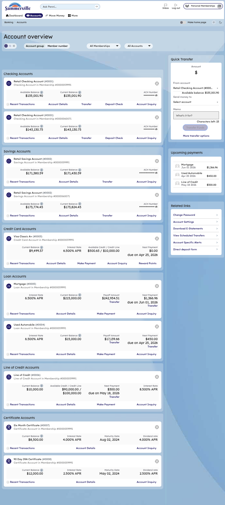
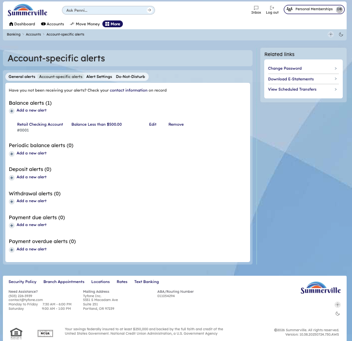

# Account Alerts

## Summary

Account-specific alerts allow members to configure notifications triggered by activity on individual accounts. Members can set up balance alerts that trigger when the account balance crosses a specified threshold (above or below), and debit/credit alerts that trigger on specific transaction types. Alerts can be delivered via email, SMS, or push notification to the member's registered contact information. Members configure alerts through the Account Alerts page accessed via the More menu or from within account detail pages.

## Key Use Cases

* Get notified when balance drops below a threshold
* Monitor large deposits or withdrawals
* Track debit activity on a checking account
* Set up low-balance warnings to avoid overdrafts
* Receive alerts for specific transaction types

## End-to-End Workflow

**Step 1: Open Account Overview**

The member clicks "Accounts" in the top navigation bar to open the Account Overview page. All accounts are listed with their balances and action buttons. From here, the member navigates to Account Alerts via the More menu.

<figure><figcaption></figcaption></figure>

**Step 2: Configure account alerts**

To Reach account specific alerts you click on the "Account Alerts" option on the related links column,where you can add,edit and remove various account related alerts such as balance alerts,deposit alerts,withdrawal alerts,payment due alerts,payment overdue alerts.

<figure><figcaption></figcaption></figure>
