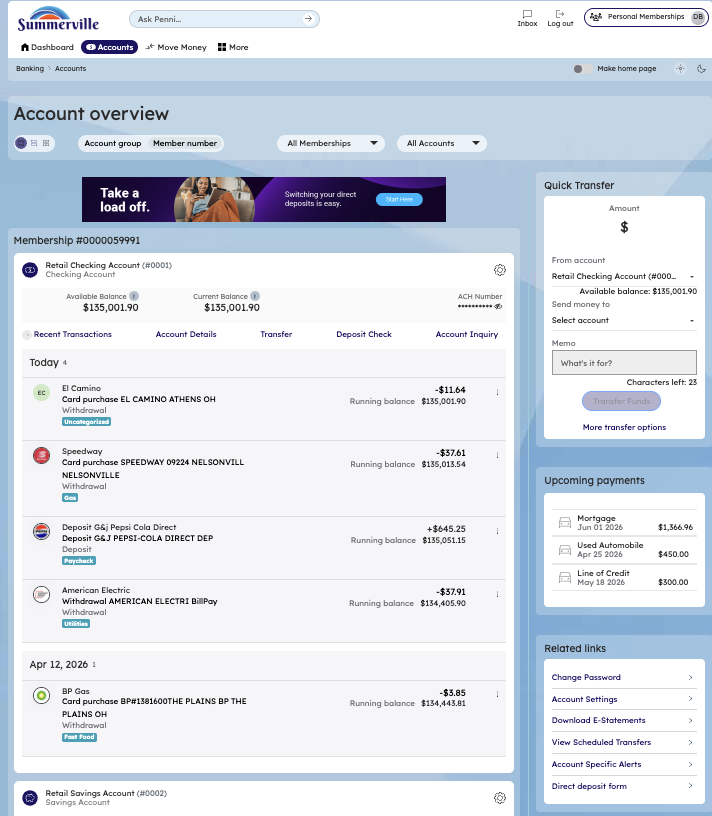
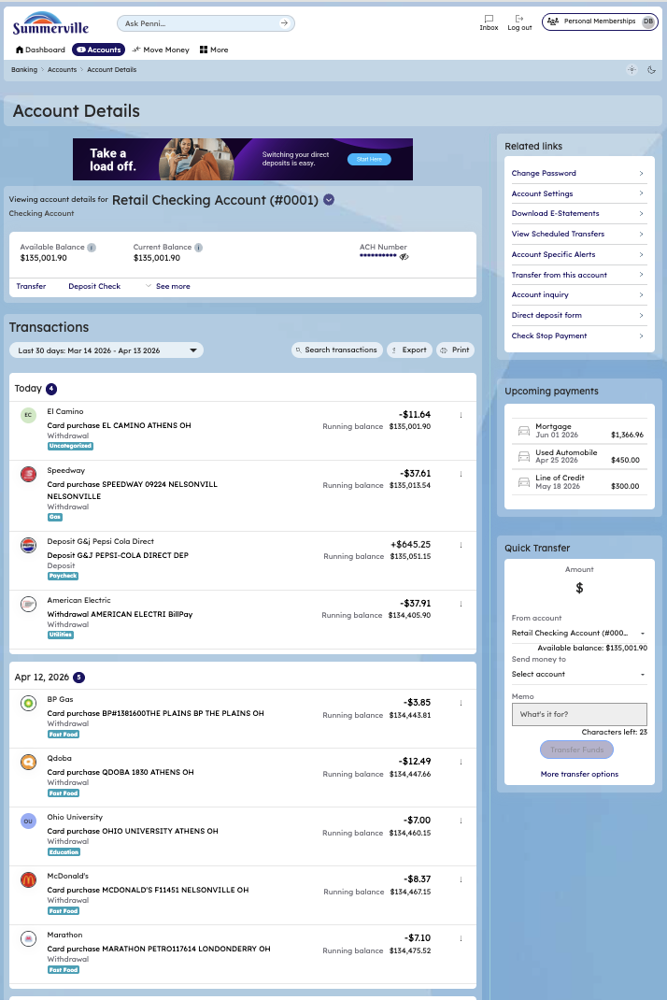
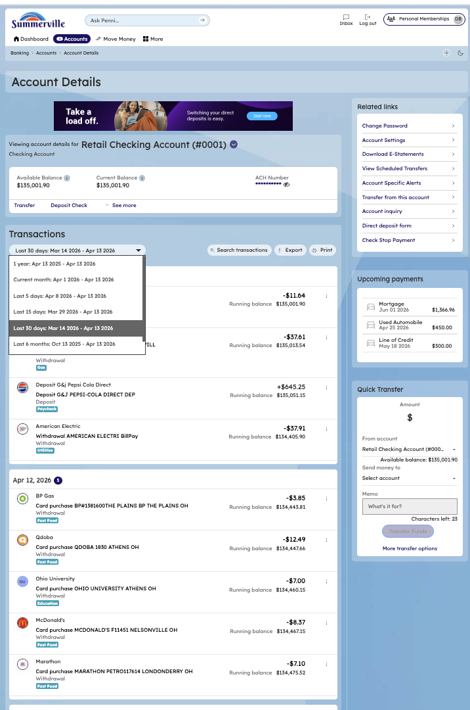

# Account Details & Transaction History

## Summary

Account Details gives members a comprehensive view of a single account — current balance, account metadata, and the full transaction history — in one screen. For business members reconciling daily activity, reviewing cleared checks, or preparing for an audit, the transaction history with search and filter capabilities eliminates the need to download statements for routine lookups. The view supports both retail and commercial accounts and is accessible from the Dashboard account tile or the Accounts menu.

## Key Use Cases

Business members use Account Details to verify that a specific payment has posted before releasing a vendor hold, confirm that an incoming wire credit has cleared, and review year-to-date activity for a particular account without pulling a full statement. Members preparing for tax filings or loan applications use the transaction history to locate specific debits or credits within a date range. The account metadata view — routing number, account number, and account type — also supports members who need to provide banking details to a payroll provider or set up a direct deposit without visiting a branch.

## End-to-End Workflow

**Step 1: View recent transactions inline from Account Overview**

The member is viewing the Account Overview page. The member clicks "Recent Transactions" on any account row. Recent transactions expand inline below that account, showing the latest entries with transaction dates, descriptions, and amounts in a compact list format.

<figure><figcaption></figcaption></figure>

**Step 2: Open the full Account Details page**

The member clicks "Account Details" on any account row. The full Account Details page loads, displaying the account name (e.g., "Retail Checking Account (#0001)"), the account number, and the complete Transaction History with all transactions listed in chronological order. Each transaction entry shows the date, description, amount, and running balance.

<figure><figcaption></figcaption></figure>

**Step 4: View additional transactions and account actions**

The member scrolls down the Account Details page to see additional transactions. There are time period filters that the member can use to look at transactions for a specific time period. And the member can export and print the transactions in CSV, QFX, QBO, OFX formats for a specific time period.&#x20;

<figure><figcaption></figcaption></figure>

<figure><figcaption></figcaption></figure>

**Step 7: Add Note**

In the three-dotted menu of a transaction, there is an option to add a note to the transaction.&#x20;

<figure><figcaption></figcaption></figure>

**Step 8: Download/Print Transaction**&#x20;

In the three-dotted menu of a transaction, there is an option to download/print the transaction. This opens a new tab showing the transaction detail with option to print & download.&#x20;

<figure><figcaption></figcaption></figure>
