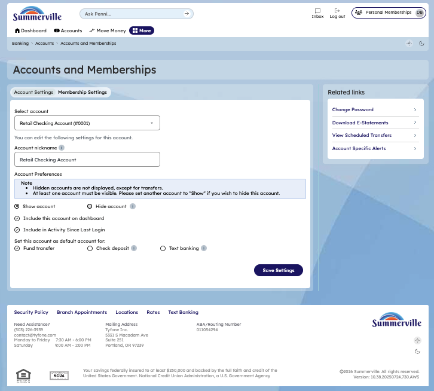

# Accounts & Memberships

## Summary

The Accounts & Memberships view provides members with a consolidated overview of all accounts and membership shares linked to their profile — balances, account types, member numbers, and account status — in a single screen. For business members managing multiple account relationships with the credit union, this view is the master reference for account identifiers, available balances, and membership context needed for payment instructions, direct deposit forms, and loan applications.

## Key Use Cases

Business members use the Accounts & Memberships view to retrieve account and routing numbers when setting up a new ACH originator or payroll direct deposit, confirm which membership number is associated with a specific loan or deposit account, and audit all active accounts before closing out an old membership. Members adding a new account or share to an existing membership use this view to verify that the new account has been correctly linked. Operations staff use the membership view to confirm account eligibility before initiating certain transaction types that require a specific account or share designation.

## End-to-End Workflow

**Step 1: Open Account Overview**

The member clicks "Accounts" in the top navigation bar to open the Account Overview page. All accounts are listed with their balances and action buttons.

<figure><figcaption></figcaption></figure>

**Step 2: Navigate to Accounts and Memberships page**

The member clicks "gear" in the top rIght of accounts.&#x20;

<figure><figcaption></figcaption></figure>

**Step 3: Add a new membership or account**

The member views the current membership details on the page. The page displays a link labeled "Open a new account or Apply for a new membership". The member clicks the "Go to site" button to proceed to the account opening or membership application process. The browser opens the Tyfone site where the member can complete the application for a new account or membership.

<figure><figcaption></figcaption></figure>
