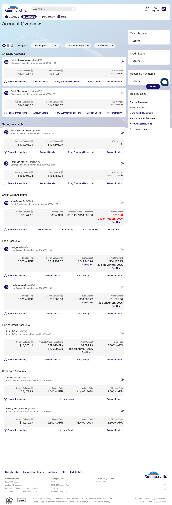
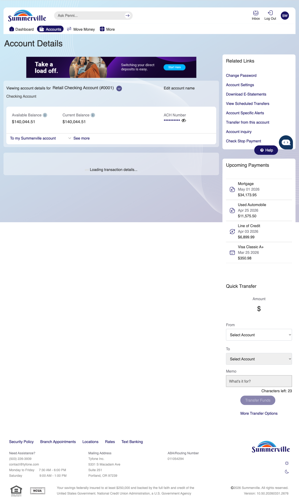
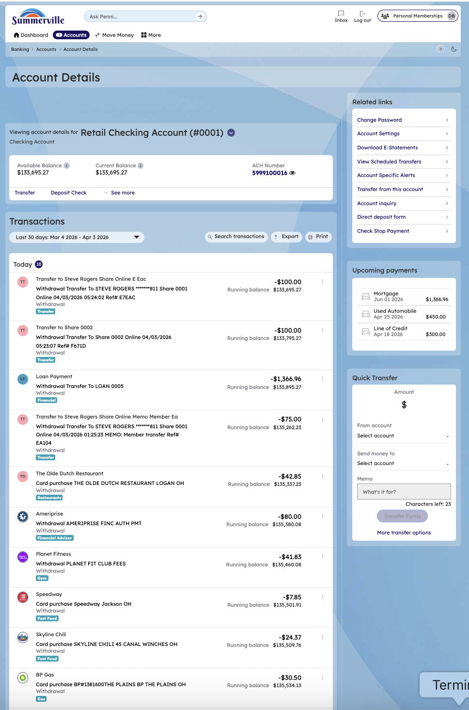
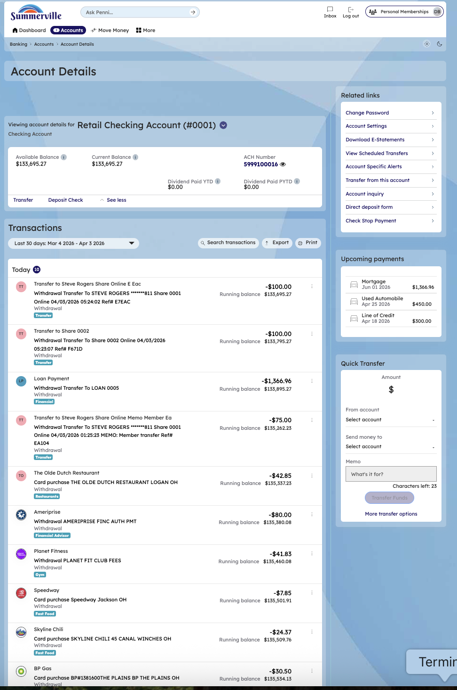
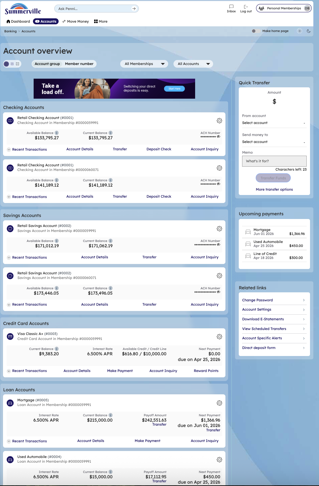
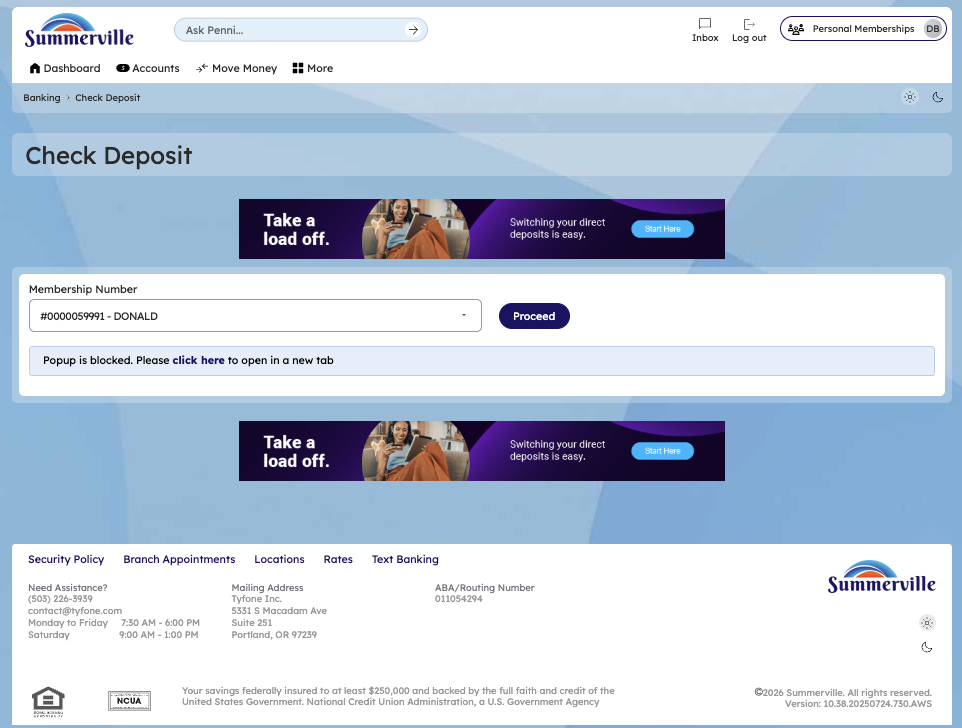
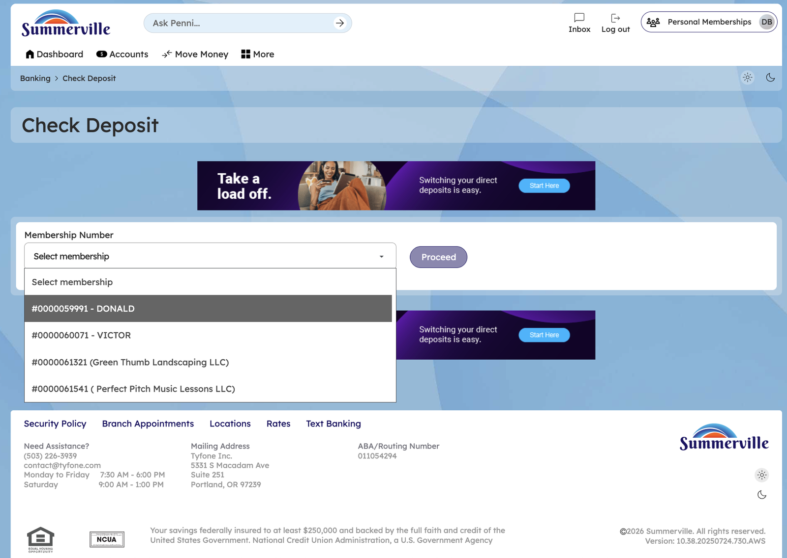
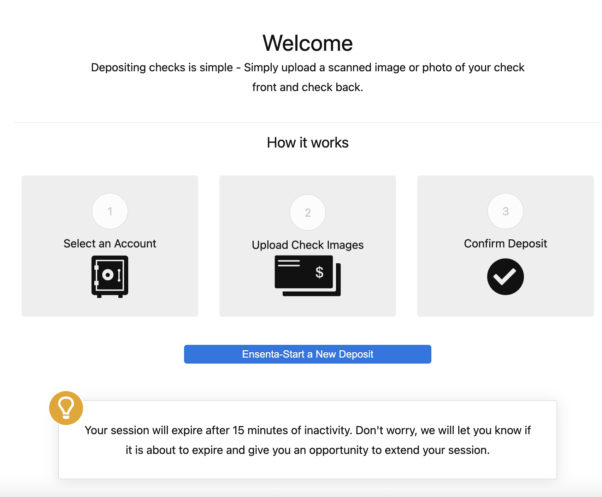
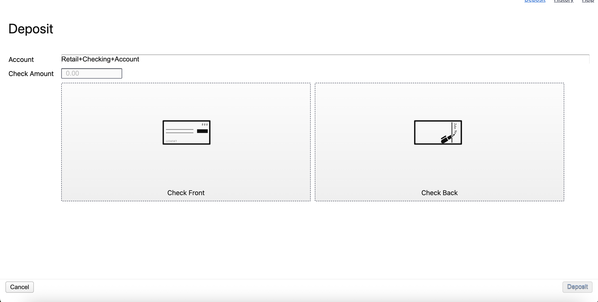

# Account Overview & Transaction History

## Summary

Account Overview & Transaction History provides members with a consolidated view of account balances and a detailed, searchable transaction ledger — the core account monitoring feature that supports daily reconciliation, balance verification, and transaction investigation. For business members who need to confirm that a specific payment has posted, verify an incoming deposit, or prepare a summary of account activity for a specific period, this view surfaces the data needed without generating a statement or contacting the credit union.

## Key Use Cases

Business members use Account Overview & Transaction History as the primary daily reconciliation tool — checking current and available balances across all accounts and drilling into individual transactions to confirm posting status. Members preparing for a tax audit or loan underwriting request use the transaction history filter to extract activity within a defined date range and isolate the relevant debits and credits. Operations staff investigating a reported discrepancy use the transaction detail view to retrieve the full posting description, date, amount, and reference number for any transaction in the account history — providing the documentation needed to open or close a dispute.

## Step-by-Step Guide

**Step 1 — Start from Dashboard**

You begin at the Dashboard after logging in. The Dashboard displays all account balances, upcoming payments, quick-action tiles, and the top navigation bar with links to Accounts, Move Money, and More.

<figure><figcaption></figcaption></figure>

**Step 2 — Open the More Menu**

Click 'More' in the top navigation bar. The More options panel expands to show additional features: Check Deposit, User ID and Password, eDocuments, Account Alerts, General Alerts, Password, Forms, One-Time Passcode, Skip A Pay, Do-Not-Disturb, Manage Devices, My Insights, Alert Settings, Recent Activities, and Card Services.

<figure><figcaption></figcaption></figure>

**Step 3 — Navigate from Dashboard to Accounts**

The Account Overview page is displayed showing a compact list of account cards. Each card shows the account name and current balance in a condensed view.

<figure><figcaption></figcaption></figure>

**Step 4 — Scroll Full Account List**

The complete Accounts page is shown with all account types organized by category — checking, savings, credit cards, and loans — each displaying their current balances and action links.

<figure><figcaption></figcaption></figure>

**Step 5 — Open Checking Account Detail**

The Retail Checking Account detail page is displayed, showing the available and current balance, ACH number, and a transaction list with multiple entries including dates, descriptions, amounts, and running balances.

<figure><figcaption></figcaption></figure>

**Step 6 — Open Savings / Dividends Account Detail**

The checking account detail page continues, showing the transaction list with transfer and deposit transactions. Each entry displays the date, description, amount, and running balance.

<figure><figcaption></figcaption></figure>

**Step 7 — View All Account Types Overview**

The Account Overview page shows all account types grouped by category — checking, savings, credit card, and loan — with balances and quick action buttons displayed for each account.

<figure><figcaption></figcaption></figure>

**Step 8 — Check Deposit from Account Detail**

The Check Deposit page is displayed with a 'Check Deposit' header and a blue informational banner promoting direct deposit services. The deposit interface is accessible from this screen.

<figure><figcaption></figcaption></figure>

**Step 9— Check Deposit — Select Membership**

The Check Deposit page shows a membership selection dropdown listing multiple membership accounts, each identified by number and name, for you to select before depositing a check.

<figure><figcaption></figcaption></figure>

**Step 10 — Check Deposit — Ensenta Welcome**

The Ensenta remote deposit welcome screen is displayed, explaining the three-step deposit process: Select Account, Upload Check Images, and Confirm Deposit.

<figure><figcaption></figcaption></figure>

**Step 11 — Check Deposit — Enter Amount & Upload Images**

The check deposit form is shown with fields for selecting the account and entering the check amount, plus upload areas for capturing the check front and back images.

<figure><figcaption></figcaption></figure>
