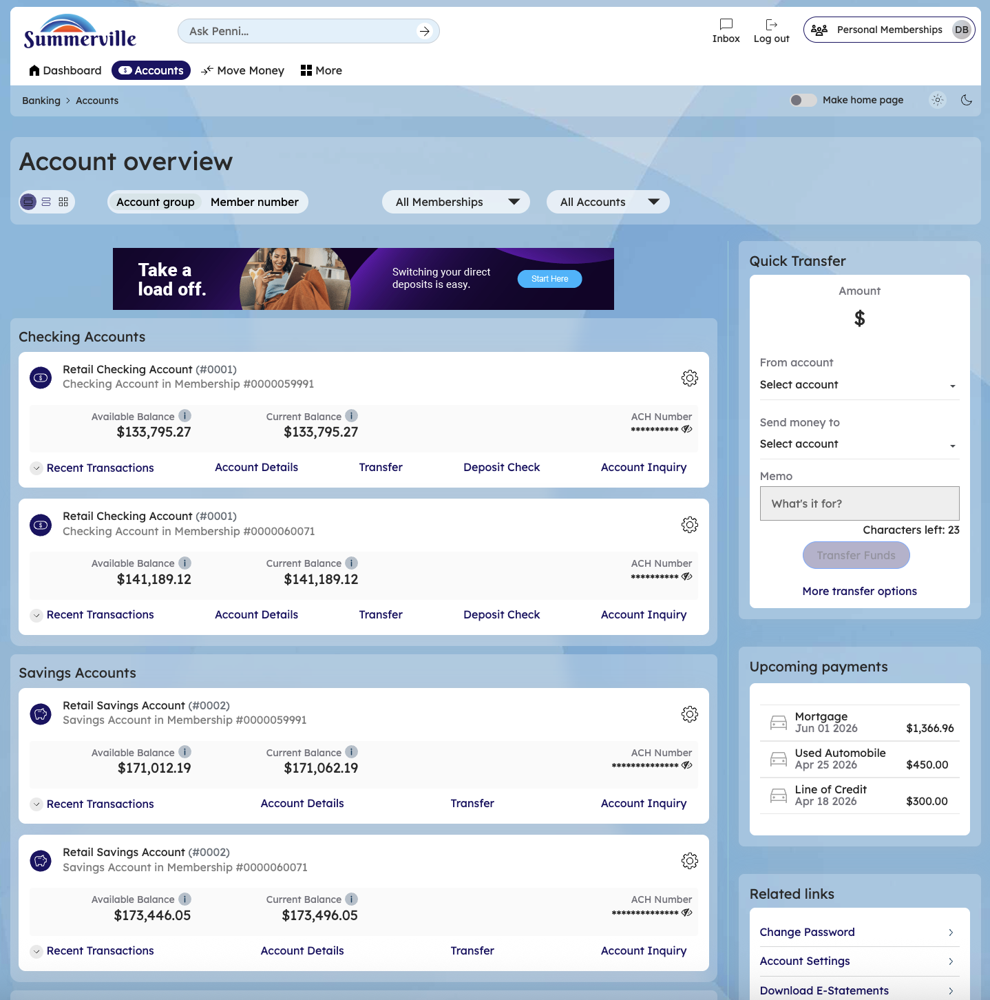
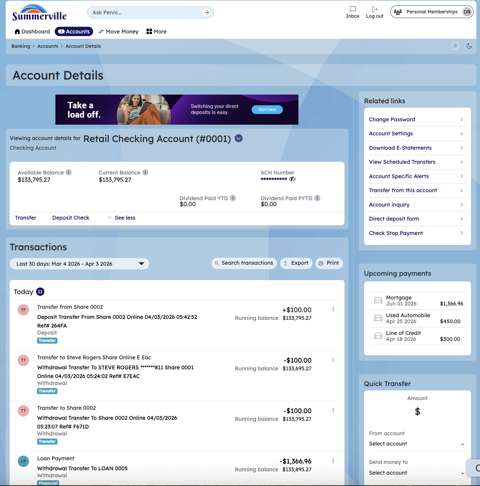

# Account Detail — All Types

> **Module:** Banking › Accounts › \[Account]

## Summary

Each account type in nFinia has a dedicated Account Detail page providing the full operational view of that account. The Checking Account Detail is the most-visited page for most you — it shows the real-time balance, complete transaction history, and provides direct access to all account services. Savings and dividends accounts add dividend rate information and earning summaries.

Money Market accounts show tiered rate details alongside transaction history. Certificate of Deposit accounts display maturity date, interest rate, term, and renewal options. Loan accounts show the outstanding principal, next payment due, payment history, and provide direct access to the loan payment workflow. Line of Credit accounts display the credit limit, drawn amount, available credit, and transaction history including draw and repayment records.

All account detail pages follow a consistent layout: balance summary at top, transaction history in the main panel, and related actions/links in the side panel or at the bottom. This consistency reduces the learning curve when managing multiple account types.

**At a Glance**

| Attribute             | Detail                                                                  |
| --------------------- | ----------------------------------------------------------------------- |
| Account Types Covered | Checking, Savings/Dividends, Money Market, CD, Loan, Line of Credit     |
| Common Features       | Balance summary, Transaction history, Related Links, Transfer shortcuts |
| Checking-Specific     | Account/routing number, Stop Payment, Check Reorder                     |
| Loan-Specific         | Next payment due, Principal balance, Payment history, Pay Now shortcut  |
| CD-Specific           | Maturity date, Interest rate, Term, Renewal election                    |

## Key Use Cases

| Use Case                 | Who Uses It                        | What They Do                                                               | Business Value                                              |
| ------------------------ | ---------------------------------- | -------------------------------------------------------------------------- | ----------------------------------------------------------- |
| Daily Balance Monitoring | You checking account status        | Open account detail for real-time balance and recent activity              | Instant financial status without contacting the CU          |
| Stop Payment Request     | You stopping an issued check       | Open checking detail > Related Links > Stop Payment                        | Prevents a check from clearing without branch visit         |
| Loan Payment Tracking    | You monitoring loan status         | Open loan account detail to see principal, interest, and payment history   | Full loan amortization visibility in one screen             |
| CD Maturity Election     | You with maturing certificates     | Open CD account detail > Renewal Options before maturity date              | Self-service CD renewal election without branch appointment |
| Round Up to Savings      | You building savings automatically | Enable Round Up feature in account settings to round up debit transactions | Passive savings accumulation from everyday spending         |

## Step-by-Step Guide

| _Navigation: Dashboard > Accounts > \[Account Name]._ |&#x20;

**Step 1 — Start from Dashboard**

You begin at the Dashboard after logging in. The Dashboard displays all account balances, upcoming payments, quick-action tiles, and the top navigation bar with links to Accounts, Move Money, and More.

<figure><figcaption></figcaption></figure>

**Step 2 — Navigate to Accounts**

Click 'Accounts' in the top navigation bar. The Account Overview page loads, showing all your accounts organized by type — checking, savings, credit cards, and loans — with balances and quick-action links for each account.

<figure><figcaption></figcaption></figure>

**Step 3 — Open Account Detail**

Click on any account tile or the 'Account Details' link to view the full detail page for that account. The layout varies by account type but follows a consistent structure.

<figure><figcaption></figcaption></figure>

**Step 4 — View Checking Account Balance & History**

The Retail Checking Account detail page displays the current balance, YTD dividend amounts, and a filterable transaction history. A Quick Transfer widget is available in the right sidebar.

<figure><figcaption></figcaption></figure>
