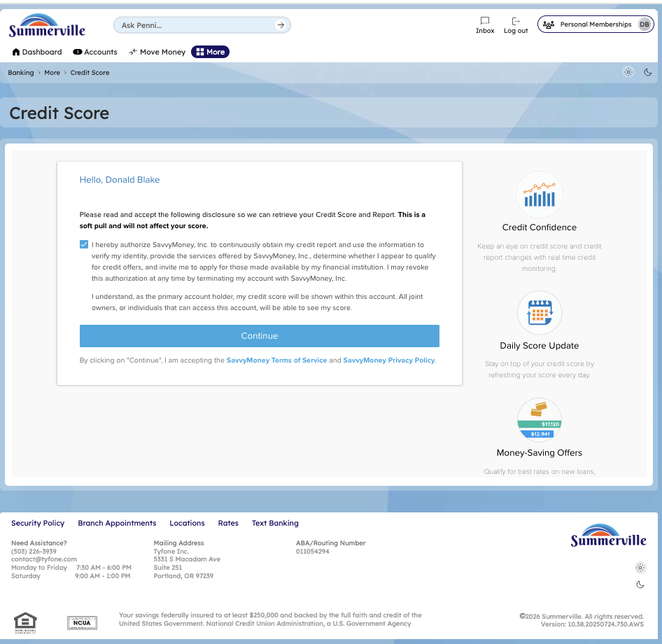
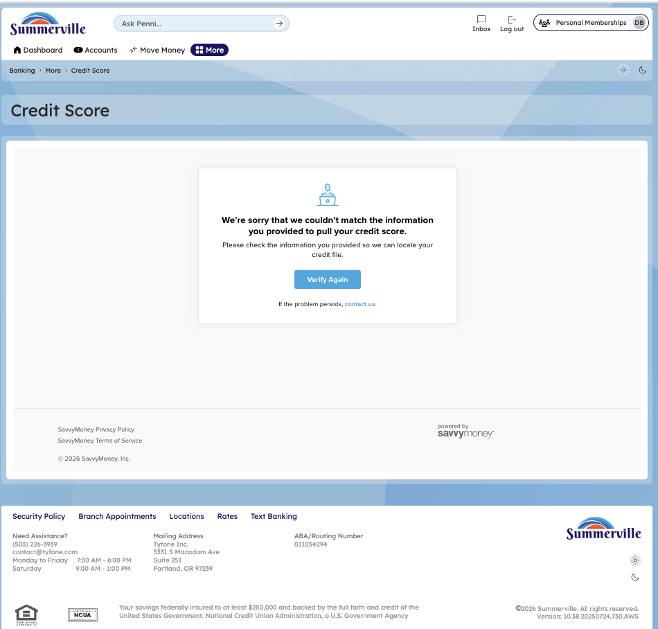
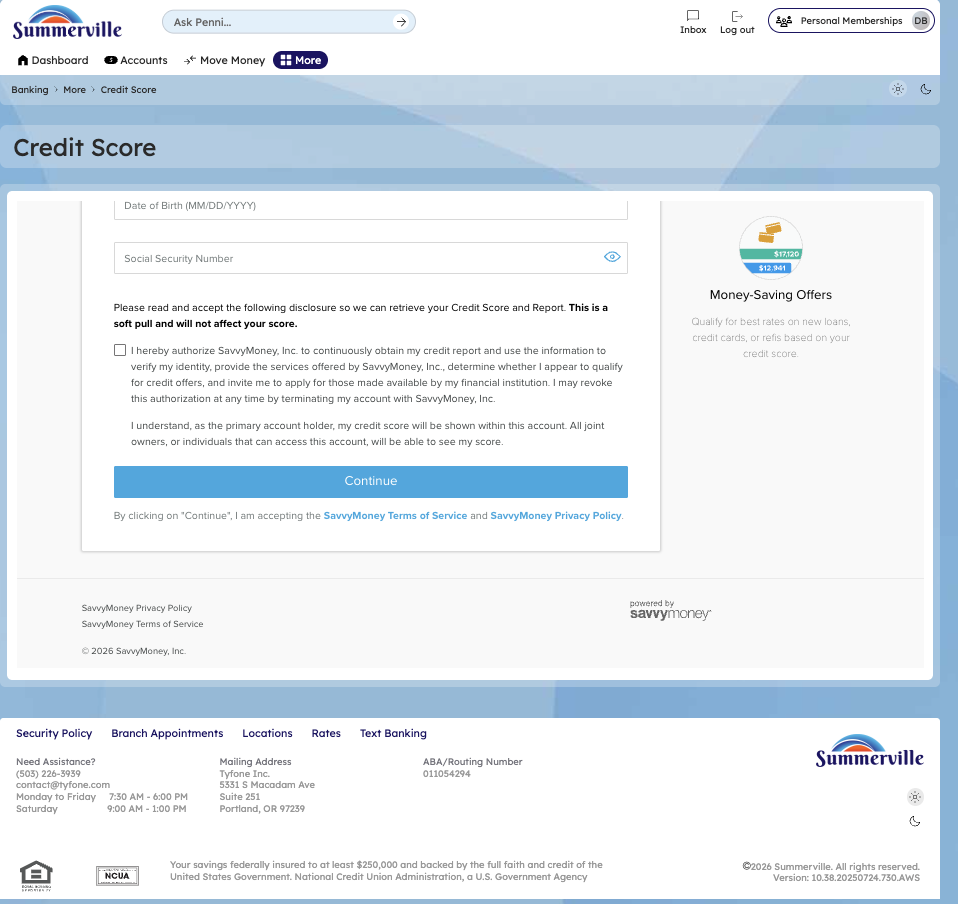

# Credit Score & Financial Tools

## Summary

Credit Score & Financial Tools surfaces the member's current credit score, score factors, and score history directly within the nFinia platform — powered by a soft-pull inquiry that has no impact on the member's credit. For business members who track their personal credit as part of managing business loan eligibility, and for retail members working toward a credit improvement goal, embedding this data within the banking session creates a natural feedback loop between financial behaviour and credit outcomes.

## Key Use Cases

Business members monitor their personal credit score within digital banking to assess readiness for an upcoming SBA loan application or equipment financing request, using the score factor breakdown to identify which actions will have the highest impact before approaching the lending team. Retail members working with a credit union financial counsellor use the score history chart to track month-over-month progress against an improvement plan, with the factor detail view identifying utilisation or payment history issues to address. Members who see an unexpected score drop on the Dashboard use the Credit Score detail view to identify the contributing factor — such as a new hard inquiry or increased revolving utilisation — and determine whether the change warrants further investigation.

## Step-by-Step Guide

**Step 1 — Start from Dashboard**

You begin at the Dashboard after logging in. The Dashboard displays all account balances, upcoming payments, quick-action tiles, and the top navigation bar with links to Accounts, Move Money, and More.

<figure><figcaption></figcaption></figure>

**Step 2 — Open the More Menu**

Click 'More' in the top navigation bar. The More options panel expands to show additional features: Check Deposit, User ID and Password, eDocuments, Account Alerts, General Alerts, Password, Forms, One-Time Passcode, Skip A Pay, Do-Not-Disturb, Manage Devices, My Insights, Alert Settings, Recent Activities, and Card Services.

<figure><figcaption></figcaption></figure>

**Step 3 — Navigate from Dashboard to Credit Score**

The Credit Score page is displayed with consent information describing the credit score service and a blue action button for you to access your credit score data.

<figure><figcaption></figcaption></figure>

**Step 4 — Score Not Found — Thin Credit File**

The Credit Score page shows a message indicating that credit score information is not currently available, with a button to proceed or retry the lookup.

<figure><figcaption></figcaption></figure>

**Step 5 — Re-Confirm Credit Score Consent**

The Credit Score page displays a re-confirmation consent screen with updated terms and information about accessing credit score data.

<figure><figcaption></figcaption></figure>
