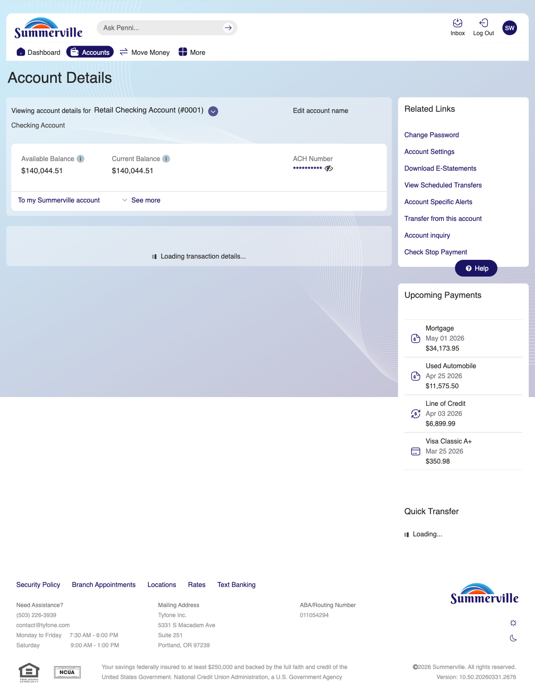
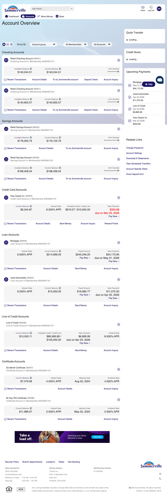
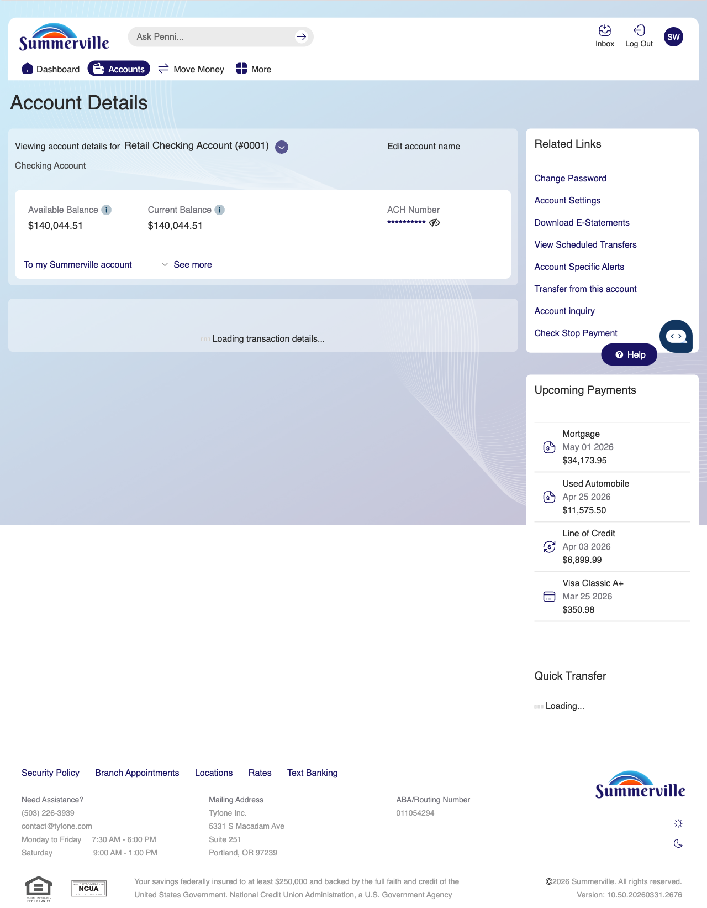
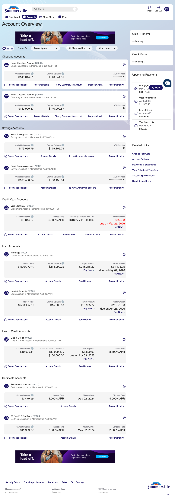
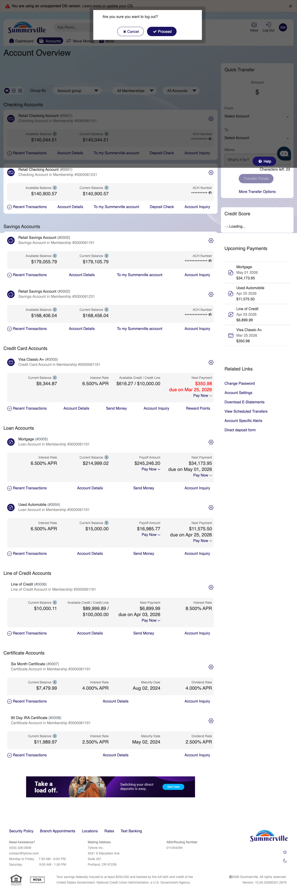

# Dashboard Activities

> **Module:** Banking › Dashboard

## Summary

The Dashboard is the first screen you encounter after completing multi-factor authentication. It is the command centre of the nFinia digital banking experience: a single, consolidated view presenting your complete financial picture — all account balances, recent transactions, pending items, and primary action shortcuts — without requiring navigation to individual account pages.

Quick-action tiles on the Dashboard provide one-tap access to the most common tasks: initiating a transfer, making a payment, depositing a check, or viewing recent activity. The Dashboard is intentionally designed as a zero-friction summary, enabling you to assess your financial position and initiate the most common banking actions directly from one screen.

The Activities Since Last Login feature (accessible via More > Recent Activities) presents a real-time audit log of all account events that occurred since your previous session, providing an instant security check and activity summary.

**At a Glance**

| Attribute      | Detail                                                  |
| -------------- | ------------------------------------------------------- |
| Module         | Banking › Dashboard (post-login landing screen)         |
| Accounts Shown | All accounts under the active membership                |
| Quick Actions  | Transfer, Pay, Deposit, Alerts, Move Money              |
| Activities Log | Events since last login (Recent Activities / More menu) |
| Refresh        | Pull-to-refresh or auto-refresh on session open         |
| Related        | [Move Money Hub](../../transfers-and-payments/internal-and-own-account-transfers/CSUM-05-Move-Money-Hub.md) for all payment and transfer options |

## Key Use Cases

| Use Case                   | Who Uses It                            | What They Do                                            | Business Value                                                      |
| -------------------------- | -------------------------------------- | ------------------------------------------------------- | ------------------------------------------------------------------- |
| Morning Balance Check      | You starting your day                  | Open app, view Dashboard for all account balances       | Single-screen financial overview without navigating to each account |
| Quick Transfer             | You moving funds between accounts      | Tap Transfer tile on Dashboard, complete transfer       | Fastest path to internal transfer without full navigation           |
| Post-Login Security Review | Security-conscious you                 | View Activities Since Last Login for unexpected events  | Instant detection of unauthorized account activity                  |
| Sneak Peek Balance         | You wanting balance without full login | Enable Sneak Peek to view balance before authentication | Quick balance check without full credential entry                   |

## Step-by-Step Guide

| _Navigation: Displayed automatically after login._ |&#x20;

**Step 1 — Start from Dashboard**

You begin at the Dashboard after logging in. The Dashboard displays all account balances, upcoming payments, quick-action tiles, and the top navigation bar with links to Accounts, Move Money, and More.

<figure><figcaption></figcaption></figure>

**Step 2 — Review Account Balances & Widgets**

The main Dashboard is displayed after login, showing multiple account cards with current balances, an upcoming payments sidebar on the right, and quick transfer options available in the right panel. The top navigation provides access to Accounts, Move Money, and More for all banking actions.

> For the full list of payment and transfer options, see the [Move Money Hub](../../transfers-and-payments/internal-and-own-account-transfers/CSUM-05-Move-Money-Hub.md) guide.

<figure><figcaption></figcaption></figure>

**Step 3 — Use Quick Transfer from Dashboard**

The Accounts page is shown with a detailed list of multiple checking and savings accounts. Each account displays the account name, masked number, and current balance with available action buttons.

<figure><figcaption></figcaption></figure>

**Step 4 — Fill Quick Transfer Details**

The accounts list view is displayed in a scrollable format showing multiple account options with their account types and current balances for selection.

<figure><figcaption></figcaption></figure>

**Step 5 — Enter Transfer Amount**

A full Accounts page is shown displaying all account types — checking, savings, credit cards, and loans — organized by category with their respective balances and transaction history links.

<figure><figcaption></figcaption></figure>

**Step 6 — Confirm Quick Transfer**

The account overview page displays all account types organized by category. Recent transactions and related action buttons are visible for each account entry.

<figure><figcaption></figcaption></figure>

**Step 7 — Log Off Securely**

A logout confirmation modal is displayed over the accounts page interface. The modal prompts you to confirm you want to end your session before logging out.

<figure><figcaption></figcaption></figure>
