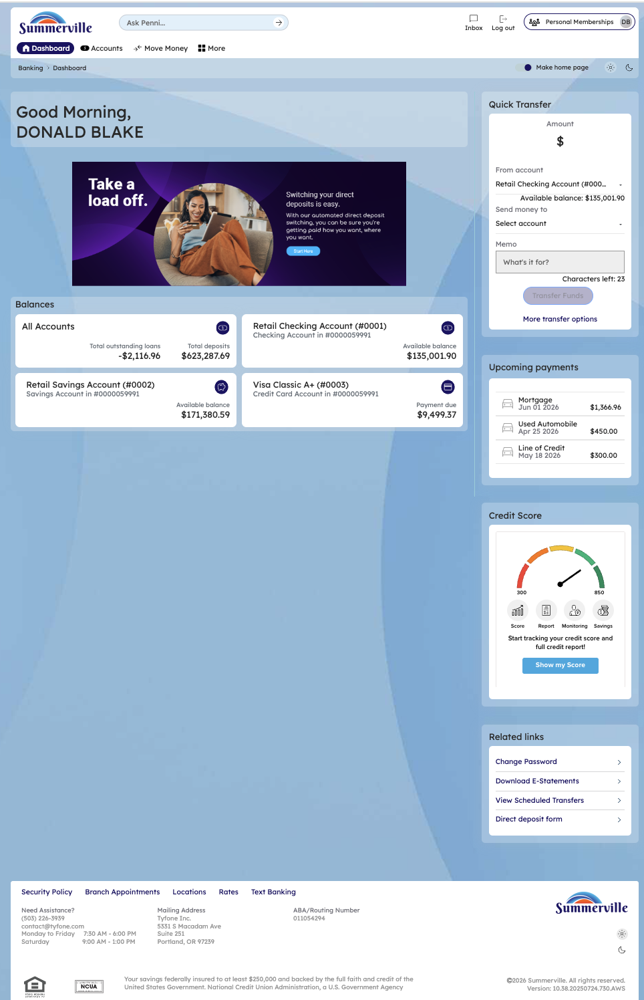
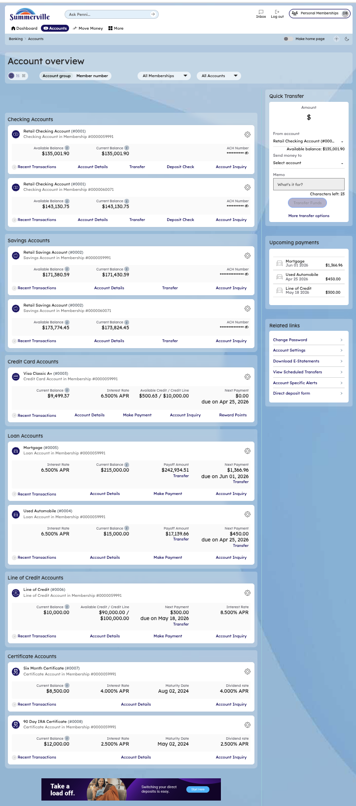

# Dashboard

## Summary

The Dashboard is the first screen after login. It displays all account balances in the centre column, a Quick Transfer widget, Upcoming Payments, Credit Score meter, and Related Links on the right panel, and footer quick links at the bottom. From this single screen, the member can check balances, transfer funds, review upcoming payments, and navigate to every major module.

## Key Use Cases

| Use Case               | Who Uses It                                      | What They Do                                        | Business Value                                                       |
| ---------------------- | ------------------------------------------------ | --------------------------------------------------- | -------------------------------------------------------------------- |
| Morning Balance Check  | Member starting their day                        | Opens app, views Dashboard for all account balances | Single-screen financial overview without navigating to each account  |
| Quick Transfer         | Member moving funds between accounts             | Uses the Quick Transfer widget on the right panel   | Fastest path to internal transfer without full Move Money navigation |
| Navigate to Accounts   | Member needing transaction detail                | Clicks "Accounts" in the top navigation bar         | Direct path to full Account Overview and transaction history         |
| Navigate to Move Money | Member initiating a payment or transfer          | Clicks "Move Money" in the top navigation bar       | Access to all payment and transfer options                           |
| Access More Features   | Member needing alerts, settings, or credit score | Clicks "More" in the top navigation bar             | Expands panel with all secondary features                            |

## End-to-End Workflow

### Step 1 — Dashboard Landing

After logging in, the member lands on the Dashboard. The top navigation bar shows **Dashboard**, **Accounts**, **Move Money**, and **More**. The centre column displays account summary tiles. The right panel shows the Quick Transfer widget, Upcoming Payments, Credit Score meter, and Related Links.

<figure><figcaption></figcaption></figure>

### Step 2 — Click "Accounts" to View All Accounts

Click **Accounts** in the top navigation bar. The Account Overview page loads, displaying all account types — Checking, Savings, Credit Card, Mortgage, Loans, Line of Credit, and Certificate accounts — each with their balance, account number, and action buttons (Recent Transactions, Account Details, Transfers, Deposit Direct, Account Enquiry).

<figure><figcaption></figcaption></figure>

