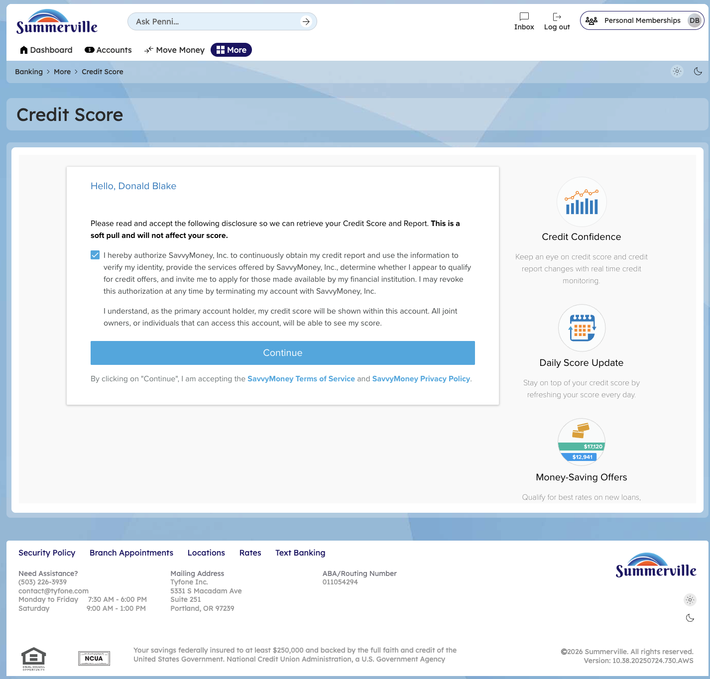

# Dashboard Credit Score Widget

## Summary

The Credit Score Widget on the Dashboard surfaces the member's current credit score and score trend directly within the digital banking session, powered by a soft-pull credit inquiry that does not affect the member's credit. For credit union members exploring loan products, refinancing options, or credit-building goals, having the score visible on every login creates a natural connection between daily banking activity and long-term financial health — a differentiated value-add that large national banks use to drive product cross-sell.

## Key Use Cases

Members use the Credit Score Widget to monitor score changes month over month and understand which factors are driving improvements or declines. Business members evaluating their personal credit ahead of an SBA loan application or equipment financing use the widget to assess readiness before approaching the lending team. The widget also serves as a trigger for credit union staff conversations — a member who sees a score drop on the Dashboard is more likely to initiate a financial wellness conversation than one who discovers it at loan application time.

## Step-by-Step Guide

**Step 1 — View Your Credit Score on the Dashboard**

After logging in, the Credit Score Widget displays your current score prominently on the Dashboard alongside the score range indicator and a month-over-month trend arrow. No action is required — the score updates automatically each month via a soft-pull inquiry and reflects the latest data from the credit bureau.

<figure><figcaption></figcaption></figure>

**Step 2 — Click the Widget to View Score Details**

Click the Credit Score Widget to open the full Credit Score detail view, which breaks down the key factors influencing your score — payment history, credit utilization, account age, credit mix, and recent inquiries. Each factor is rated and explained so members understand specifically what to address to improve their score over time.

<figure><figcaption></figcaption></figure>

**Step 3 — Review Score History and Offers**

The detail screen displays a historical score chart showing month-over-month movement and may surface relevant credit union loan or credit card offers calibrated to the member's current score range. Members can use this view to track progress toward a target score or explore products available to them based on their current credit profile.

<figure><figcaption></figcaption></figure>
