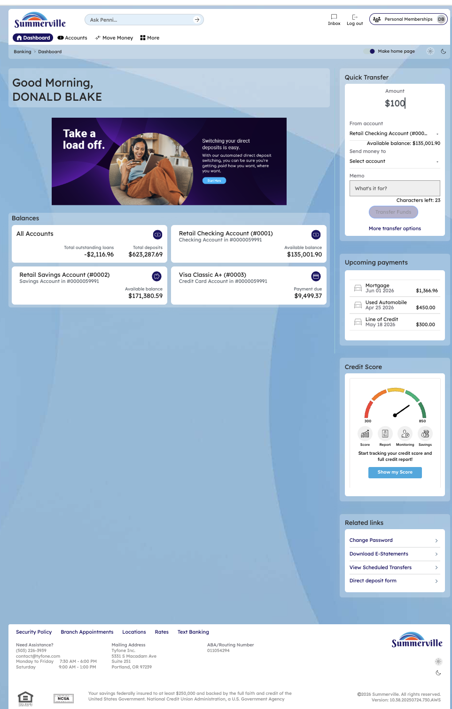
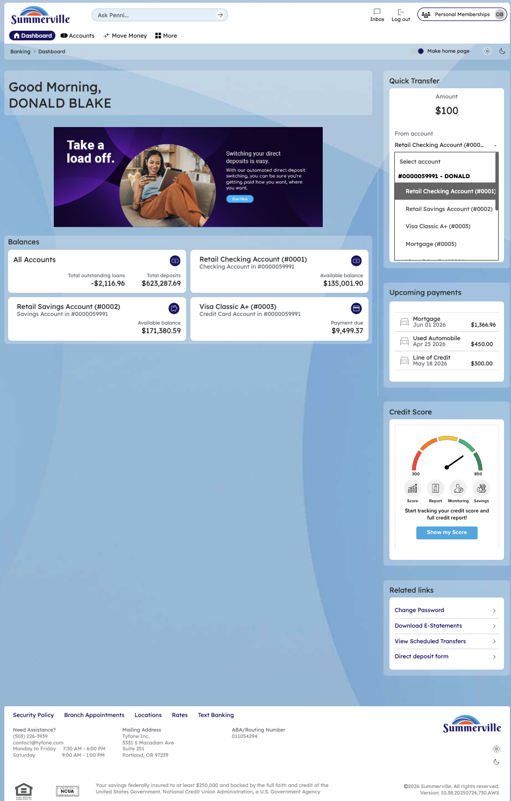
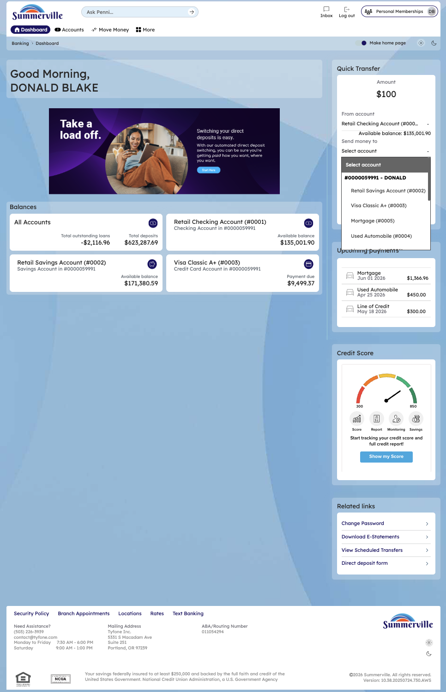

# Quick Pay & Quick Transfer

## Summary

The Quick Transfer widget is a compact transfer form on the right side of the Dashboard. It allows members to move funds between their own accounts — or make a loan payment — without navigating to the full Move Money Hub. The "From" and "To" dropdowns list all accounts under the membership with their balances. The member enters an amount, selects accounts, and clicks Transfer. The entire flow takes three clicks.

## Key Use Cases

| Use Case              | Who Uses It                             | What They Do                                                            | Business Value                                                   |
| --------------------- | --------------------------------------- | ----------------------------------------------------------------------- | ---------------------------------------------------------------- |
| Quick Savings Top-Up  | Member with extra checking balance      | Transfers from Checking to Savings via the Dashboard widget             | Fastest possible internal transfer — three clicks, no navigation |
| Cover a Shortfall     | Member with low checking balance        | Transfers from Savings to Checking to cover an upcoming debit           | Prevents overdraft without opening Move Money                    |
| Quick Loan Payment    | Member with a loan due date approaching | Selects Loan account as "To" destination, enters payment amount         | On-the-spot loan payment directly from the Dashboard             |
| Morning Funds Shuffle | Member managing multiple accounts       | Reviews balances on Dashboard tiles, immediately moves funds via widget | Balances and transfer tool on the same screen                    |

## End-to-End Workflow

### Step 1 — Locate the Quick Transfer Widget

After logging in, the Quick Transfer widget is visible on the top-right of the Dashboard. It contains a dollar amount field, a "From account" dropdown, a "Send money to" dropdown, a Memo field, and a **Transfer** button.

<figure><figcaption></figcaption></figure>

### Step 2 — Enter the Transfer Amount

Click the dollar amount field in the Quick Transfer widget and type the amount to transfer (e.g., $100).

<figure><figcaption></figcaption></figure>

### Step 3 — Select the "To" Account

Click the **"Send money to"** dropdown. A list of all accounts under the membership appears — Checking, Savings, Visa Credit Card, Mortgage, and Loan accounts — each showing the account name and number. Select the destination account.

<figure><figcaption></figcaption></figure>

### Step 4 — Review the Selected Account

After selecting the destination, the dropdown closes and the selected account is displayed in the "Send money to" field. Optionally add a memo and select the transfer frequency.

<figure><figcaption></figcaption></figure>

### Step 5 — Click Transfer and Confirm

Click the **Transfer** button. A confirmation modal appears showing the transfer details: From account, To account, Amount, Frequency, and Transaction date. Review the details and click **Confirm** to complete the transfer, or click **Cancel** to go back.

<figure><figcaption></figcaption></figure>
