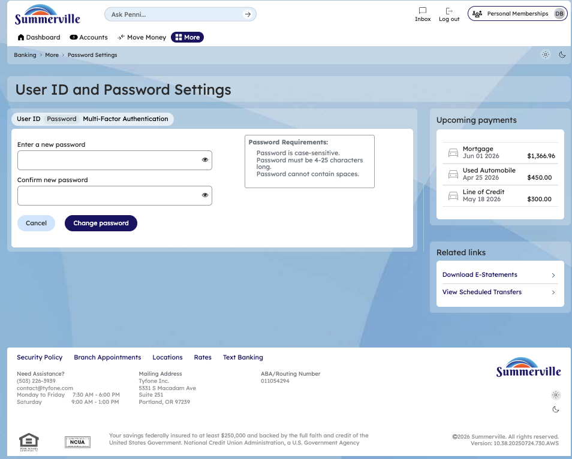
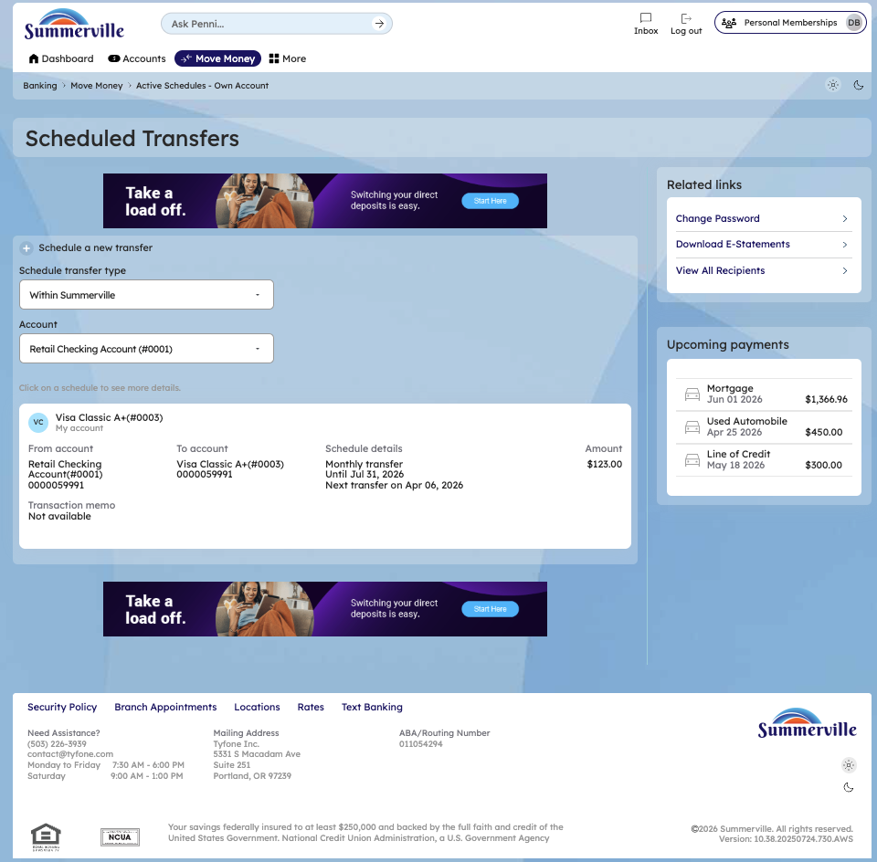
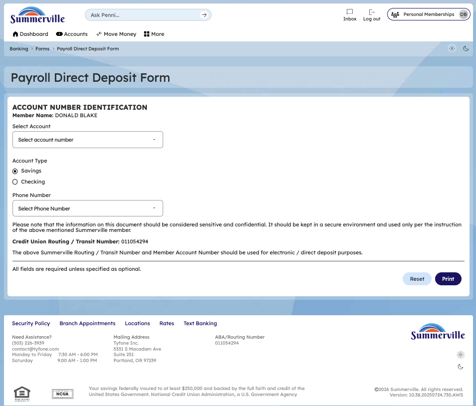

# Related Links

## Summary

The Related Links sidebar is a configurable shortcut panel positioned on the Dashboard that gives members one-click access to the most operationally relevant self-service tasks — without navigating through menus. For business members who move money frequently, update credentials regularly, or need direct deposit forms for onboarding employees, this panel eliminates unnecessary clicks and surfaces high-value actions at the point where members are most likely to need them.

The panel currently exposes four links — **Change Password**, **Download E-Statements**, **View Scheduled Transfers**, and **Direct Deposit Form** — each configured by the credit union based on member behavior and operational priorities. This is a credit union-controlled configuration, meaning Summerville CU can update which shortcuts appear as member needs evolve.

## Key Use Cases

Business member enforcing security hygiene clicks **Change Password** from the Dashboard without navigating to Settings, reduces credential update friction for members managing business accounts with strict access controls.

Member reconciling books or preparing for tax filing clicks **Download E-Statements** directly from the Dashboard, eliminates the multi-step path to More > eDocuments — critical for members on tight month-end timelines.

Business member monitoring cash outflows clicks **View Scheduled Transfers** to audit all upcoming automated payments, provides immediate visibility into scheduled obligations without leaving the primary account view.

New employee or business owner managing payroll routing clicks **Direct Deposit Form** to retrieve the pre-populated routing form, pre-fills account number, member name, account type, and routing number — removes manual data entry risk.

For credit unions with business banking members, the Related Links panel is a low-effort, high-impact configuration that directly reduces support call volume for commonly requested tasks.

## End-to-End Workflow

### Prerequisites

* Active authenticated session in nFinia Digital Banking
* Dashboard loaded and visible with the Related Links sidebar in the right panel

### Step-by-Step Flow

**Step 1 — Locate the Related Links Sidebar**

After logging in, scroll to the lower-right section of the Dashboard to locate the **Related Links** card, positioned below the Credit Score widget. The panel displays the four configured shortcut links — **Change Password**, **Download E-Statements**, **View Scheduled Transfers**, and **Direct Deposit Form** — each launching its respective feature directly with a single click.

<figure><figcaption></figcaption></figure>

**Step 2 — Change Password**

Click **Change Password** to navigate directly to the User ID and Password Settings page, which opens with the **Password** tab active. Enter the current password and the new password in the respective fields, then click **Change password** to apply the update immediately — no additional navigation required.

<figure><figcaption></figcaption></figure>

**Step 3 — View Scheduled Transfers**

Click **View Scheduled Transfers** to open the Scheduled Transfers page under Move Money, which lists every active scheduled and recurring transfer on the account. Each entry displays the source account, destination account, transfer amount, frequency, and next scheduled execution date — with inline options to edit or cancel any entry.

<figure><figcaption></figcaption></figure>

**Step 4 — Direct Deposit Form**

Click **Direct Deposit Form** to load the Payroll Direct Deposit Form, pre-populated with the member's Account Number, Member Name, Account Type, and the Credit Union's Routing/Transit Number. The member can print or save the completed form and submit it directly to their employer's payroll department — no manual data entry required.

<figure><figcaption></figcaption></figure>

### Completion & Confirmation

Each Related Links shortcut navigates directly to its target feature — the member completes the task within that feature and can return to the Dashboard via the navigation menu. No separate confirmation is generated by the Related Links panel itself; confirmations are handled by the destination feature (e.g., password change success banner, transfer cancellation confirmation).

### Quick Reference

| Task | Navigation Path | Notes |
| --- | --- | --- |
| Change Password | Dashboard > Related Links > Change Password | Opens directly to the Password tab in Settings |
| Download E-Statements | Dashboard > Related Links > Download E-Statements | Launches BDI eDocuments portal via SSO |
| View Scheduled Transfers | Dashboard > Related Links > View Scheduled Transfers | Opens Move Money > Scheduled Transfers list |
| Direct Deposit Form | Dashboard > Related Links > Direct Deposit Form | Pre-populated with account and routing details |
