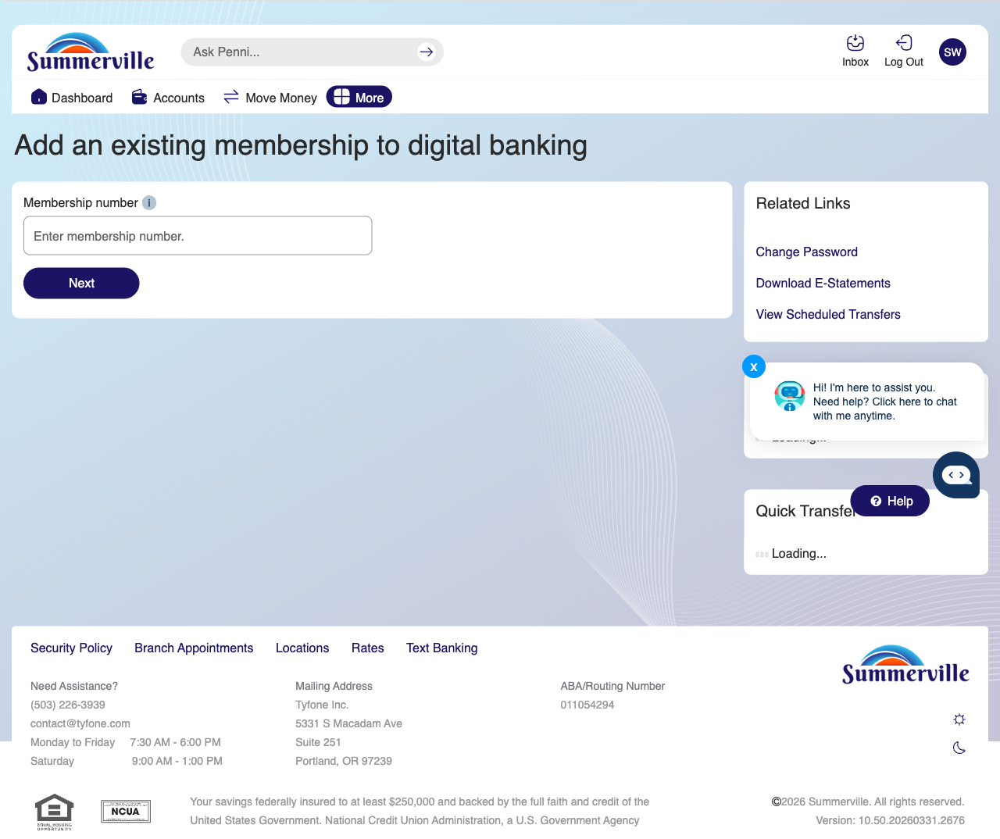
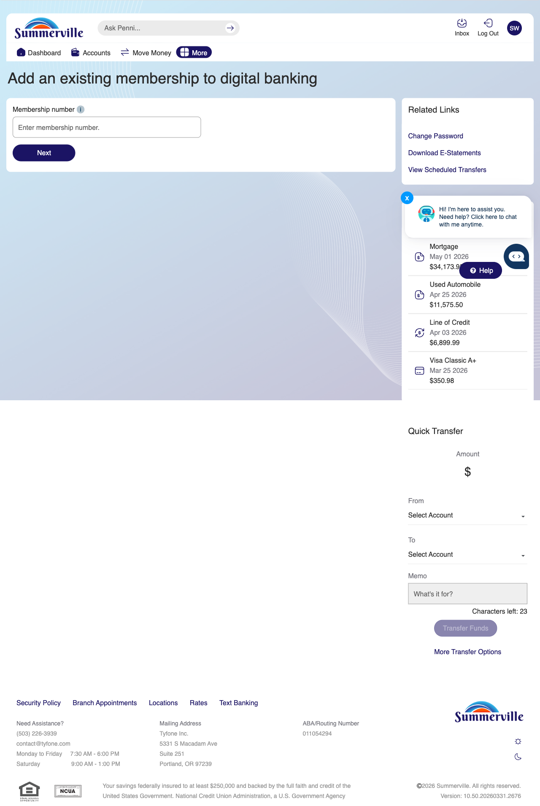
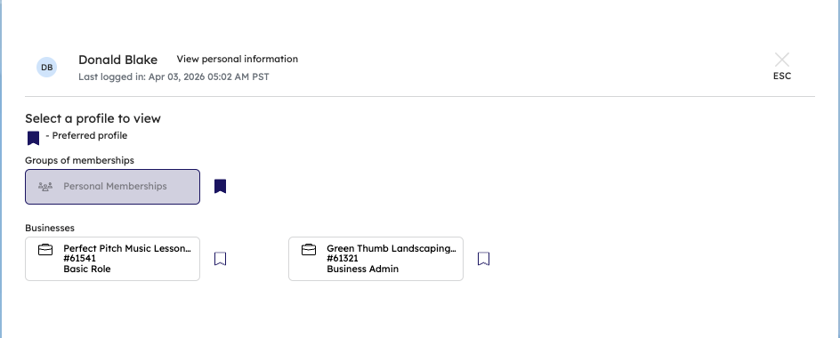

# Profile & Membership Management

## Summary

Profile & Membership Management gives members a centralised location to update personal details, manage account display preferences, configure security settings, and maintain the membership records associated with their digital banking profile. For business members managing an account profile that reflects both personal and business banking relationships, keeping profile details current ensures that alert notifications, OTP delivery, and official correspondence all reach the correct contact — and that account displays reflect the member's preferred organisation of their account relationships.

## Key Use Cases

Business members update their profile contact information when a business phone number or email address changes, ensuring that OTP verification codes and security alerts are delivered to active contacts. Members managing multiple memberships under a single digital banking login use Profile Management to organise which membership is primary, set display names for each membership, and configure default accounts for transfers and deposits. Operations staff assisting a member with a profile correction update address and contact details on behalf of the member through an authenticated support session, with all changes generating an audit log entry for compliance review.

## Step-by-Step Guide

**Step 1 — Start from Dashboard**

You begin at the Dashboard after logging in. The Dashboard displays all account balances, upcoming payments, quick-action tiles, and the top navigation bar with links to Accounts, Move Money, and More.

<figure><figcaption></figcaption></figure>

**Step 2 — Open the More Menu**

Click 'More' in the top navigation bar. The More options panel expands to show additional features: Check Deposit, User ID and Password, eDocuments, Account Alerts, General Alerts, Password, Forms, One-Time Passcode, Skip A Pay, Do-Not-Disturb, Manage Devices, My Insights, Alert Settings, Recent Activities, and Card Services.

<figure><figcaption></figcaption></figure>

**Step 3 — Navigate from Dashboard to Membership Settings**

The Accounts and Memberships page is displayed with a checkbox option for adding an existing membership to digital banking.

<figure><figcaption></figcaption></figure>

**Step 4 — View Account Settings**

The 'Add an existing membership to digital banking' page is shown with input fields for entering the membership number and details.

<figure><figcaption></figcaption></figure>

**Step 5 — Configure Account Display Settings**

The 'Add an existing membership' page displays the Membership number field and a Quick Transfer section with account selection dropdowns for configuring transfer preferences.

<figure><figcaption></figcaption></figure>

**Step 6 — Switch Active Membership via Profile**

The Profile selection modal is displayed showing the Preferred profile option and Personal Memberships group with two associated business accounts listed.

<figure><figcaption></figcaption></figure>
