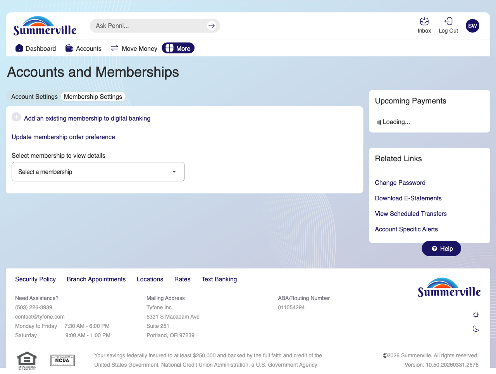

# Profile & Membership Management

## Summary

Profile & Membership Management gives members a centralised location to update personal details, manage account display preferences, configure security settings, and maintain the membership records associated with their digital banking profile. For business members managing an account profile that reflects both personal and business banking relationships, keeping profile details current ensures that alert notifications, OTP delivery, and official correspondence all reach the correct contact — and that account displays reflect the member's preferred organisation of their account relationships.

## Key Use Cases

Business members update their profile contact information when a business phone number or email address changes, ensuring that OTP verification codes and security alerts are delivered to active contacts. Members managing multiple memberships under a single digital banking login use Profile Management to organise which membership is primary, set display names for each membership, and configure default accounts for transfers and deposits. Operations staff assisting a member with a profile correction update address and contact details on behalf of the member through an authenticated support session, with all changes generating an audit log entry for compliance review.

## Step-by-Step Guide

**Step 1 — Open Profile & Membership Settings**

From the More menu or Settings, navigate to **Profile** or **Account & Membership Settings** to open the profile management screen. The screen displays the current profile information — name, contact details, linked memberships, and account display preferences — in a tabbed layout.

<figure><figcaption></figcaption></figure>

**Step 2 — Update Contact Information or Account Display Preferences**

Select the relevant tab to update a specific section — contact details, mailing address, account nicknames, or membership visibility settings. For sensitive fields such as phone number or email, the platform requires OTP verification against the existing contact before saving the change.

<figure><figcaption></figcaption></figure>

**Step 3 — Save and Confirm**

Click **Save** after updating each section. A confirmation banner confirms the changes have been applied. Contact information updates take effect immediately for all future OTP delivery and alert notifications.

<figure><figcaption></figcaption></figure>
