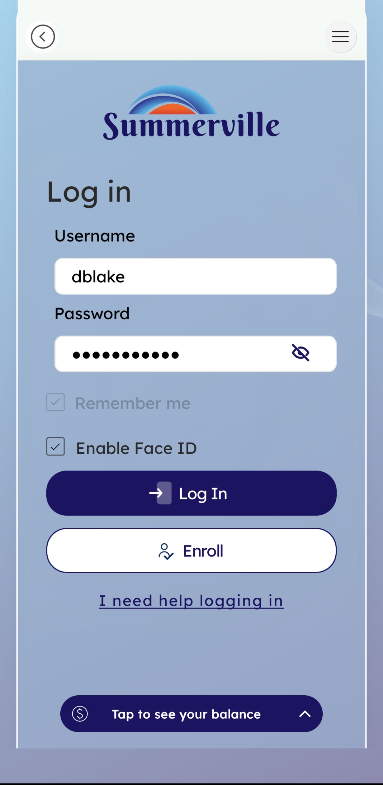

# Face ID - Biometric Auth

## Summary

Face ID is a biometric authentication feature within the nFinia mobile banking platform that enables you to log into your digital banking account using facial recognition instead of (or in addition to) a traditional username and password. The feature is surfaced as an opt-in checkbox **Enable Face ID** - directly on the standard Log In screen, making activation frictionless and contextual at the moment of first credential entry.

The feature leverages the native biometric framework of your mobile device (iOS Face ID / Android BiometricPrompt), meaning that no facial data is transmitted to or stored on Tyfone's or Caltech Employees FCU's servers. The device itself performs the biometric match and passes an authenticated signal to the nFinia app. This architecture separates credential security from biometric data entirely, reducing PII exposure risk and simplifying compliance.

Face ID serves all authenticated nFinia users both retail members and business banking users who access the platform via a compatible mobile device. Once enrolled, you can authenticate subsequent sessions with a glance, eliminating password entry friction while maintaining a strong second-factor assurance level. This is particularly valuable if you log in frequently to monitor cash flow, approve transactions, or review commercial activity throughout the day.

**At a Glance**

| Attribute | Detail |
| ------------ | ----------------------------------------------------------------- |
| Feature Name | Face ID (Biometric Authentication) |
| Module | Banking › Authentication › Log In |
| User Roles | All authenticated members (Retail & Business Banking) |
| Access Level | Self-service; opt-in at login |
| Key Actions | Enable Face ID, authenticate via biometric, fall back to password |

## Use Cases

Members logging in from a new or reset device check the "Enable Face ID" box during credential-based login; complete device biometric prompt on next launch, eliminates repeated password entry; reduces login friction from day one on new devices.

Any enrolled member opening the app for a subsequent session app launches biometric prompt automatically; authenticate with a glance, faster session start; reduces abandonment from forgotten passwords; improves daily engagement.

Members who shares a device with a family member or colleague leave "Enable Face ID" unchecked; use password-only login, preserves account security on shared hardware; no unwanted biometric binding.

Members whose Face ID fails (poor lighting, appearance change, etc.) device declines biometric match; you are presented with standard username/password login, maintains access continuity; prevents lockout; ensures 100% accessibility.

Members who upgrades your phone or resets biometrics re-enable Face ID by checking the option at next credential login, seamless re-onboarding to biometric auth without contacting the credit union.

Members checking balances and approvals multiple times daily use Face ID to authenticate quickly between commercial tasks, reduces session startup cost; supports real-time cash flow monitoring without password fatigue.

## Step-by-Step Guide

**Step 1 — Navigate to the Log In Screen**

You open the Caltech Employees FCU nFinia app. The Welcome screen presents two primary actions: **Enroll** and **Log In**. Tap **Log In**.

<figure><figcaption></figcaption></figure>

**Step 2 — Enter Credentials**

The Log In screen loads with two input fields: **Username** and **Password**. Enter your registered digital banking username and password. Below the password field, two optional checkboxes are displayed — review these before tapping Log In, as one of them controls Face ID enrollment.

<figure><figcaption></figcaption></figure>

**Step 3 — Enable Face ID Checkbox**

Below the credential fields, two checkboxes are visible:

* **Remember me** — pre-checked by default
* **Enable Face ID** — unchecked by default on first access; check this box to enroll

Checking **Enable Face ID** signals to the app that you are opting in to biometric authentication for all future sessions on this device. From the next login onwards, the app will prompt your device's Face ID system instead of asking for your username and password. If you are on a shared device or prefer not to use Face ID, leave this checkbox unchecked and the app will continue to require full credential entry each time.

<figure><figcaption></figcaption></figure>

**Step 4 — Complete Login**

Tap the **Log In** button. The platform authenticates your credentials against your account record. On success, and because you checked Enable Face ID, the app communicates with your device's biometric framework to initiate the Face ID enrollment process for this device. You will be prompted at the device level to confirm with a glance.

<figure><figcaption></figcaption></figure>

**Step 5 — Biometric Binding (Device-Level)**

Your device operating system presents a native biometric confirmation prompt — the same system prompt used by other apps that support Face ID. Look at the camera to authenticate. Once confirmed, the nFinia app stores a secure, device-bound token tied to your session. Crucially, no facial data, biometric templates, or images are sent to Tyfone or Caltech Employees FCU servers — the biometric match happens entirely on your device and only a success signal is passed to the app.

**Step 6 — Subsequent Sessions**

From the next time you open the app, the login flow changes automatically. Instead of showing the username and password fields, the app triggers a Face ID prompt directly on the welcome screen. Authenticate with a glance and your session opens immediately — no credential entry required. This is particularly valuable for members who check balances or review transactions frequently throughout the day, as each login takes a second rather than requiring typed credentials.

## Error Handling

| Scenario | Your Experience | Recovery |
| ------------------------------------------ | -------------------------------------------- | ---------------------------------------------------------------- |
| Face ID match fails (lighting, angle) | Device presents retry or fallback prompt | Fall back to username/password login |
| Device biometric not set up | OS-level alert or feature unavailable in app | Configure Face ID in device Settings, then re-attempt enrollment |
| Account lockout (too many failed attempts) | Standard lockout message with help link | Tap "I need help logging in" for self-service recovery |
| Token expiry / session invalidated | App falls back to full credential entry | Re-enter credentials and re-check "Enable Face ID" to re-bind |

## Log In Screen Reference

| Field / Element | Type | Description |
| ----------------------- | ----------------- | ---------------------------------------------------------- |
| Back arrow | Navigation button | Returns to Welcome screen |
| Caltech Employees FCU Logo | Branding | Credit union brand mark |
| Username | Text input | Your digital banking username |
| Password | Password input | Your account password |
| Remember me | Checkbox | Persists device recognition across sessions |
| Enable Face ID | Checkbox | Opts you into biometric authentication for future sessions |
| Log In | Button | Submits credentials and initiates authentication |
| I need help logging in | Hyperlink | Self-service help for forgotten credentials or lockouts |
| Tap to see your balance | Bottom bar | Reveals balance without full authentication |

## Quick Reference

| Task | Navigation Path | Who Can Do It | Notes |
| ---------------------------------------- | ---------------------------------------------------------------------- | ----------------------------------------------- | --------------------------------------------------------- |
| Enable Face ID for the first time | Welcome › Log In › Enter credentials › Check "Enable Face ID" › Log In | Any authenticated member on a compatible device | Device biometric must be configured at device level first |
| Disable Face ID | Welcome › Log In › Leave "Enable Face ID" unchecked | Any member | Face ID will not activate; standard credential login only |
| Re-enroll Face ID after device change | Welcome › Log In › Enter credentials › Check "Enable Face ID" › Log In | Any member on a new or reset device | Re-binds biometric token to new device |
| Manage trusted devices | Welcome › Manage Devices | Any authenticated member | View and remove devices with saved biometric trust |
| Fall back to password when Face ID fails | Face ID prompt › Use Password / Cancel | Any enrolled member | App returns to standard Log In screen |
| Get help with login | Welcome › Log In › "I need help logging in" | Any member | Routes to self-service credential recovery |
