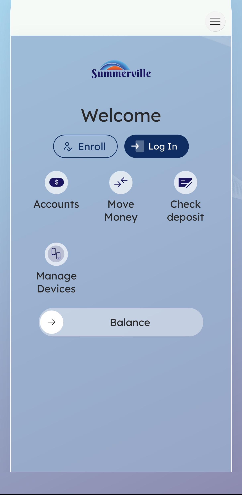
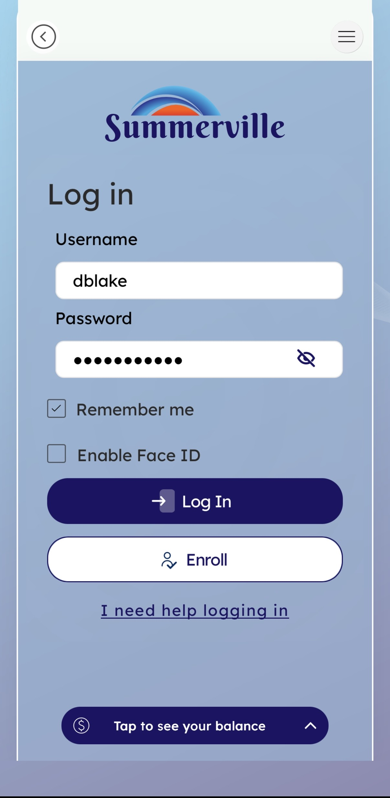
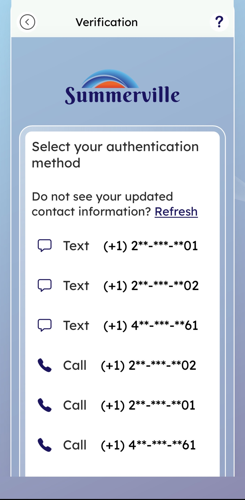
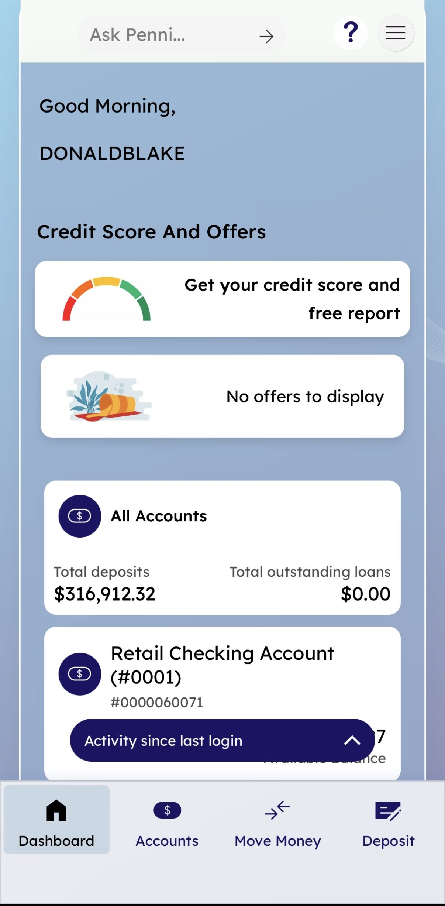
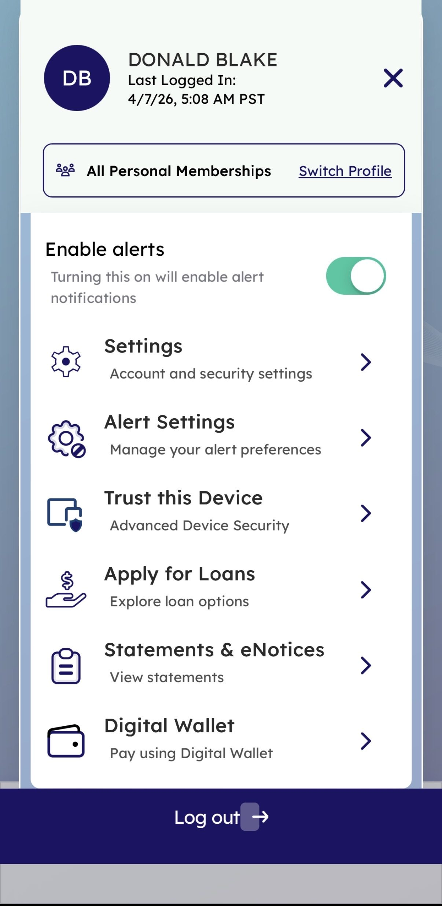
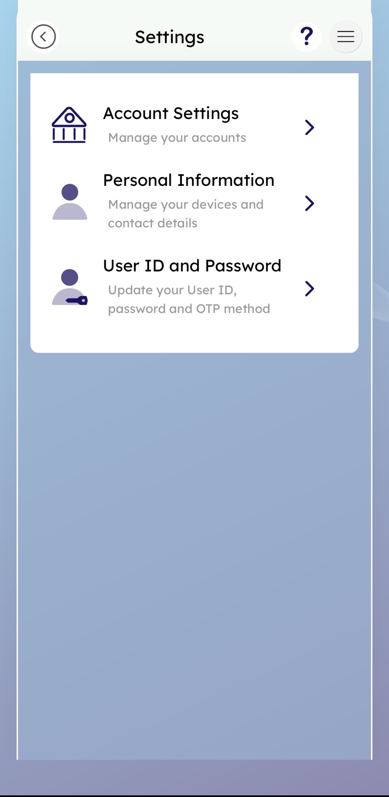
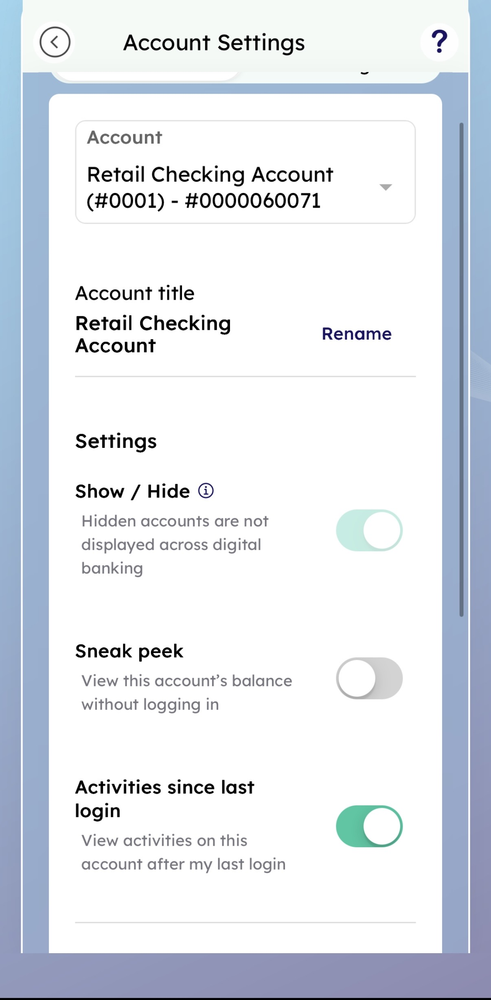
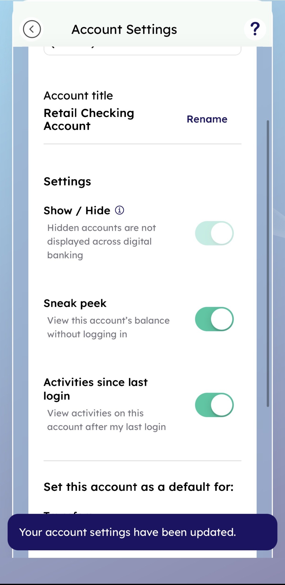

# Sneak Peek

## Summary

Sneak Peek is a convenience feature in Summerville Credit Union's nFinia mobile banking platform that allows you to view your account balance on the pre-login Welcome screen — without requiring a full username/password/OTP authentication session. You opt in per account through Account Settings, and once enabled, a **Balance** widget on the Welcome screen surfaces your configured account's current balance with a single tap or swipe.

The feature serves enrolled retail members who frequently check their balance without needing to conduct a transaction — a common behavior pattern among mobile banking users. Rather than requiring a full multi-factor authentication session for a read-only balance inquiry, Sneak Peek delivers just enough information to answer "How much do I have?" while keeping your full account access securely behind the login wall. The feature is per-account and opt-in only, meaning no account balance is ever exposed without your explicit decision.

Sneak Peek reduces unnecessary authentication events, lowers the risk of credential fatigue, and improves the mobile experience for everyday banking.

**At a Glance**

| Attribute | Detail |
| ------------------ | ---------------------------------------------------------------------------- |
| Feature Name | Sneak Peek |
| Module | Banking › Welcome Screen (pre-login) · Account Settings (configuration) |
| User Roles | Enrolled Retail Member |
| Access Level | Pre-login (balance view only); Account Settings requires full authentication |
| Key Actions | Enable Sneak Peek per account (toggle), View balance on Welcome screen |
| Configuration Path | Dashboard › Menu › Settings › Account Settings › Sneak Peek toggle |

## Use Cases

Members on the go open the app and tap Balance on the Welcome screen — no login required, eliminates a full authentication session for a read-only inquiry; reduces session load and friction.

Members new to the feature or existing member authenticate, navigate to Account Settings, and turn on the Sneak Peek toggle for your primary checking account, one-time setup that permanently improves the day-to-day mobile experience.

Members with multiple accounts repeat the Account Settings flow for a savings or secondary checking account, allows you to monitor multiple balances at a glance pre-login.

Members sharing a device turn off the Sneak Peek toggle in Account Settings, ensures no balance information is visible to anyone who picks up the phone before login.

Members performing a quick task tap Balance on Welcome screen, review balance, then proceed to Move Money or Check Deposit, increases pre-login feature engagement; reduces steps to action.

## Step-by-Step Guide: Enabling Sneak Peek

**Step 1 — Open the App (Welcome Screen)**

Open the Summerville mobile app. The Welcome screen is displayed with two primary actions — **Enroll** and **Log In** — along with a **Balance** widget at the bottom of the screen. The Balance widget is visible to all users but will only display account data after Sneak Peek has been configured. To configure Sneak Peek, you first need to complete a full authenticated login and navigate to Account Settings. Tap **Log In** to begin.

<figure><figcaption></figcaption></figure>

**Step 2 — Log In**

On the Log In screen, enter your registered **Username** and **Password** in the respective fields. Two optional checkboxes are displayed below the password field: **Remember me**, which saves your username for future visits, and **Enable Face ID**, which registers biometric authentication for subsequent sessions on this device. Tap the **Log In** button to proceed to the MFA verification step.

<figure><figcaption></figcaption></figure>

**Step 3 — Select MFA Verification Method**

The platform validates your credentials and prompts for step-up authentication. The **Verification** screen lists available OTP delivery methods — SMS text or voice call — tied to your registered phone numbers (displayed in masked format for security). Select your preferred method.

<figure><figcaption></figcaption></figure>

**Step 4 — Enter One-Time Passcode**

The **User Verification** screen confirms where the OTP was sent and provides an input field for the passcode. A 60-second countdown is shown before a resend is available. Enter the OTP and tap **Submit**.

<figure><figcaption></figcaption></figure>

**Step 5 — Authenticated Dashboard**

After the OTP is validated successfully, you land on the main **Dashboard**. The personalised greeting, full account balance summary, and the top navigation bar confirm that you have full authenticated access. From here, you need to navigate to Account Settings to enable Sneak Peek. Tap the hamburger menu icon in the top-right corner to open the side navigation panel.

<figure><figcaption></figcaption></figure>

**Step 6 — Open the Side Menu**

Tap the hamburger icon (≡) at the top-right of the Dashboard. The side menu slides in, displaying your name, last login time, membership context, and a list of navigation options. Scroll through the menu to find **Settings** and tap it to open the Settings hub.

<figure><figcaption></figcaption></figure>

**Step 7 — Settings Hub**

The Settings screen presents three main options: **Account Settings**, **Personal Information**, and **User ID and Password**. Each section manages a different aspect of your digital banking configuration. Tap **Account Settings** to access the per-account preferences where the Sneak Peek toggle is located.

<figure><figcaption></figcaption></figure>

**Step 8 — Account Settings: Enable Sneak Peek**

The Account Settings screen loads with your target account pre-selected — for example, Retail Checking Account #0001. The Settings panel on the right side of the screen displays several account preferences, including the **Sneak Peek** toggle, which is set to **off** by default. Tap the toggle to turn Sneak Peek **on** for this account. The toggle turns green to confirm it is active. If you have multiple accounts and want Sneak Peek on more than one, select each account in turn and repeat this step.

<figure><figcaption></figcaption></figure>

**Step 9 — Confirmation & Pre-Login Use**

A toast notification confirms: _"Your account settings have been updated."_ From this point forward, every time you open the app without logging in, tapping **Balance** on the Welcome screen will immediately display your configured account's current balance — no username, password, or OTP required. This is the primary benefit of Sneak Peek: the most frequent banking question ("how much do I have?") can be answered in a single tap, without the overhead of a full authentication session.

<figure><figcaption></figcaption></figure>

<figure><figcaption></figcaption></figure>

## Decision Points

* **Sneak Peek off (default):** Balance widget on the Welcome screen shows no data or prompts you to enable the feature
* **Sneak Peek on for one account:** Only that account's balance is surfaced pre-login; other accounts remain hidden
* **Multiple accounts with Sneak Peek on:** The Balance widget may display a summary or allow you to cycle between configured accounts
* **Disabling Sneak Peek:** Turn off the toggle in Account Settings; balance immediately stops appearing pre-login on next app open
* **Show/Hide toggle also off:** If an account is hidden (Show/Hide = off), Sneak Peek for that account will not function regardless of toggle state

## Error Handling

| Scenario | Your Experience | Recovery |
| ------------------------------------ | ----------------------------------------------------------------------------------------- | -------------------------------------------------------------------------------------- |
| Authentication failure during setup | Members cannot reach Account Settings if login fails | Resolve credentials first |
| OTP not received | Use the Retry option after the 60-second countdown, or select a different delivery method | Try again after countdown expires |
| Balance not appearing after enabling | Sneak Peek is on but balance is not visible | Check that the Show/Hide toggle for the same account is also in the "shown" (on) state |

## Welcome Screen Reference

| Field / Element | Type | Description |
| --------------- | ---------------------------------- | -------------------------------------------------------------------------------------- |
| Balance | Slide-up widget (bottom of screen) | Sneak Peek surface. Displays your configured account's balance without requiring login |
| Accounts | Shortcut icon | Pre-login access to account views |
| Move Money | Shortcut icon | Pre-login shortcut to Move Money hub |
| Check Deposit | Shortcut icon | Pre-login shortcut to mobile deposit |
| Manage Devices | Shortcut icon | Pre-login device management shortcut |
| Log In | Button (Primary) | Full authenticated login entry point |
| Enroll | Button (Secondary) | New member enrollment flow |

## Quick Reference

| Task | Navigation Path | Who Can Do It | Notes |
| ------------------------------------------- | ------------------------------------------------------------------------------ | ---------------------------------- | ------------------------------------------------------- |
| Enable Sneak Peek for an account | Log In › Dashboard › Menu › Settings › Account Settings › Sneak Peek toggle ON | You (authenticated) | Per-account setting; must be done once per account |
| View balance without logging in | Open app › Welcome Screen › Tap **Balance** widget | Any member with Sneak Peek enabled | No authentication required; balance is read-only |
| Disable Sneak Peek | Dashboard › Menu › Settings › Account Settings › Sneak Peek toggle OFF | You (authenticated) | Balance immediately stops appearing pre-login |
| Enable Sneak Peek for a second account | Repeat Account Settings flow, select second account | You (authenticated) | Each account is configured independently |
| Rename an account shown via Sneak Peek | Account Settings › Rename | You (authenticated) | The friendly name appears in the Balance widget |
| Ensure Sneak Peek is working (troubleshoot) | Check Account Settings: Show/Hide must be ON, Sneak Peek must be ON | You (authenticated) | Both toggles must be active for the feature to function |
