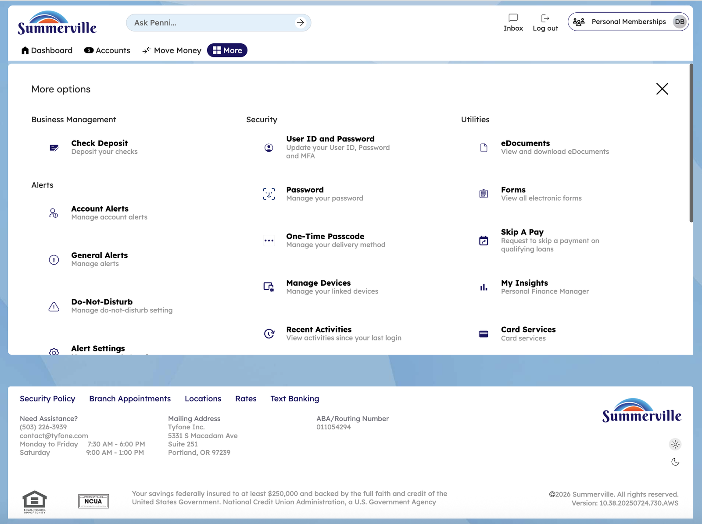
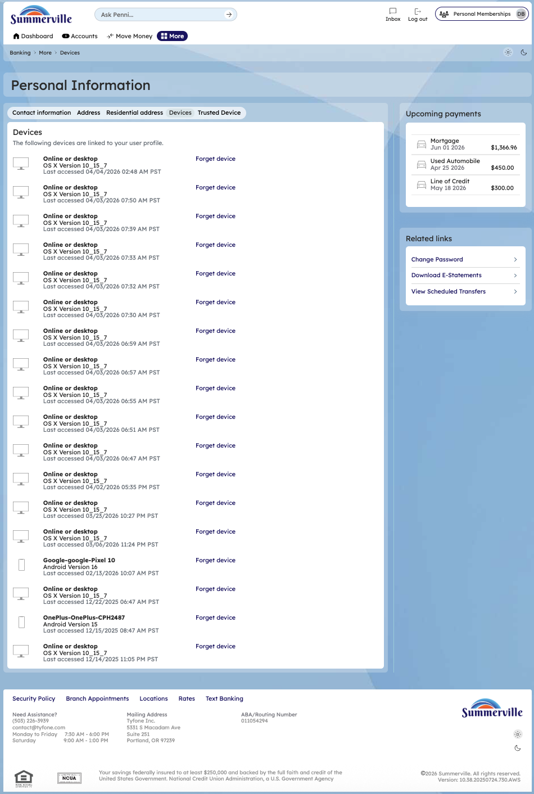
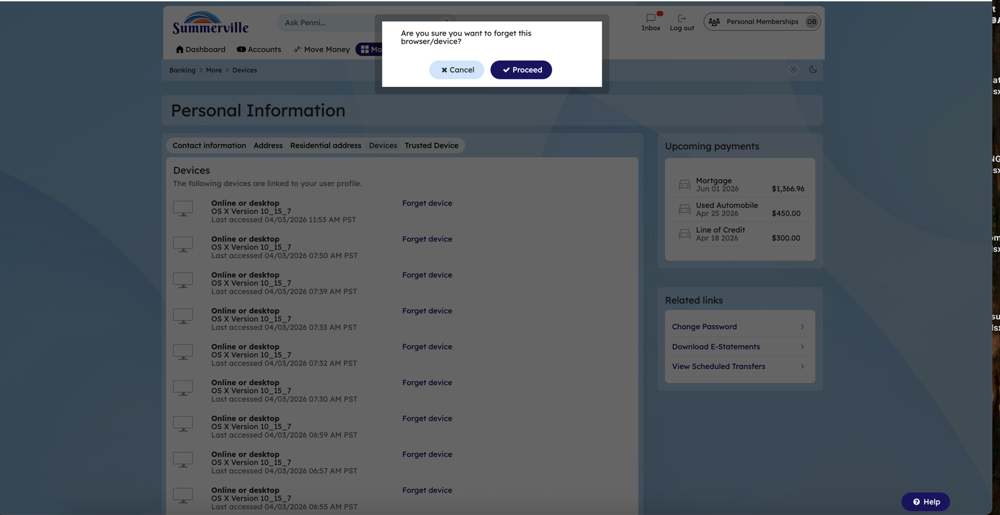

# Device Management & Trusted Devices

## Summary

Device Management allows members to view, manage, and revoke all devices that have been registered as trusted — browsers and mobile devices that have been granted permission to skip the OTP step at login. For business members who access digital banking from multiple devices, or for members who need to revoke a device after disposing of hardware or suspecting unauthorised access, Device Management is the security control that governs which devices can bypass multi-factor authentication.

## Key Use Cases

Business members who replace a laptop or smartphone revoke the old device from the trusted device list immediately, preventing the discarded hardware from being used to access the business banking account with only a username and password. Members who notice an unfamiliar device in the trusted device list — indicating that their credentials may have been used on an unrecognised machine — remove the suspicious entry and change their password as an immediate security response. Operations staff conducting periodic security reviews of a business account audit the trusted device list to confirm that only current, authorised devices retain trusted status, removing any entries that correspond to former employees or retired hardware.

## Step-by-Step Guide

**Step 1 — Start from Dashboard**

You begin at the Dashboard after logging in. The Dashboard displays all account balances, upcoming payments, quick-action tiles, and the top navigation bar with links to Accounts, Move Money, and More.

<figure><figcaption></figcaption></figure>

**Step 2 — Open the More Menu**

Click 'More' in the top navigation bar. The More options panel expands to show additional features: Check Deposit, User ID and Password, eDocuments, Account Alerts, General Alerts, Password, Forms, One-Time Passcode, Skip A Pay, Do-Not-Disturb, Manage Devices, My Insights, Alert Settings, Recent Activities, and Card Services.

<figure><figcaption></figcaption></figure>

**Step 3 — Navigate from Dashboard to Devices**

The Account Overview page shows a detailed list of registered devices with columns for device type, date registered, and action buttons for managing each device.

<figure><figcaption></figcaption></figure>

**Step 4 — Review Device Details**

The Personal Information page displays a comprehensive list of registered devices, each with a 'Forget Device' button for removing the device from your trusted device list.

<figure><figcaption></figcaption></figure>

**Step 5 — Remove a Trusted Device**

A confirmation modal asks 'Are you sure you want to forget this device?' with Cancel and Proceed buttons for you to confirm or cancel the device removal.

<figure><figcaption></figcaption></figure>
