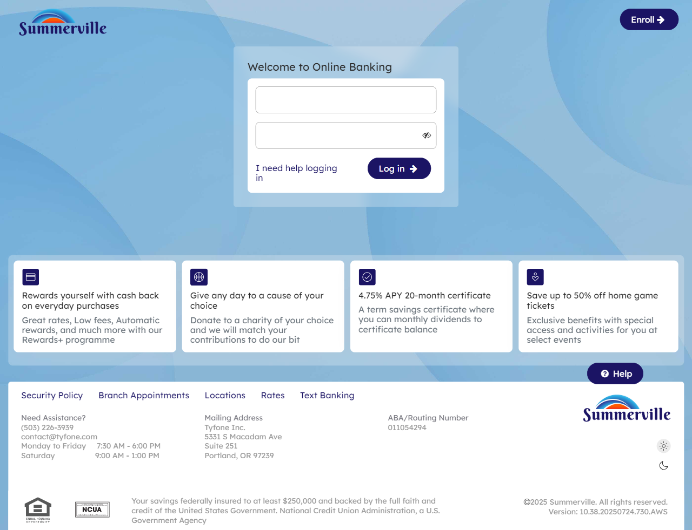
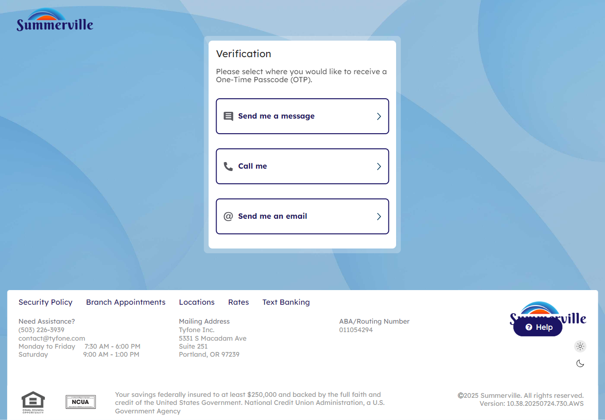
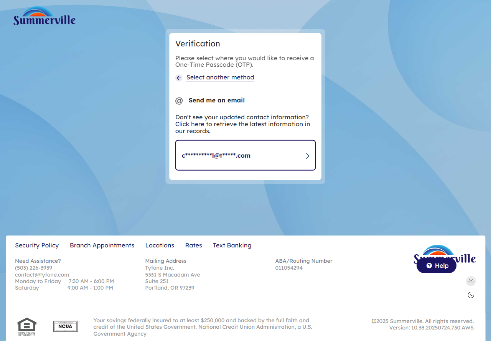
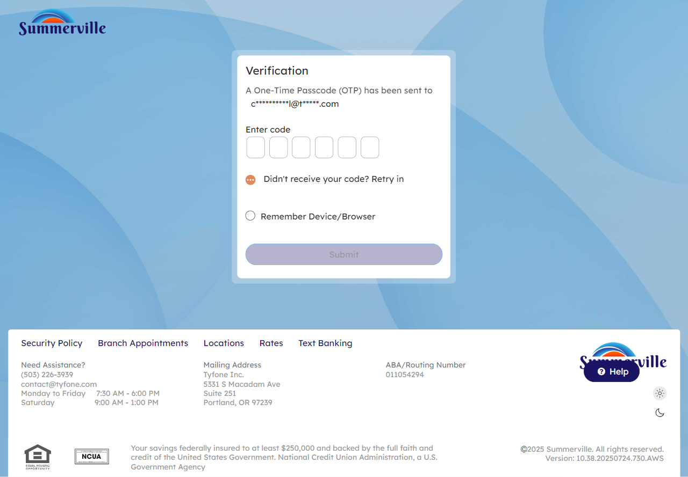
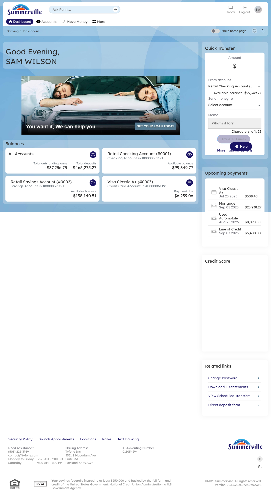

# Login & Authentication

## Summary

The Login & Authentication module is the security gateway to the digital banking platform. Every session begins here — it is the single point of identity verification before any account data, transaction capability, or self-service function is accessible. The authentication flow employs a multi-layer design: the member supplies a registered username and password, then completes a one-time passcode (OTP) challenge delivered to a pre-registered email or mobile number. After successful verification, the member lands on the Dashboard with full access to all banking features. Biometric login (Touch ID / Face ID) is available on supported devices for returning members. Self-service recovery options (Forgot User ID, Forgot Password, Unlock Account) are accessible from the login screen and documented separately.

## Key Use Cases

- Sign in to digital banking with username, password, and OTP verification
- Select OTP delivery method (text message, phone call, or email)
- Complete first-time login and establish an authenticated session
- Enable biometric login (Touch ID / Face ID) on a trusted device
- Access self-service recovery options from the login screen

## End-to-End Workflow

**Step 1: Open the login screen**

The member navigates to the digital banking URL. The login page loads, displaying a welcome modal with the User ID and Password input fields and a "Log in" button. Links to self-service recovery options (Forgot User ID, Forgot Password, Unlock Account) appear below the login form.

<figure><figcaption></figcaption></figure>

**Step 2: Enter credentials and click Log In**

The member enters their registered User ID and password into the respective fields and clicks "Log in" to begin the authentication process. The system validates the credentials and proceeds to the OTP verification step.

<figure><figcaption></figcaption></figure>

**Step 3: Select OTP delivery method**

The Verification screen appears, offering three OTP delivery options: "Send me a text message," "Call me," and "Send me an email." The member selects their preferred method to receive the one-time passcode.

<figure><figcaption></figcaption></figure>

**Step 4: Confirm email address (if email chosen)**

If the member selected email delivery, the screen displays the "Send me an email" option with an input field to confirm or select the registered email address for receiving the verification code. The member confirms and proceeds.

<figure><figcaption></figcaption></figure>

**Step 5: Enter OTP code**

A verification code entry form appears with an "Enter code" text field. The member enters the one-time passcode received via their chosen delivery method. A "Didn't receive your code? Resend" link is available below the input if the member needs the OTP re-sent.

<figure><figcaption></figcaption></figure>

**Step 6: Arrive at the Dashboard**

The Dashboard loads successfully after authentication. The screen greets the member by name and displays account balances, a quick transfer widget, upcoming payments, and promotional messaging. The member now has full access to all digital banking features.

<figure><figcaption></figcaption></figure>
