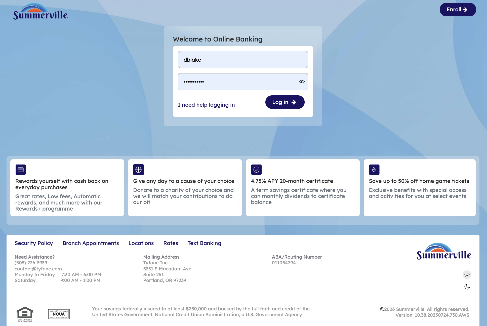
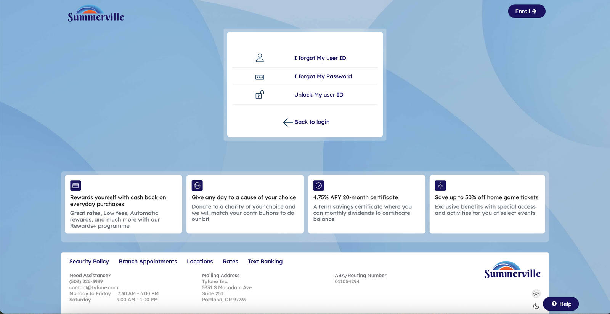
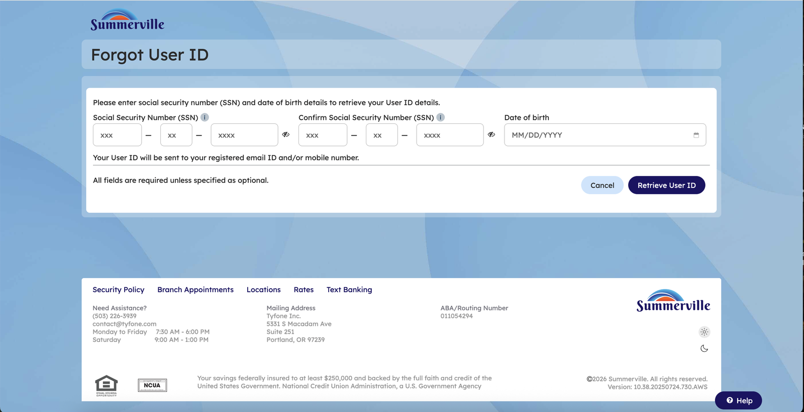
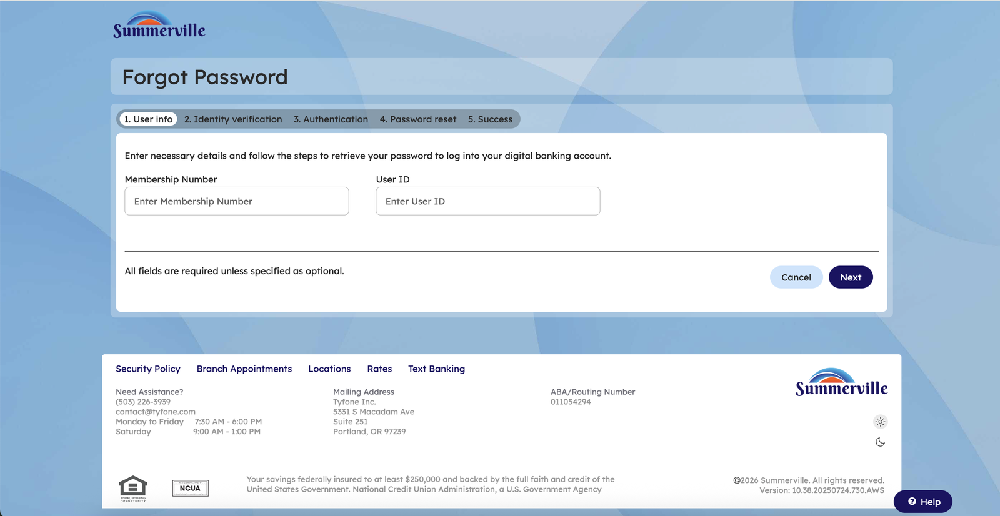
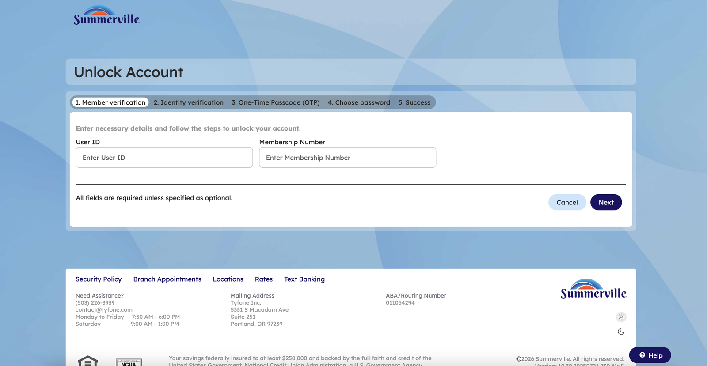

# Forgot Username, Password & Unlock Account

## Summary

The self-service recovery page provides three account recovery workflows accessible from the login screen: Forgot User ID, Forgot Password, and Unlock Account. Each workflow guides the member through identity verification steps before restoring access. Forgot User ID retrieves the member's username and sends it to their registered email or mobile number after SSN and date of birth verification. Forgot Password walks the member through a five-step wizard to verify identity and set a new password. Unlock Account follows a similar five-step wizard to restore access for members locked out after multiple failed login attempts. All three options are available without an active session, ensuring members can regain access independently without contacting the credit union.

## Key Use Cases

* Recover a forgotten User ID by verifying SSN and date of birth
* Reset a forgotten password through a guided five-step verification wizard
* Unlock an account after being locked out due to multiple failed login attempts
* Regain access to digital banking without calling or visiting a branch
* Self-service credential recovery available 24/7 from the login screen

## End-to-End Workflow

**Step 1: Click "I need help logging in" on the login page**

The member opens the digital banking login page. Below the User ID and Password fields, a link labeled "I need help logging in" is displayed. The member clicks this link to access the self-service recovery options. The system navigates to the recovery page where the member can choose from three recovery workflows.

<figure><figcaption></figcaption></figure>

**Step 2: Choose a recovery option**

The self-service recovery page loads, displaying three options: "I forgot My User ID," "I forgot My Password," and "Unlock My User ID." Each option is presented with an icon. A "Back to login" link at the bottom returns the member to the main login screen. The member clicks the option that matches their need.

<figure><figcaption></figcaption></figure>

**Step 3: Forgot User ID - enter SSN and date of birth**

The member clicks "I forgot My User ID." The Forgot User ID form loads, prompting the member to enter their Social Security Number (SSN) in two matching fields for confirmation and their Date of Birth. A note on the page states the User ID will be sent to the member's registered email and/or mobile number. The member fills in the fields and clicks "Retrieve User ID" to submit. The system verifies the information and delivers the User ID to the registered contact method. The member can then return to the login page and sign in.

<figure><figcaption></figcaption></figure>

**Step 4: Forgot Password - begin the five-step reset wizard**

The member clicks "I forgot My Password" from the recovery page. The Forgot Password flow opens at Step 1 (User info) of a five-step wizard: User info, Identity verification, Authentication, Password reset, and Success. The member enters their Membership Number and User ID, then clicks "Next" to proceed through identity verification, OTP authentication, and finally sets a new password. On the Success step, the member is returned to the login screen to sign in with the new password.

<figure><figcaption></figcaption></figure>

**Step 5: Unlock Account - begin the five-step unlock wizard**

The member clicks "Unlock My User ID" from the recovery page. The Unlock Account flow opens at Step 1 (Member verification) of a five-step wizard: Member verification, Identity verification, One-Time Passcode (OTP), Choose password, and Success. The member enters their User ID and Membership Number, then clicks "Next" to proceed through identity verification and OTP authentication. On the Choose password step, the member sets a new password. On the Success step, the account is unlocked and the member is returned to the login screen to sign in.

<figure><figcaption></figcaption></figure>
