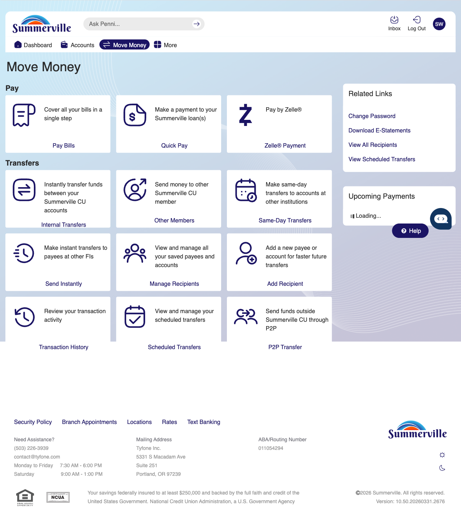

# Bill Pay

> **Module:** Banking › Move Money → Bill Pay

## Summary

Bill Pay is an integrated payment service within the nFinia Move Money suite that enables You to pay bills — utilities, insurance, credit cards, subscriptions, and other recurring obligations — directly from their Summerville CU account without leaving the digital banking platform. You can pay one-time bills on demand or set up recurring scheduled payments to ensure obligations are met on time every month.

The Bill Pay service is delivered through an integrated third-party provider that maintains a comprehensive payee database covering thousands of national and local billers. You can add payees manually or search the database. Electronic payments to e-pay-enabled billers arrive in 1–2 business days; check payments to non-electronic billers are mailed within 3–5 business days.

The Bill Pay module includes full history of all past payments, management of payee details (nickname, account number, delivery preference), and the ability to view pending payments and upcoming scheduled payments in one place.

**At a Glance**

| Attribute        | Detail                                                  |
| ---------------- | ------------------------------------------------------- |
| Module           | Move Money > Bill Pay                                   |
| Biller Types     | Electronic (1–2 days) and check (3–5 days)              |
| Schedules        | One-time, recurring (weekly, bi-weekly, monthly)        |
| Payee Management | Add, edit, delete payees; view/edit payment details     |
| History          | Full payment history with biller name, amount, and date |

## Key Use Cases

| Use Case                 | Who Uses It                  | What They Do                                                | Business Value                                                      |
| ------------------------ | ---------------------------- | ----------------------------------------------------------- | ------------------------------------------------------------------- |
| Pay Utility Bill         | You paying monthly utilities | Add utility as payee, enter amount, select pay date, submit | Single-platform bill payment without visiting each biller's site    |
| Set Up Recurring Payment | You automating monthly bills | Create a recurring payment schedule for a payee             | Automation ensures bills never miss due dates                       |
| Add New Payee            | You adding a new biller      | Search payee database or manually enter biller details      | Builds personalised payee list for all regular obligations          |
| Review Payment History   | You reconciling payments     | Open Bill Pay > History to view all past payments           | Complete audit trail of all bill payments made through the platform |

## Step-by-Step Guide

**Step 1 — Navigate to Move Money Hub**

Click ‘Move Money' in the top navigation bar and select Pay Bills

<figure><figcaption></figcaption></figure>

**Step 3 — Navigate  to Bill Pay**

The Bill Pay screen from the vendor banking interface is displayed, showing payment options and form fields for setting up or making a bill payment.

<figure><figcaption></figcaption></figure>
