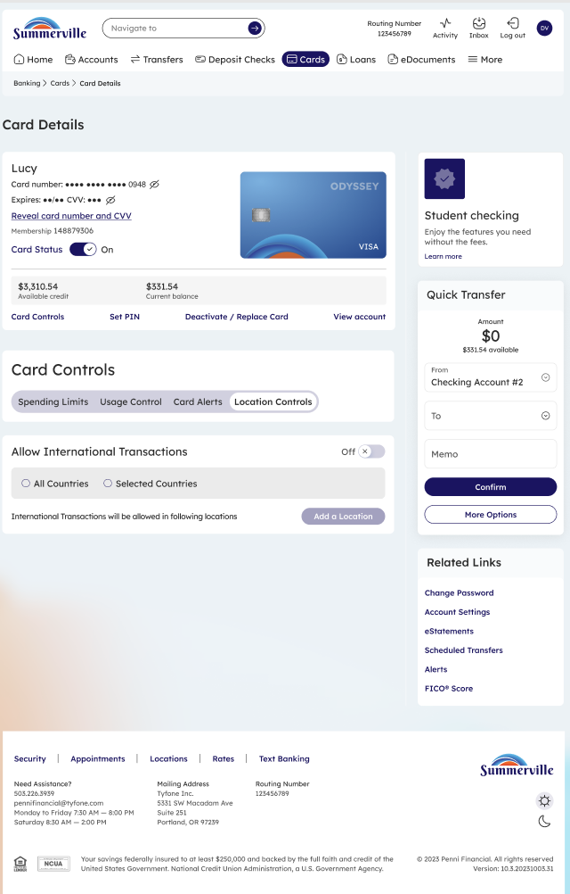
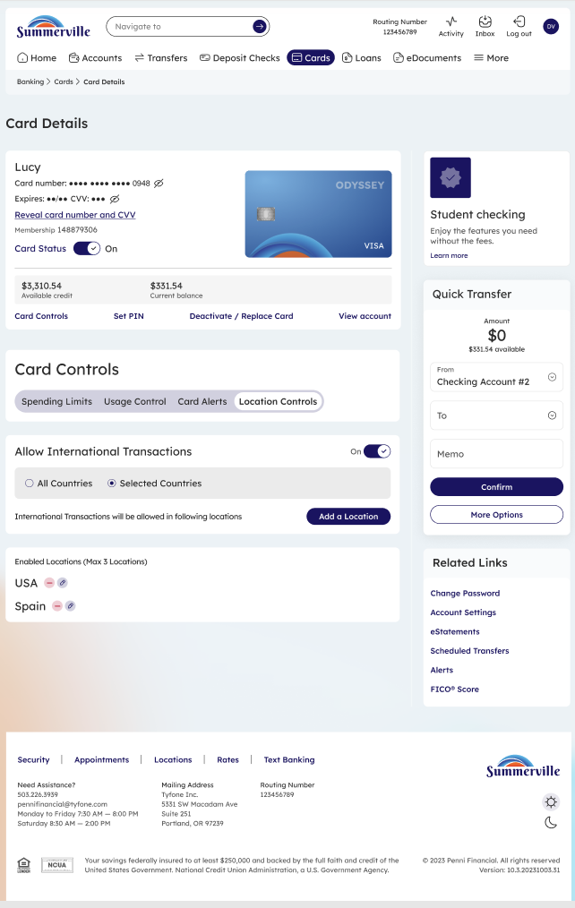
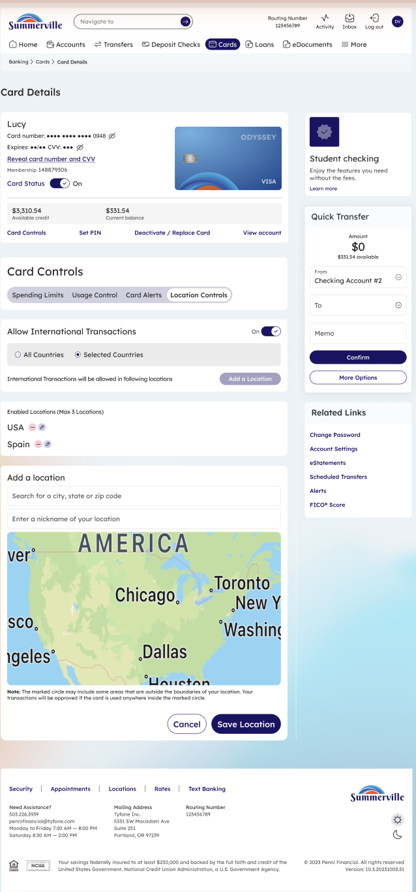

# Location Controls

_Module: Banking › Cards › Card Details › Card Controls › Location Controls_

## Summary

Location Controls allow you to restrict or permit card transactions based on geographic location. By default, international transactions are disabled. You can enable them for all countries or limit approvals to a specific set of locations you define — useful when traveling abroad or wanting to restrict card use to your home region.

When you enable location-based permissions, you can add up to 3 named locations. Each location is defined by searching for a city, state, or zip code on an interactive map. Transactions will be approved anywhere within the defined location boundaries. Locations can be named for easy identification and removed at any time.

## At a Glance

| Attribute | Detail |
| --- | --- |
| Module | Banking › Cards › Card Details › Card Controls › Location Controls |
| Default State | International transactions disabled |
| Scope Options | All Countries or Selected Countries / locations |
| Max Saved Locations | 3 locations |
| Location Search | By city, state, or zip code with interactive map |
| Related Features | Spending Limits, Card Alerts, Usage Control |

## Key Use Cases

| Use Case | Who It's For |
| --- | --- |
| **Enable card for travel** | Member traveling internationally |
| **Restrict card to home region** | Member wanting geographic fraud protection |
| **Add a new travel location** | Member planning a trip |
| **Remove a travel location** | Member returned from a trip |

## Step-by-Step Guide

_Navigation: Log in to Summerville Credit Union online banking. From the Dashboard, click Cards, select your card, click Card Controls, then select Location Controls._

### Step 1 — Open Location Controls (Default State)

From Card Details, click **Card Controls** in the quick-action row. In the Card Controls panel, select the **Location Controls** tab. By default, the **Allow International Transactions** toggle is set to **Off**, meaning card transactions are restricted to domestic use only. You will see two scope options — **All Countries** and **Selected Countries** — both inactive until you enable the toggle.

<figure><figcaption>
Step 1: Location Controls tab with international transactions turned off by default.
</figcaption></figure>

### Step 2 — Enable International Transactions

Toggle **Allow International Transactions** to **On**. Once enabled, choose your scope: select **All Countries** to allow transactions worldwide, or select **Selected Countries** to restrict transactions to specific locations you define. If you choose Selected Countries, click the **Add a Location** button to begin adding permitted locations.

<figure><figcaption>
Step 2: International transactions enabled. Choose All Countries or Selected Countries.
</figcaption></figure>

### Step 3 — Review Saved Locations

Once locations have been added, they appear in the **Enabled Locations** list below the scope selector. Each saved location — such as USA or Spain — shows its flag and can be edited or removed. Up to 3 locations can be active at once. Transactions will be approved for any use within the defined boundary of each saved location.

<figure><figcaption>
Step 3: Saved locations listed — USA and Spain are enabled. Up to 3 locations can be active.
</figcaption></figure>

### Step 4 — Add a New Location

Click **Add a Location** to open the location search panel. Enter a city, state, or zip code into the search field. The interactive map zooms to the area and displays a boundary circle — transactions will be approved for any use within that marked boundary. You can assign a nickname for easy identification. Click **Save Location** to add it, or **Cancel** to discard.

<figure><figcaption>
Step 4: Search for a location and define a geographic boundary on the interactive map.
</figcaption></figure>

> **Note:** When you are done traveling, return to Location Controls and toggle **Allow International Transactions** back to Off to restore domestic-only restrictions. Saved locations are retained so you can re-enable them for future trips without re-entering the details.
