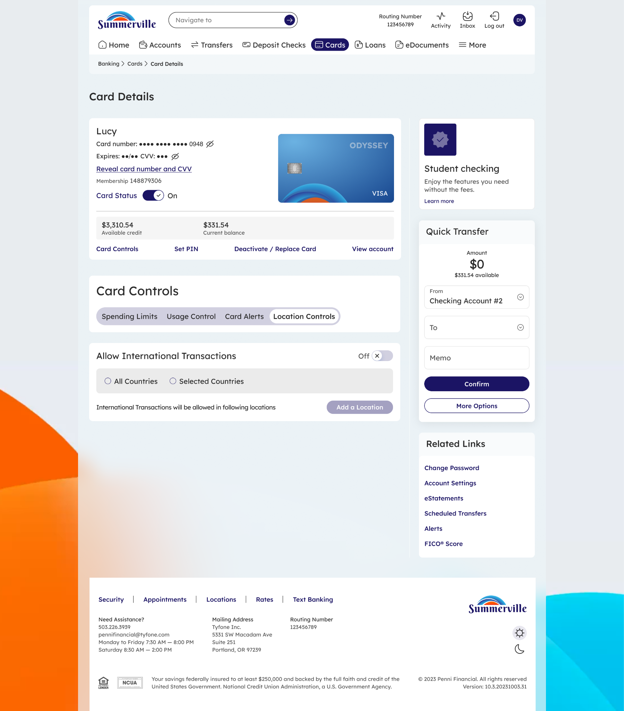

# Location Controls

_Module: Banking › Cards › Card Details › Card Controls › Location Controls_

## Summary

Location Controls allow members to restrict or permit card transactions based on geographic location, giving members a direct mechanism to prevent unauthorized international card use. By default, international transactions are disabled — cards are approved for domestic use only. Members can enable international transactions either broadly for all countries or narrowly for specific locations they define, which is particularly useful when traveling abroad or wanting to limit card acceptance to a defined home region.

When international transactions are enabled with specific locations, members can add up to three named locations. Each location is defined by searching for a city, state, or zip code on an interactive map, and the system establishes a geographic boundary around the selected area. Transactions are approved for any card use within that boundary. Saved locations can be named for quick identification and removed once travel is complete, restoring domestic-only restrictions.

## At a Glance

| Attribute | Detail |
| ------------------- | ------------------------------------------------------------------ |
| Module | Banking › Cards › Card Details › Card Controls › Location Controls |
| Default State | International transactions disabled |
| Scope Options | All Countries or Selected Countries / locations |
| Max Saved Locations | 3 locations |
| Location Search | By city, state, or zip code with interactive map |
| Related Features | Spending Limits, Card Alerts, Usage Control |

## Key Use Cases

| Use Case | Who It's For |
| -------------------------------- | ------------------------------------------ |
| **Enable card for travel** | Member traveling internationally who needs to avoid fraud-prevention declines on legitimate purchases abroad |
| **Restrict card to home region** | Member wanting geographic fraud protection by ensuring the card can only be approved within a defined local area |
| **Add a new travel location** | Member planning a trip who wants to pre-authorize card use in a specific country or region before departure |
| **Remove a travel location** | Member who has returned from a trip and wants to immediately restore domestic-only card restrictions |

## Step-by-Step Guide

_Navigation: Log in to Summerville Credit Union online banking. From the Dashboard, click Cards, select your card, click Card Controls, then select Location Controls._

### Step 1 — Open Location Controls (Default State)

<figure><figcaption></figcaption></figure>

From Card Details, click **Card Controls** in the quick-action row. In the Card Controls panel, select the **Location Controls** tab. By default, the **Allow International Transactions** toggle is set to **Off**, meaning card transactions are restricted to domestic use only. You will see two scope options — **All Countries** and **Selected Countries** — both inactive until the toggle is enabled. This default-off state protects members who do not travel internationally from card fraud originating outside the country.

<figure><figcaption></figcaption></figure>

### Step 2 — Enable International Transactions

Toggle **Allow International Transactions** to **On** to begin enabling international card use. Once enabled, choose your scope: select **All Countries** to allow transactions worldwide without geographic restrictions, or select **Selected Countries** to limit approvals to specific locations you define. If you choose Selected Countries, click the **Add a Location** button to begin specifying which regions should be permitted.

<figure><figcaption>
Step 2: International transactions enabled. Choose All Countries or Selected Countries.
</figcaption></figure>

### Step 3 — Review Saved Locations

Once locations have been added, they appear in the **Enabled Locations** list below the scope selector. Each saved location — for example, USA or Spain — displays its country flag and name, and can be edited or removed individually. Up to three locations can be active at the same time. Card transactions will be approved for any use within the geographic boundary of each saved location.

<figure><figcaption>
Step 3: Saved locations listed — USA and Spain are enabled. Up to 3 locations can be active.
</figcaption></figure>

### Step 4 — Add a New Location

Click **Add a Location** to open the location search panel. Type a city name, state, or zip code into the search field. The interactive map updates in real time to zoom to the matched area and displays a boundary circle indicating the coverage zone — transactions will be approved for any card use within that marked area. Assign a nickname to the location for easy identification later (for example, "Spain Trip" or "Business Travel — NY"). Click **Save Location** to confirm and add it to your enabled list, or **Cancel** to discard the entry without saving.

<figure><figcaption>
Step 4: Search for a location and define a geographic boundary on the interactive map.
</figcaption></figure>

> **Note:** When you return from travel, go back to Location Controls and toggle **Allow International Transactions** back to Off to immediately restore domestic-only restrictions. Your saved locations are retained in the system, so you can re-enable them for future trips without needing to re-enter the details.
