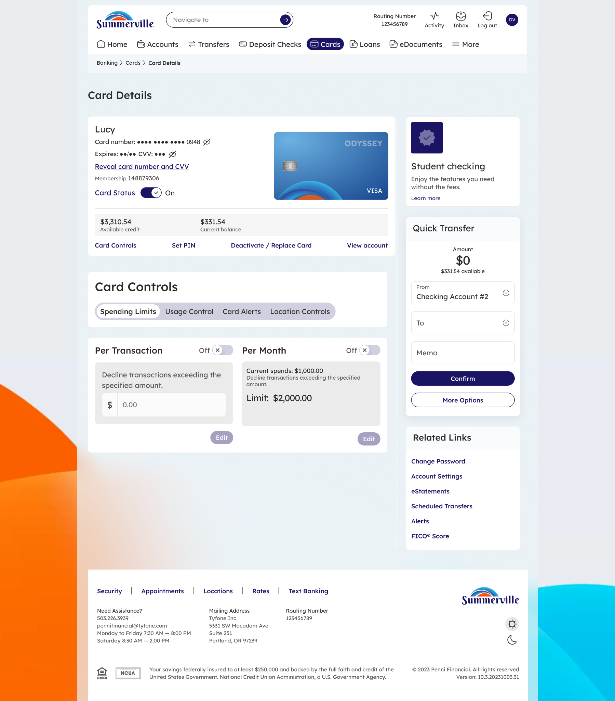

# Spending Limits

## Summary

Spending Limits allows members to set maximum dollar thresholds for card transactions — per transaction, per day, or per category — enforced in real time by the card processor. For business members issuing cards to employees or managing a card assigned to a specific cost centre, Spending Limits is the primary control for enforcing budget discipline without relying on after-the-fact expense review.

## Key Use Cases

Business members use Spending Limits to cap a company card at the monthly petty cash budget, preventing any single transaction or cumulative daily spend from exceeding the authorised amount. Members setting up a travel card for a business trip apply a per-transaction limit that matches the per diem policy, blocking any charge above the approved threshold. Operations staff reviewing card controls use Spending Limits in combination with merchant category restrictions to create tightly defined card profiles — for example, a card that can only be used at fuel stations up to $150 per transaction.

## Step-by-Step Guide

**Step 1 — Open Spending Limits from Card Controls**

From the Cards dashboard, click **Card Controls** on the relevant card and select the **Spending Limits** tab. The screen displays current limit settings for per-transaction, daily, and category-based spend, with toggle switches to enable each limit type.

<figure><figcaption></figcaption></figure>

**Step 2 — Set the Limit Type and Amount**

Enable the desired limit type — Per Transaction, Daily, or a specific category limit — and enter the maximum dollar amount. Click **Save** to apply the limit immediately; any transaction that would exceed the threshold will be declined in real time at the point of sale.

<figure><figcaption></figcaption></figure>

**Step 3 — Confirm and Monitor**

The Spending Limits screen refreshes to display the active limits alongside the card's current spend for the period. Members can return to this screen at any time to adjust, increase, or remove a limit — changes take effect immediately without requiring a new card or a credit union call.

