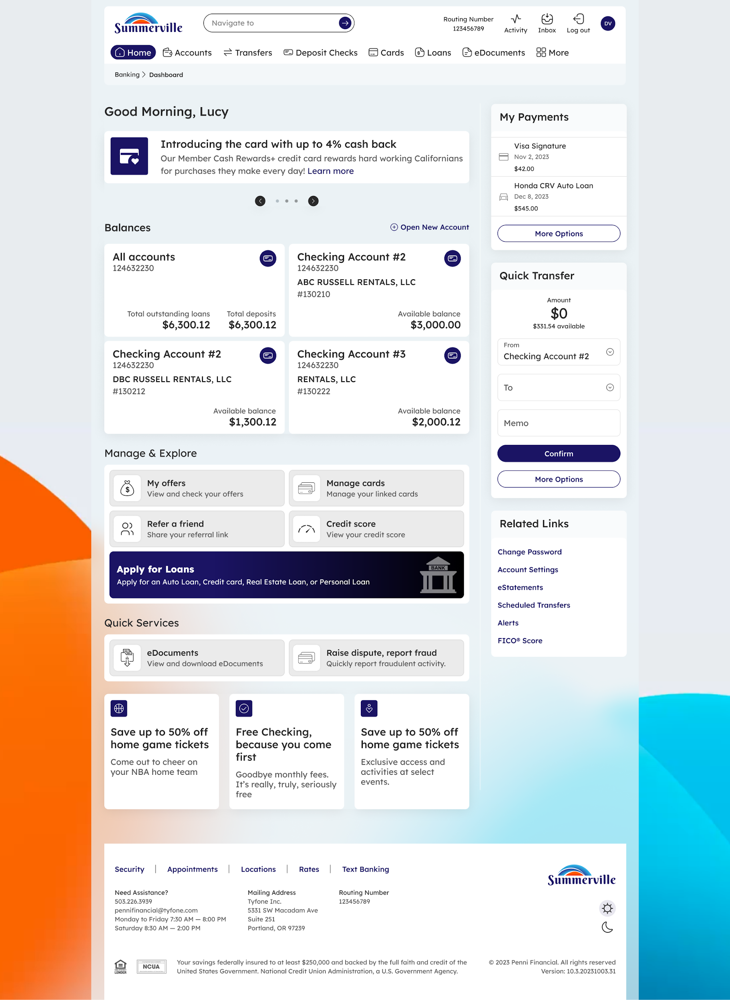
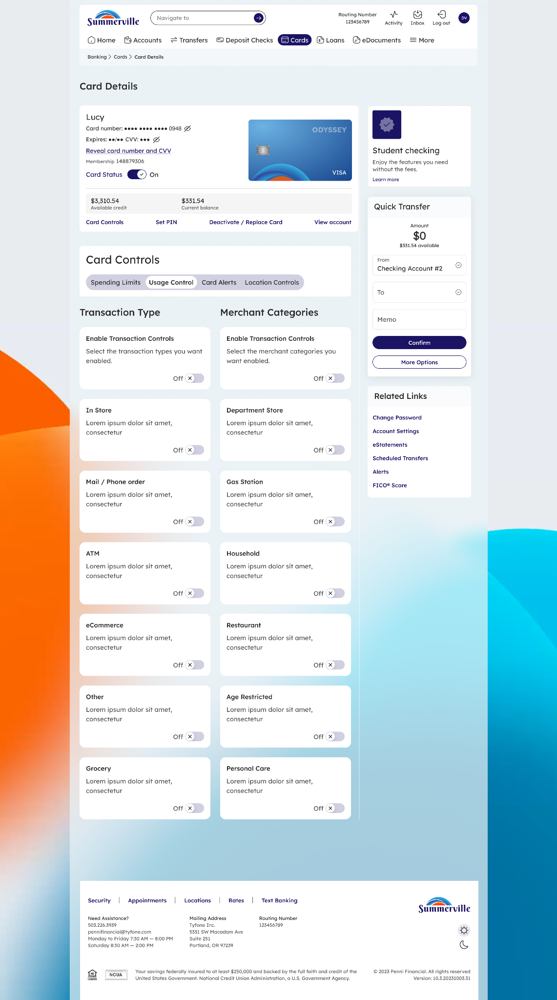

# Usage Control

_Module: Banking › Cards › Card Details › Card Controls › Usage Control_

## Summary

Usage Control gives you granular control over where and how your card can be used. You can enable or disable specific transaction types — such as In Store, ATM, Mail / Phone Order, eCommerce, and more — as well as specific merchant categories like Department Store, Gas Station, Grocery, and Restaurant.

Each transaction type and merchant category can be toggled on or off individually. When a category is disabled, transactions of that type will be declined automatically regardless of the amount or location. This is especially useful for restricting card use to specific spending scenarios or preventing misuse on specific merchant types.

## At a Glance

| Attribute           | Detail                                                                                                             |
| ------------------- | ------------------------------------------------------------------------------------------------------------------ |
| Module              | Banking › Cards › Card Details › Card Controls › Usage Control                                                     |
| Transaction Types   | In Store, ATM, Mail / Phone Order, eCommerce, Household, Restaurant, Grocery, Personal Care, Other, Age Restricted |
| Merchant Categories | Department Store, Gas Station, and more                                                                            |
| Toggle              | Each type and category is controlled independently                                                                 |
| Effect              | Declined transactions for any disabled type or category                                                            |
| Related Features    | Spending Limits, Location Controls, Card Alerts                                                                    |

## Key Use Cases

| Use Case                      | Who It's For                                   |
| ----------------------------- | ---------------------------------------------- |
| **Block online purchases**    | Member wanting to prevent eCommerce fraud      |
| **Restrict ATM withdrawals**  | Member who only uses card for purchases        |
| **Limit merchant categories** | Member managing a household budget             |
| **Re-enable a category**      | Member who needs to restore a transaction type |

## Step-by-Step Guide

_Navigation: Log in to Summerville Credit Union online banking. From the Dashboard, click Cards, select your card, click Card Controls, then select Usage Control._

### Step 1 — Arrive at the Dashboard

After logging in, you land on the Dashboard. Click Cards in the top navigation, select your card, then open Card Controls from the Card Details page.

<figure><figcaption></figcaption></figure>

_Step 1: Dashboard — click Cards to begin._

### Step 2 — Configure Transaction Types and Merchant Categories

The Usage Control tab displays two columns: Transaction Type and Merchant Categories. Each item has a toggle that can be turned on or off. Disabled items show an Off indicator. Toggle any type or category to control whether your card is accepted for that use. Changes take effect immediately — no save button is needed.

<figure><figcaption></figcaption></figure>

_Step 2: Toggle transaction types and merchant categories on or off._
