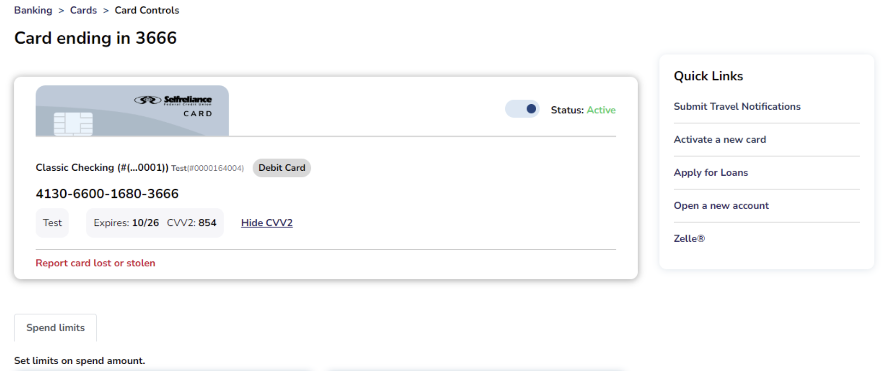

# Activate New Card

_Module: Banking › Cards › Activate New Card_

## Summary

The Activate New Card feature lets you activate a newly issued or replacement debit or credit card directly from nFinia Digital Banking. You will need the card number, expiration date, and CVV printed on the physical card. Activation is instant — once submitted, the card is ready for use immediately.

## At a Glance

| Attribute | Detail |
| --- | --- |
| Module | Banking › Cards › Activate New Card |
| Who Can Use | All nFinia Digital Banking members with a new or replacement card |
| Required Info | Card number, expiration date, CVV |
| Activation Speed | Immediate |
| Availability | 24 / 7 — via web or mobile |

## Key Use Cases

| Use Case | Description |
| --- | --- |
| **Activate replacement card** | Activate a card received after deactivation or reissuance |
| **Activate new card** | Activate a card received after opening a new account |

## Step-by-Step Guide

_Navigation: Banking › Cards › [select card] › Card Details › Activate Card_

### Step 1 — Open the Card from the Cards Dashboard

From the Cards dashboard, locate the card you need to activate and click it to open Card Details. When a card has been deactivated, the **Deactivate / Replace Card** button on the Card Details screen is automatically replaced with an **Activate Card** button. Click **Activate Card** to begin.

<figure><figcaption>
Step 1: Open the card from the Cards dashboard. For deactivated cards, the same button now reads <strong>Activate Card</strong>.
</figcaption></figure>

### Step 2 — Enter Card Details

Select the card type (Debit Card or Credit Card) and enter the required details from your physical card: full card number, expiration date, and the last four digits or CVV as prompted. Click **Activate Card** to submit.

<figure><figcaption>
Step 2: Enter your new card details — card number, expiration, and CVV — then click Activate Card.
</figcaption></figure>

### Step 3 — Card Activated Successfully

A confirmation message appears: **"Your card has been successfully activated."** Your card is now ready for immediate use at ATMs, in-store, and online. Click **Go to Cards** to view your card details, or **Go to Dashboard** to return home.

<figure><figcaption>
Step 3: Confirmation — the card is activated and ready for use.
</figcaption></figure>

> **Note:** Once a card has been deactivated via **Deactivate / Replace Card**, the same action button on the Card Details screen changes to **Activate Card**. Use that button to activate your replacement card when it arrives.
