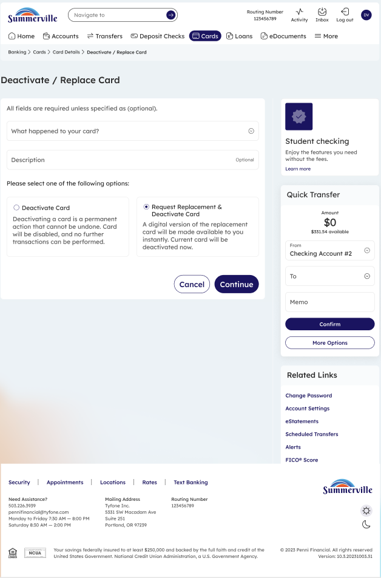
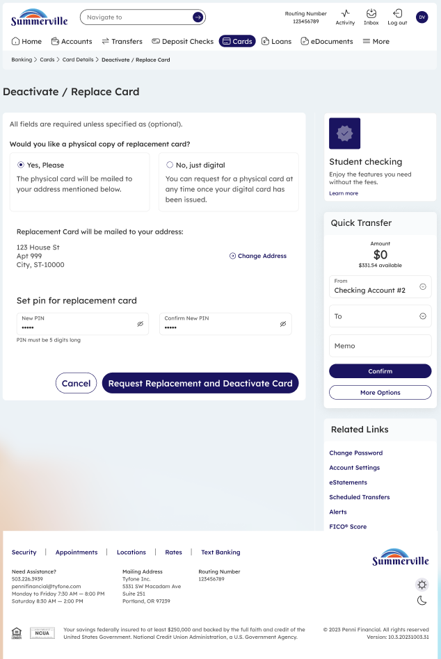
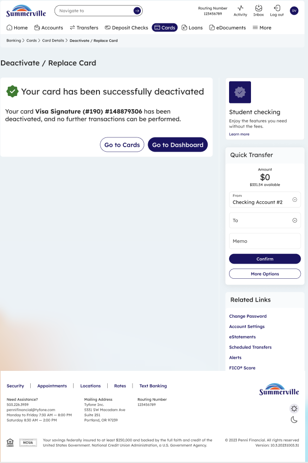

# Deactivate / Replace Card

_Module: Banking › Cards › Card Details › Deactivate / Replace Card_

## Summary

The Deactivate / Replace Card feature lets you permanently deactivate a card and optionally request a replacement — all from within nFinia Digital Banking. This is used when a card is damaged, compromised, or no longer needed. Once deactivated, the card cannot be reactivated; a replacement card with a new number will be issued and mailed to your address on file.

## At a Glance

| Attribute | Detail |
| ------------ | ---------------------------------------------------------- |
| Module | Banking › Cards › Card Details › Deactivate / Replace Card |
| Who Can Use | All nFinia Digital Banking members with an active card |
| Action | Permanently deactivates the current card |
| Replacement | Optional — request a replacement card during deactivation |
| Reversible | No — deactivation is permanent |
| Availability | 24 / 7 — via web or mobile |

## Key Use Cases

| Use Case | Description |
| ----------------------- | ------------------------------------------------------ |
| **Card is damaged** | Request a replacement for a physically damaged card |
| **Card is compromised** | Immediately deactivate a card suspected of fraud |
| **No longer needed** | Permanently disable a card that is no longer in use |
| **Replace and upgrade** | Deactivate and request a new card with updated details |

## Step-by-Step Guide

_Navigation: Banking › Cards › \[select card] › Card Details › Deactivate / Replace Card_

### Step 1 — View Card Details

From the Cards section, select the card you want to deactivate. The Card Details screen displays your card information — including card number, status, and available actions. From here, click **Deactivate / Replace Card** to begin the process. &#x20;

<figure><figcaption></figcaption></figure>

### Step 2 — Select Deactivation Options

A form appears asking you to select a reason for deactivation from the available options. Check the appropriate reason and review the implications — deactivation is permanent and the card will no longer work for any transactions.

<figure><figcaption>
Step 2: Select a reason for deactivation. You may also choose to request a replacement card.
</figcaption></figure>

### Step 3 — Confirm Replacement Details

If you have chosen to request a replacement, the next screen shows the replacement card details — including the option to set a PIN for the new card and confirm the mailing address. Review all details carefully. Click **Request Replacement and Deactivate Card** to proceed, or **Cancel** to go back.

<figure><figcaption>
Step 3: Review replacement details and confirm. Set a PIN for the new card if prompted.
</figcaption></figure>

### Step 4 — Deactivation Confirmed

A confirmation message appears: **"Your card has been successfully deactivated."** The card is now permanently disabled. If a replacement was requested, the new card will be mailed to the address shown on the confirmation screen. Click **Go to Cards** to return to your card list or **Go to Dashboard** to return home.

<figure><figcaption>
Step 4: Confirmation — the card has been deactivated and a replacement is on its way.
</figcaption></figure>

> **Note:** Once deactivated, you will need to activate the replacement card when it arrives. See the **Activate New Card** guide for instructions.
