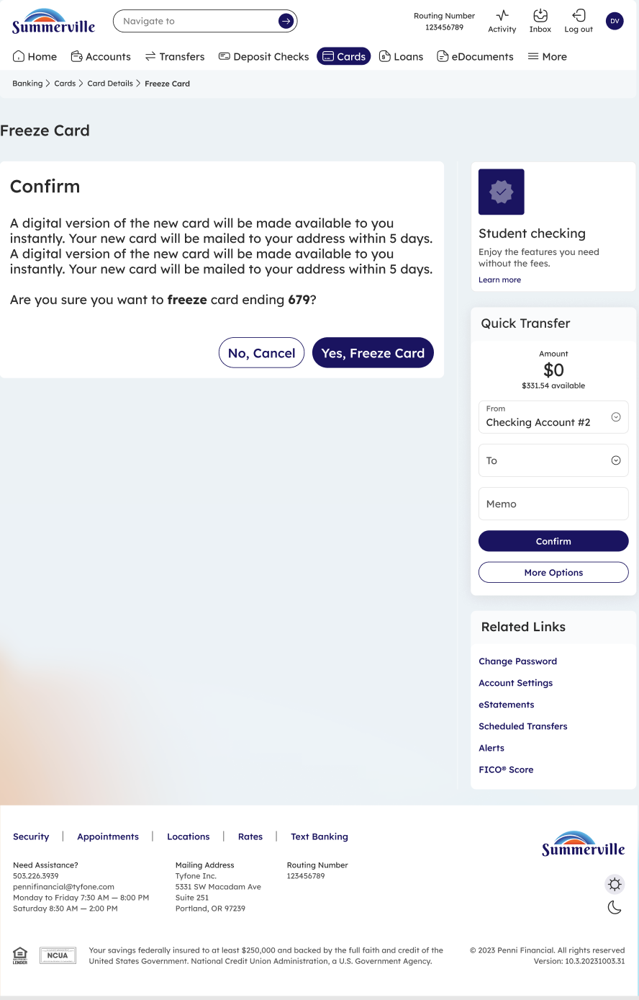

# Freeze Card

_Module: Banking › Cards › Card Details › Freeze Card_

## Summary

The Freeze Card feature lets you instantly pause a card without permanently deactivating it. A frozen card is blocked from all transactions — in-store, online, and at ATMs — until you unfreeze it. This is the fastest way to protect your card if it is temporarily misplaced or if you want to pause spending.

## At a Glance

| Attribute | Detail |
| --- | --- |
| Module | Banking › Cards › Card Details › Freeze Card |
| Who Can Use | All nFinia Digital Banking members with an active card |
| Action | Temporarily blocks all transactions on the card |
| Reversible | Yes — unfreeze at any time to resume use |
| Availability | 24 / 7 — via web or mobile |

## Key Use Cases

| Use Case | Description |
| --- | --- |
| **Card misplaced temporarily** | Freeze while searching, unfreeze once found |
| **Pause discretionary spending** | Prevent accidental charges or impulse purchases |
| **Travel gap protection** | Freeze the card between trips to reduce exposure |
| **Suspected but unconfirmed fraud** | Freeze first, investigate, then unfreeze or deactivate |

## Step-by-Step Guide

_Navigation: Banking › Cards › [select card row] › Card Status toggle → Confirm_

### Step 1 — Open the Cards Dashboard

From the top navigation, click **Cards** to open the Cards dashboard. Each card row displays a **Card Status** toggle that shows whether the card is currently **On** (active) or **Off** (frozen). Locate the card you want to freeze.

<figure><figcaption>
Step 1: Open the Cards dashboard and locate the card you want to freeze. Each row shows a Card Status toggle.
</figcaption></figure>

### Step 2 — Open Card Details and Toggle Card Status

Click the card or the **Card Controls** link to open Card Details. Toggle the **Card Status** switch from **On** to **Off**. A confirmation dialog appears explaining what will happen: while the card is frozen, it cannot be used for any transactions, and you can unfreeze it at any time. Click **Yes, Freeze Card** to proceed or **No, Cancel** to keep the card active.

<figure><figcaption>
Step 2: Review the confirmation message and click <strong>Yes, Freeze Card</strong> to freeze the card.
</figcaption></figure>

### Step 3 — Card Frozen

The Card Status toggle now shows **Off**, and the card is blocked from all transactions. To unfreeze later, return to the same toggle and switch it back to **On** — the card resumes normal operation immediately, with no reissue required.

> **Note:** Freezing is different from deactivating. A frozen card can be unfrozen at any time. A deactivated card is permanent and requires a replacement. If you suspect fraud, consider **Deactivate / Replace Card** instead.
