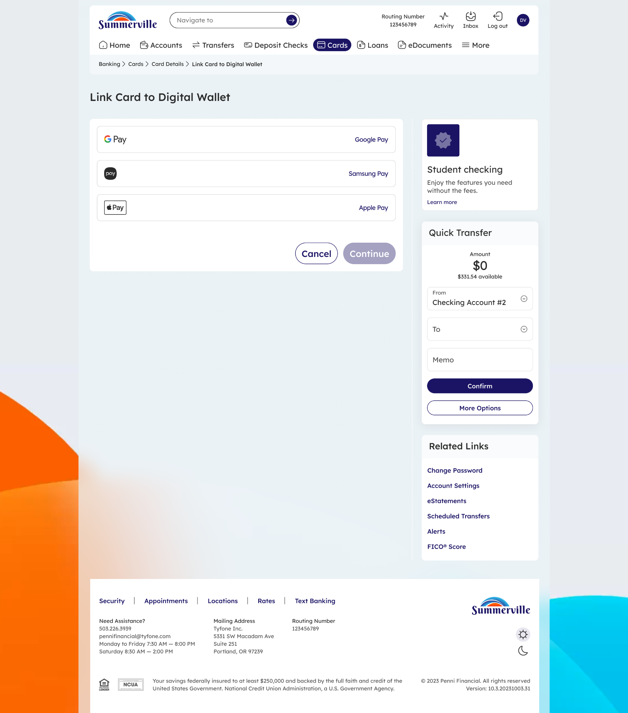

# Link Card to Digital Wallet

## Summary

Link Card to Digital Wallet enables members to provision their Summerville CU debit or credit card to Apple Pay, Google Pay, or Samsung Pay directly through nFinia Digital Banking — making the card available for contactless tap-to-pay purchases at NFC-enabled terminals, in apps, and online without entering card details. For business members who rely on their card for daily operational purchases and want to eliminate physical card dependency, digital wallet provisioning provides a more secure and convenient payment experience backed by device-level tokenisation that protects the actual card number from exposure at point of sale.

## Key Use Cases

Business members provision a company debit card to Apple Pay immediately after activation, enabling contactless vendor payments and fuel purchases without carrying the physical card — particularly useful for cards distributed to employees who need to make business purchases in the field. Members whose physical card is temporarily unavailable — worn, misplaced, or in transit after a replacement order — use a previously provisioned digital wallet token to continue making purchases uninterrupted. Members re-provision a card to their digital wallet after receiving a replacement card following fraud, updating the token with the new card number through the nFinia provisioning flow rather than through the wallet app directly.

## Step-by-Step Guide

**Step 1 — Open Card Details and Select Add to Digital Wallet**

From the Cards dashboard, click the card to be provisioned to open Card Details. Select **Add to Digital Wallet** from the card management options — the screen displays the supported wallet options (Apple Pay, Google Pay, Samsung Pay) alongside the card details.

<figure><figcaption>
Step 1: The Link Card screen showing available digital wallet options.
</figcaption></figure>

**Step 2 — Select a Wallet and Accept the Provisioning Disclaimer**

Tap the wallet to which the card should be added. A provisioning disclaimer appears confirming that limited card details — the card name, expiry, and first six and last four digits — will be shared with the wallet provider to complete the token setup. Tap **Continue** to proceed with provisioning.

<figure><figcaption>
Step 2: Review and accept the provisioning disclaimer before your card is linked.
</figcaption></figure>

**Step 3 — Complete Device-Level Wallet Setup**

The device's native wallet app takes over to complete the provisioning — for Apple Pay, select the target device (iPhone or Apple Watch), review Terms & Conditions, and confirm. For Google Pay or Samsung Pay, follow the on-screen prompts in the respective wallet app. Once confirmed, the card is immediately available for contactless transactions through the wallet.

<figure><figcaption></figcaption></figure>
