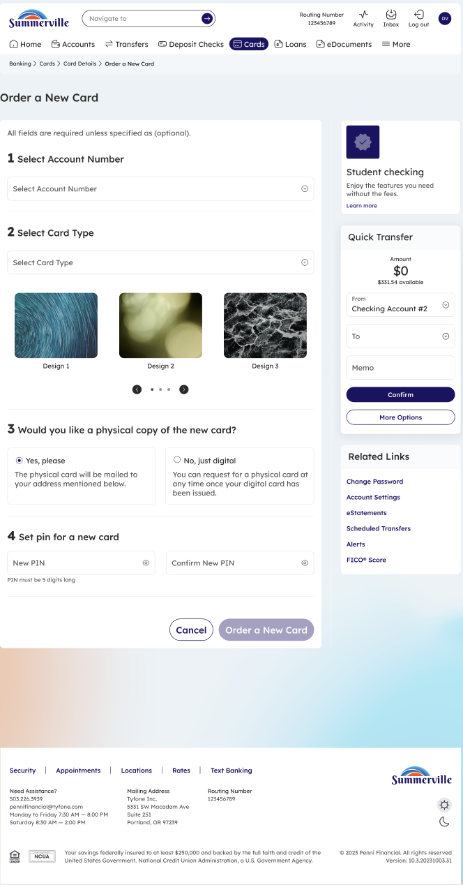
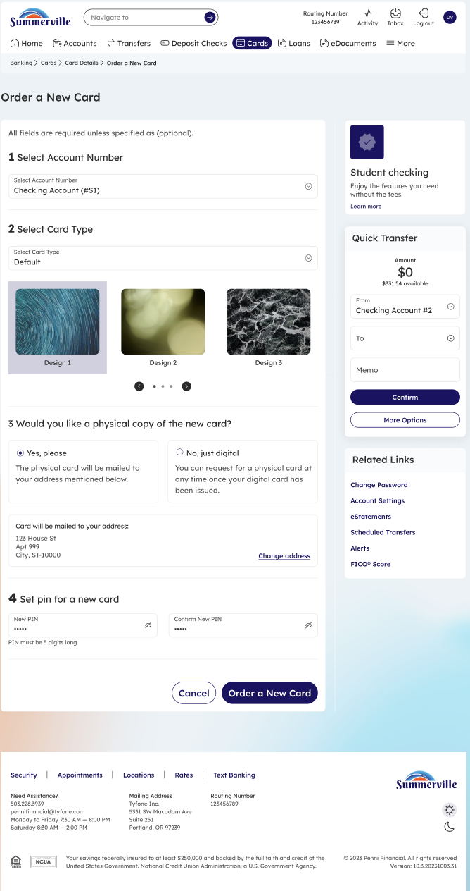
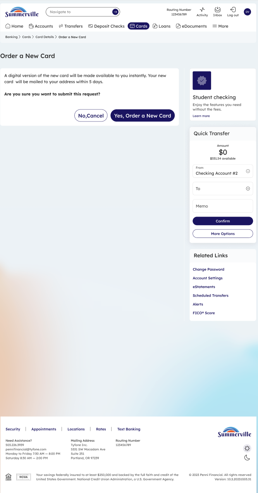
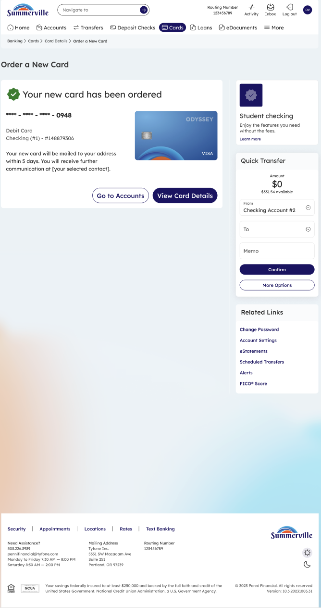

# Order New Card

## Summary

Order New Card allows members to request a new debit or credit card directly through nFinia Digital Banking — without visiting a branch or calling the credit union. For business members adding a new cardholder to a business account or replacing a card that was not the result of fraud, this self-service ordering flow initiates card production and delivery to the address on file in one session.

## Key Use Cases

Business members use Order New Card to request an additional business debit card when onboarding a new authorised user to the company account, with the card issued and mailed without requiring a branch visit. Members whose card has expired use the ordering flow to request a new card if the automatic renewal was not received, confirming the mailing address before submitting the request. Operations staff managing a business account with multiple cardholders use Order New Card to track which cards are in production and which have been delivered, keeping the card inventory current without manual record-keeping.

## Step-by-Step Guide

_Navigation: Banking › Cards › Open New Card_

### Step 1 — Open the Cards Dashboard

From the top navigation, click **Cards** to open the Cards dashboard. In the top-right of the dashboard, click **⊕ Open New Card** to start the order workflow.

<figure><figcaption>
Step 1: From the Cards dashboard, click <strong>Open New Card</strong> in the top-right corner.
</figcaption></figure>

### Step 2 — Select Account, Card Type, and Options

The Order a New Card form appears with four sections: **Select Account Number**, **Select Card Type** (choose from available card designs), **Should you like a physical copy of the new card?** (Yes / No), and **Set pin for a new card** (enter and confirm an initial PIN). Fill in each section as required.

<figure><figcaption>
Step 2: Select the account, card design, physical copy preference, and initial PIN.
</figcaption></figure>

### Step 3 — Review and Submit

Once all required fields are complete, the **Order a New Card** button becomes active. Review your selections — particularly the card design and mailing preference — then click **Order a New Card** to submit the request.

<figure><figcaption>
Step 3: Review the filled form and click <strong>Order a New Card</strong>.
</figcaption></figure>

### Step 4 — Confirm the Order

A confirmation dialog appears asking **"Are you sure you want to order a new card?"** with a summary of the order. Click **Yes, Order a New Card** to place the order or **No, Cancel** to go back and adjust your selections.

<figure><figcaption>
Step 4: Confirm the order by clicking <strong>Yes, Order a New Card</strong>.
</figcaption></figure>

### Step 5 — Order Placed

A success screen appears: **"Your new card has been ordered."** The screen shows the masked card number, the funding account, and the digital card image. Click **Go to Accounts** to return to your account list or **View Card Details** to jump directly to the new card's detail page.

<figure><figcaption>
Step 5: Order placed. The digital card is immediately available; the physical copy (if requested) arrives within ~5 business days.
</figcaption></figure>

> **Note:** If you requested a physical copy, you will need to activate the physical card once it arrives — see the **Activate New Card** guide. The digital card is usable immediately via digital wallets.
