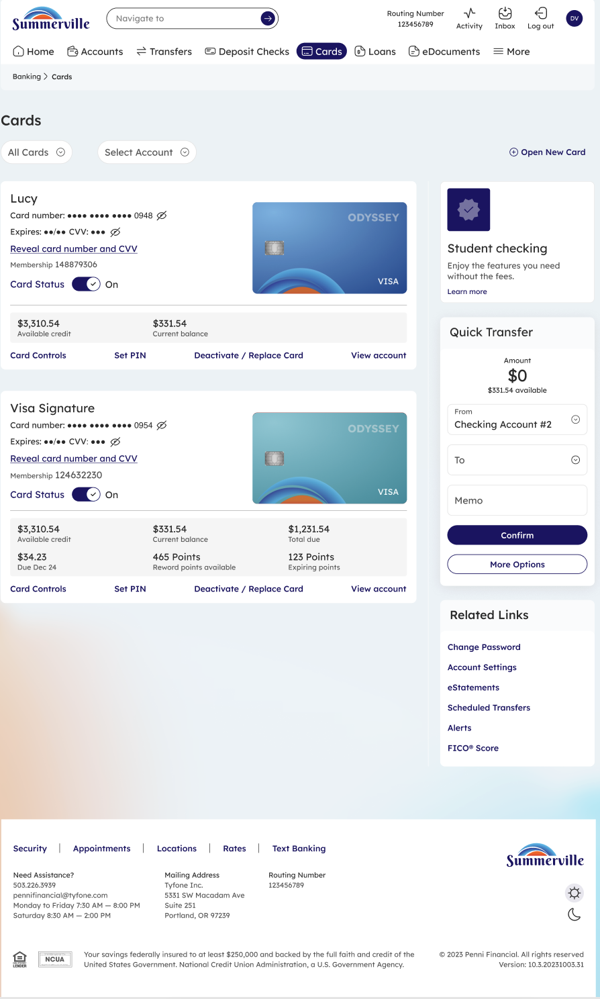
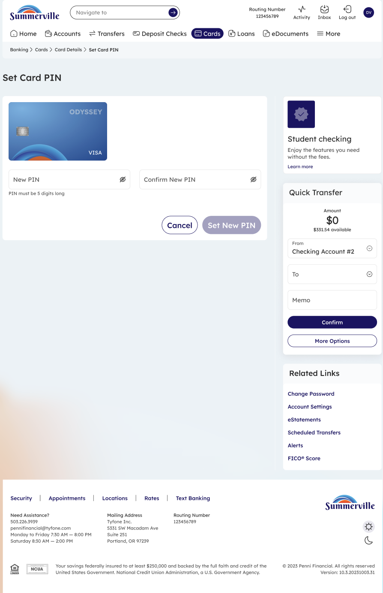
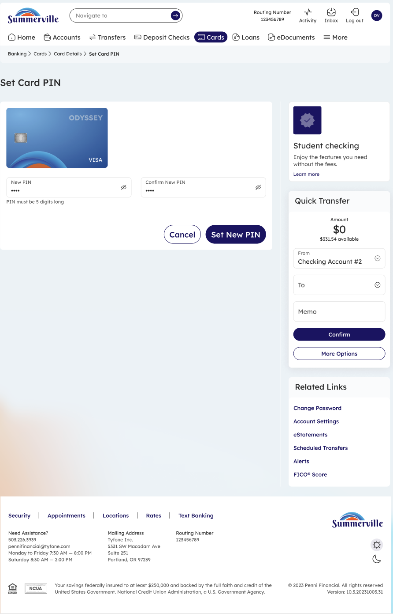

# Set Card PIN

_Module: Banking › Cards › Card Details › Set PIN_

## Summary

The Set Card PIN feature lets you create or update the Personal Identification Number (PIN) for your debit or credit card. The PIN is required for ATM withdrawals and in-store chip-and-PIN purchases. PIN changes take effect immediately and apply to both physical and digital card usage.

## At a Glance

| Attribute | Detail |
| --- | --- |
| Module | Banking › Cards › Card Details › Set PIN |
| Who Can Use | All nFinia Digital Banking members with an active card |
| PIN Format | 4-digit numeric PIN |
| Change Speed | Immediate |
| Availability | 24 / 7 — via web or mobile |

## Key Use Cases

| Use Case | Description |
| --- | --- |
| **Set PIN for a new card** | Create a PIN for a newly issued or replacement card |
| **Forgot current PIN** | Reset the PIN without calling support |
| **Routine PIN rotation** | Update the PIN periodically for security hygiene |
| **PIN compromised** | Replace the PIN immediately after suspected exposure |

## Step-by-Step Guide

_Navigation: Banking › Cards › [select card row] › Set PIN_

### Step 1 — Open the Cards Dashboard

From the top navigation, click **Cards** to open the Cards dashboard. Locate the card you want to set or change the PIN for. Click the **Set PIN** link on that card row — or open Card Details and click **Set PIN** from there.

<figure><figcaption>
Step 1: Open the Cards dashboard and click <strong>Set PIN</strong> on the card row.
</figcaption></figure>

### Step 2 — Enter New PIN

The Set Card PIN screen displays the selected card and two input fields: **New PIN** and **Confirm New PIN**. Enter your chosen 4-digit PIN in both fields. Avoid easily guessed combinations such as 1234, birth years, or repeating digits.

<figure><figcaption>
Step 2: Enter and confirm the new 4-digit PIN.
</figcaption></figure>

### Step 3 — Confirm and Save

Once both fields match, the **Set New PIN** button becomes active. Click it to save the PIN change. The PIN takes effect immediately and can be used at ATMs and chip-and-PIN terminals.

<figure><figcaption>
Step 3: With both fields filled, click <strong>Set New PIN</strong> to save.
</figcaption></figure>

> **Note:** The PIN is never displayed in plain text after it is saved. If you forget your PIN, return to this screen to set a new one — there is no "recover PIN" flow.
