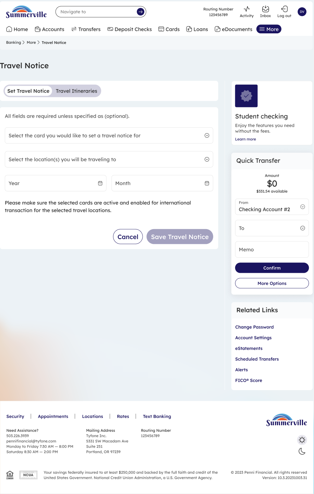
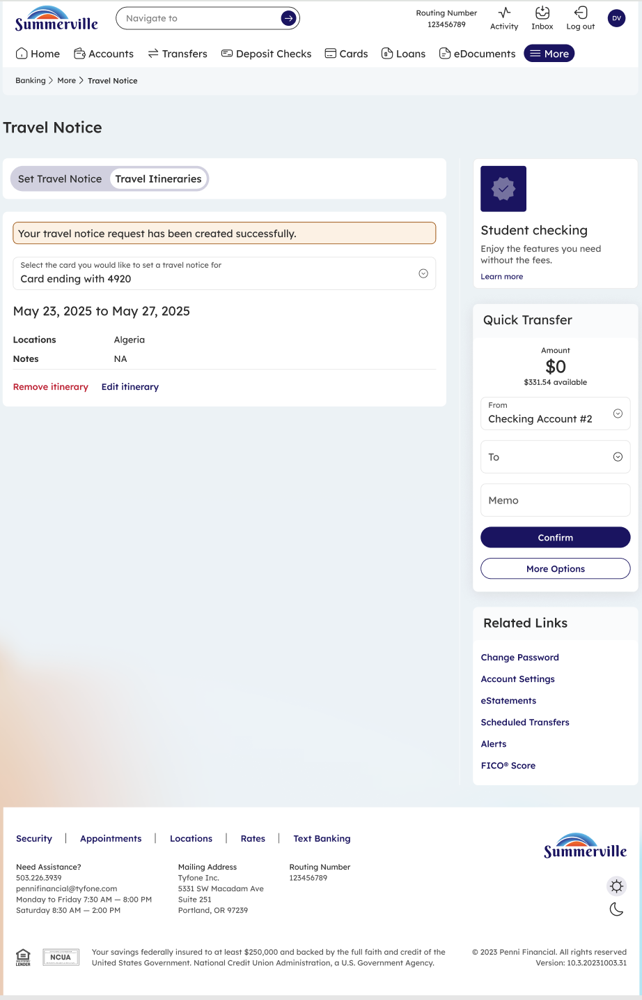

# Travel Notice

_Module: Banking › More › Travel Notice_

## Summary

The Travel Notice feature allows members to proactively notify Caltech Employees Federal Credit Union of upcoming travel so that card transactions continue to be approved while away from home. Without a travel notice, the credit union's fraud prevention systems may automatically decline international or out-of-pattern transactions as a protective measure — even when the charges are legitimate. By setting a travel notice in advance, members temporarily enable international transactions for selected cards and destinations within the defined travel window, reducing the risk of mid-trip declines.

Members can add multiple itineraries to cover back-to-back trips or multi-destination journeys, review all active notices in one place, and remove or edit itineraries once travel is complete. The feature is available around the clock through both the web portal and the nFinia mobile app, making it easy to update plans even on the go.

## At a Glance

| Attribute | Detail |
| --- | --- |
| Module | Banking › More › Travel Notice |
| Who Can Use | All nFinia Digital Banking members with an active card |
| Scope | Per-card, per-destination, per-date-range |
| Effect | Enables international transactions during the specified travel window |
| Reversible | Yes — remove or edit an itinerary at any time |
| Availability | 24 / 7 — via web or mobile |

## Key Use Cases

**International travel**: Enable card use in specific countries during a planned trip to prevent fraud blocks on legitimate purchases abroad.

**Domestic out-of-pattern travel**: Reduce friction from fraud-prevention declines when traveling to an unfamiliar domestic region.

**Multi-card trip**: Add a single travel notice covering multiple cards so all cards in your wallet are protected during the trip.

**Back-to-back trips**: Maintain multiple overlapping itineraries for consecutive travel dates without needing to remove and re-add notices.

## Step-by-Step Guide

_Navigation: Banking › Cards › (or More menu) › Travel Notice_

### Step 1 — Open the Cards Dashboard

From the top navigation, click **Cards** to open the Cards dashboard. The Travel Notice entry point is available from two places: the **Related Links** panel on the right side of the Cards dashboard, or the top **More** menu. Click **More** in the navigation bar and select **Travel Notice** to open the feature directly.

<figure><figcaption>
Step 1: From the Cards dashboard, open <strong>More</strong> and select <strong>Travel Notice</strong>.
</figcaption></figure>

### Step 2 — Enter Travel Details

The Travel Notice screen has two tabs: **Set Travel Notice** (to add a new notice) and **Travel Itineraries** (to review existing notices). On the **Set Travel Notice** tab, select the card or cards you will be traveling with, choose the destination country or region you will be visiting, and set the travel date range by selecting the start and end month and year. Once all fields are filled, click **Save Travel Notice** to submit. The notice is applied immediately to the selected cards.

<figure><figcaption>
Step 2: On the <strong>Set Travel Notice</strong> tab, select cards, locations, and dates, then click <strong>Save Travel Notice</strong>.
</figcaption></figure>

### Step 3 — Review Travel Itinerary

A success banner confirms: **"Your travel notice request has been created successfully."** Switch to the **Travel Itineraries** tab to see all active notices, including the associated card, destination, and date range. From this view, click **Remove Itinerary** to cancel a notice for a completed trip, or **Edit Itinerary** to update the dates or destinations if your travel plans change.

<figure><figcaption>
Step 3: Review active itineraries under the <strong>Travel Itineraries</strong> tab. Edit or remove a notice at any time.
</figcaption></figure>

> **Note:** A travel notice does not override other card controls. If your card has location controls enabled that restrict transactions to specific regions, the travel destination must also be on the allowed list for transactions to be approved. Review **Card Controls › Location Controls** before international travel to ensure both settings are aligned.
