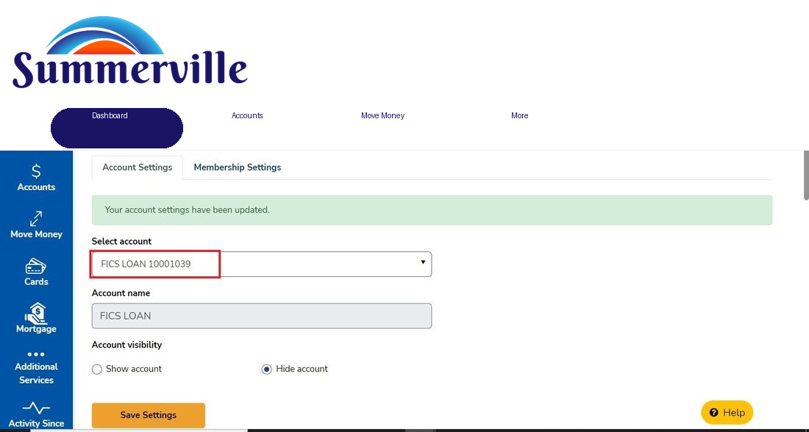

# Mortgage Balances - FICS API

***

## Summary

The **Mortgage Balances - FICS API** feature integrates nFinia's OLB (Online Banking) and Mobile Banking platforms with a credit union's FICS loan servicing system via API. It gives you direct, real-time visibility into your FICS-serviced mortgage loan accounts - without leaving the nFinia digital banking environment.

Members with active FICS mortgage loans can view loan details (property address, interest rate, payment schedule), review transaction history, monitor balance breakdowns, manage contact information on file with the servicer, request payoff quotes, access account notes, and message the credit union's mortgage department - all from within the same digital banking session they use for deposits and transfers.

For the credit union, this integration reduces inbound servicing calls by surfacing self-service mortgage data within the primary member channel. It also eliminates the friction of redirecting you to a separate mortgage servicing portal. The feature lives under **Banking > Accounts > \[FICS Loan Account]** and is also accessible from the **Mortgage** item in the More section.

| Attribute | Detail |
| ---------------- | ------------------------------------------------------------------------------------------------------------------------------------------------------------------------- |
| Feature Name | Mortgage Balances - FICS API |
| Module | Banking > Accounts > FICS Loan > Mortgage |
| Platforms | OLB (Web), Mobile Banking (iOS/Android), Mobile Browser |
| User Roles | Retail member with active FICS-serviced mortgage loan(s) |
| Key Actions | View loan details, view balances, view transaction history, edit contact info, request payoff, send secure message, access statements, initiate payment (Pay Now via SSO) |
| Integration Type | API (FICS loan servicing system) |
| SSO Dependencies | Pay Now, Paperless Statements (external redirect via SSO token) |

***

## Use Cases

| Use Case | Who Uses It | What They Do | Business Value |
| ------------------------------------------------ | -------------------------------------------- | ---------------------------------------------------------------------------------------------------------------------------------------------------- | -------------------------------------------------------------------------------- |
| View mortgage loan details | Member with active FICS mortgage | Navigates to Mortgage in sidebar or via Accounts, selects a loan, reviews property address, interest rate, payment schedule, and remaining term | Reduces inbound "what's my balance/rate?" calls to the call center |
| Make an online mortgage payment | Member with upcoming payment due | Clicks **Pay Now** on the account detail screen, acknowledges the external link warning, and completes payment in the FICS-integrated payment portal | Increases on-time payments; reduces servicing friction |
| Request payoff information | Member preparing to sell or refinance | Opens **Loan Information > Request payoff information**, selects delivery method (email/mail/fax), enters required dates, and submits | Replaces paper or phone-based payoff requests with a digital, trackable workflow |
| Update contact information on file | Member whose address or phone has changed | Navigates to **About this loan**, clicks **Edit**, updates fields, and saves | Keeps servicer records current; reduces returned mail and missed communications |
| Download transaction history or balance report | Member preparing for tax filing or refinance | Views **Transaction History** or navigates to **Balances** tab, downloads or prints the year-to-date summary | Supports member financial planning; reduces document request calls |
| Send a secure message to the mortgage department | Member with a loan servicing question | Opens the **Help** tab, types a message in "Send us a message", and submits | Provides a channel-appropriate support path without leaving the banking session |

Credit unions enabling this integration can measurably deflect mortgage servicing calls while surfacing the kind of account detail that earns member trust - especially for the increasingly common scenario where the mortgage is serviced by FICS but the primary banking relationship is with the CU.

***

## End-to-End Workflow

### Prerequisites

* Member must have an active FICS-serviced mortgage loan linked to their nFinia account.
* The credit union must have the FICS API integration configured and enabled in nFinia&#x20;
* For **Pay Now** and **Paperless Statements**, a valid SSO token configuration must be in place between nFinia and the FICS payment/document portal.
* Members with multiple FICS loans will see all linked loans in the account selector dropdown.

### Step-by-Step Flow

**Accessing the Mortgage Feature**

1. After logging in, click **Mortgage** in the More section, or navigate to **Banking > Additional Services > Mortgage**, or select a FICS loan account directly from the **Accounts** list. The platform makes a real-time API call to FICS and retrieves all mortgage accounts linked to your member profile. If you have a single loan, the platform loads that account directly. If you hold multiple FICS mortgage loans, a **Select Account** dropdown appears at the top of the screen — select the desired loan from the list to load its details.

<figure><figcaption></figcaption></figure>

2. The **Account Detail** screen loads, displaying the key loan summary data retrieved from FICS: the loan identifier, current outstanding balance, interest rate, the next payment due amount and due date, and the remaining loan term. This gives members an instant snapshot of their mortgage position without needing to call the servicer or wait for a statement.

<figure><figcaption></figcaption></figure>

3. Below the summary, the **Transactions** section lists all historical mortgage payments in chronological order. Each row shows the payment date, total amount paid, and the breakdown across principal, interest, taxes, and insurance, along with the remaining balance after that payment. Clicking any row expands a detailed transaction view that includes a **Download** button to save that individual payment record as a PDF — useful for accounting, tax documentation, or mortgage servicing inquiries.
4. Clicking **View more loan information** opens the full tabbed **Loan Information** view with five sections: **About this loan**, **Balances**, **Account notes**, **Statement and documents**, and **Help**.

<figure><figcaption></figcaption></figure>

* **About this loan** (default): Displays a full loan detail card - property address, date registered, next due payment amount and date, current interest rate (APR), payment frequency, remaining term, maturity date, a **Current payment breakdown** section (principal and interest, tax and insurance, total), and a **Contact information** section showing home phone, business phone, email address, and mailing address with an **Edit** link.
* The **Edit Contact Information** form is accessible via the Edit link within the Contact information section of About this loan. Updating this information writes directly to the FICS loan record, ensuring the mortgage servicer has current contact details for payment reminders, correspondence, and payoff notices. Available fields include First name (optional), Last name (optional), Address 1, Address 2 (optional), City/Town, State, ZIP Code, Email address, Phone number (home), Business phone (optional), and Extension (optional). Clicking **Save** submits the update to FICS and a success confirmation banner appears.

<figure><figcaption></figcaption></figure>

4. **Balances**: Displays a detailed balance breakdown pulled from FICS - Principal, Deferred principal, Tax and insurance, Subsidy, Unapplied, Unpaid late charges, Returned check charges, Loss draft, and Negative amortization. Below is a **Current year-to-date totals** section. A **Download balances year-to-date totals** link opens the browser's print dialog for you to save or print the balance report as a PDF.

<figure><figcaption></figcaption></figure>

4. **Account notes**: Displays any servicer-entered notes on the account. A search bar and date-range filter are available. Notes are displayed in chronological order with a sort option.

<figure><figcaption></figcaption></figure>

4. **Statement and documents**: Provides access to your paperless statements via SSO redirect to the FICS document portal.
5. **Help**: Displays credit union mortgage contact information (phone number, support hours, mailing address) and a **Send us a message** text area. Submitting the message delivers a secure inquiry to the credit union's mortgage team. A success confirmation banner appears after submission.

<figure><figcaption></figcaption></figure>

### Request Payoff Information

13. From the **Loan Information** screen, clicking **Request payoff information** opens a modal with the following fields:
 * **I need this information on or before** (date, required): The date by which you need the payoff quote.
 * **Estimated date of payoff** (date, required): The date by which you intends to pay off the mortgage.
 * **Send payoff information to**: Radio selection - My email (pre-filled from profile), My mailing address, or My fax number. Each selection reveals the relevant detail field.
 * **Phone number** (pre-filled, required): Your contact number.

<figure><figcaption></figcaption></figure>

13. Clicking **Submit** sends the payoff request to the FICS system. On success, a green confirmation banner "Your request for payoff information has been successfully sent." - appears on the Loan Information screen.

### Pay Now

15. On the **Account Detail** screen, clicking **Pay Now** displays an **External Link Warning** dialog informing you that you are navigating outside of nFinia to the FICS payment portal. The dialog shows a disclaimer about external site policies and offers **Cancel** and **Proceed** buttons.
16. Clicking **Proceed** initiates the SSO handoff and opens the FICS payment portal in a new browser tab, pre-authenticated via SSO token.

<figure><figcaption></figcaption></figure>

### Error Handling

* **No mortgage accounts found**: If the authenticated member has no linked FICS loans, the Mortgage page displays: _"There are no mortgage accounts."_
* **Invalid loan ID**: If the FICS API returns an error for a loan ID, you see a generic error state on the account detail page with options to go back or return to the home page.
* **Pay Now / SSO session expired**: If the SSO token has expired before you click Pay Now again, the external payment portal returns a **Login Error** screen. You should return to nFinia and retry.

***

### Account Settings - Hiding a FICS Loan

Members can control the visibility of their FICS loan accounts through **Account Settings** (accessible via the settings gear icon on the account). Accounts can be set to **Show account** or **Hide account**. Hidden accounts are suppressed from the primary Accounts view.

<figure><figcaption></figcaption></figure>

> **Note:** Hiding a FICS loan via Account Settings suppresses it from the Accounts list but should not suppress it from the Mortgage feature. Ensure the correct visibility scoping is applied at the FI configuration level.

***

## Quick Reference

| Task | Navigation Path | Platform | Notes |
| --------------------------------------- | ------------------------------------------------------------------- | ------------------- | -------------------------------------------------- |
| Access mortgage accounts | Sidebar > Mortgage **or** Banking > Additional Services > Mortgage | OLB, Mobile | Requires active FICS loan linked to member account |
| View loan details (rate, term, address) | Mortgage account > View more loan information > About this loan | OLB, Mobile | Real-time FICS data |
| Edit contact information | About this loan > Edit (Contact information section) | OLB, Mobile | Updates FICS servicer record |
| View balance breakdown | Loan information > Balances | OLB, Mobile | Includes all escrow/fee components |
| Download year-to-date balance report | Loan information > Balances > Download balances year-to-date totals | OLB | Opens print dialog; save as PDF |
| View/search account notes | Loan information > Account notes | OLB, Mobile | Notes entered by servicer |
| Request payoff information | Loan information > Request payoff information | OLB, Mobile | Delivery via email, mail, or fax |
| Make a mortgage payment | Account detail > Pay Now | OLB, Mobile | SSO redirect to FICS payment portal |
| Send message to mortgage team | Loan information > Help > Send us a message | OLB, Mobile | 249-character limit |
| Download transaction record | Account detail > Transactions > \[expand transaction] > Download | OLB, Mobile Browser | PDF per transaction |
| Access paperless statements | Loan information > Statement and documents | OLB | SSO redirect to FICS document portal |
| Hide/show a FICS loan | Account detail > Settings gear > Account Settings | OLB | Controls Accounts list visibility |
