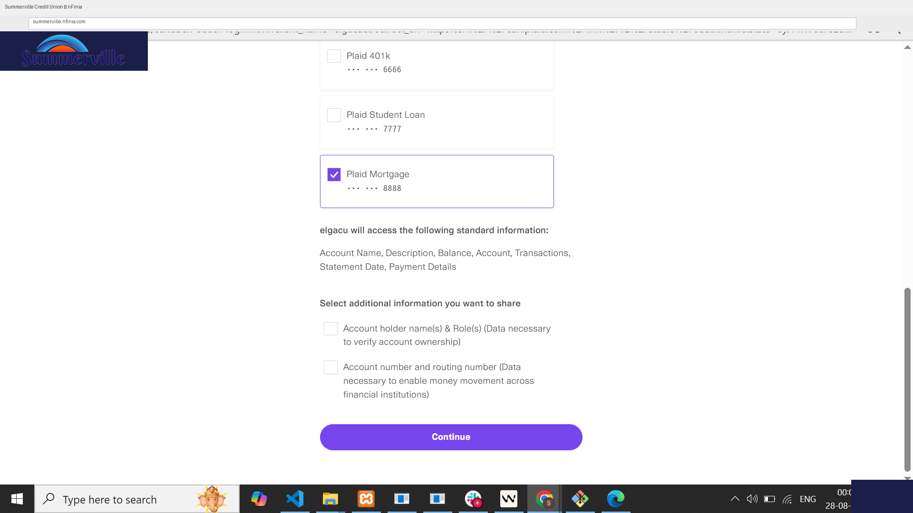
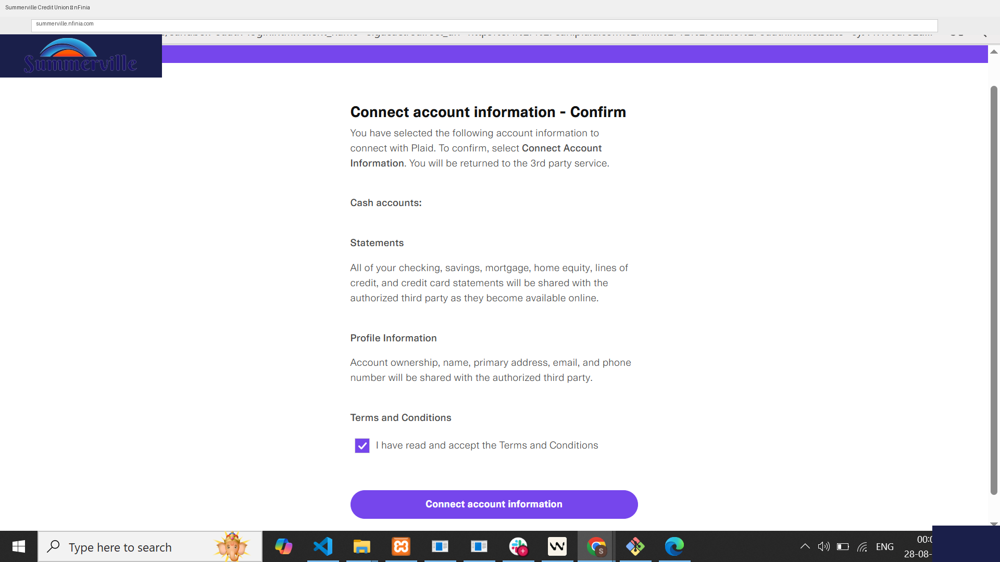
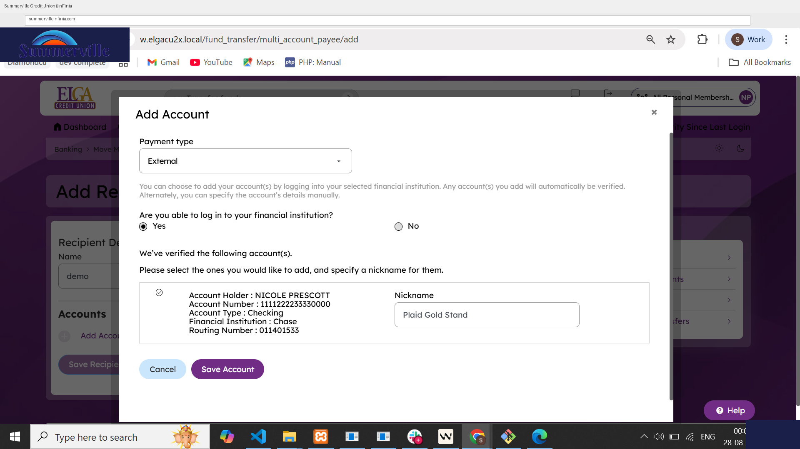

# Plaid IAV - Instant Account Verification

***

### Table of Contents

1. [Summary](plaid-iav-implementation.md#1-product-summary)
2. [Use Cases](plaid-iav-implementation.md#2-use-cases)
3. [End-to-End Workflow](plaid-iav-implementation.md#3-end-to-end-workflow)
4. [Quick Reference](plaid-iav-implementation.md#5-quick-reference)

***

### Summary

Instant Account Verification (IAV) via Plaid is a feature within the nFinia digital banking platform that allows you to verify your own external bank accounts - accounts you hold at other financial institutions - in real time, without waiting for micro-deposit confirmation. The integration leverages Plaid's Link API, enabling you to authenticate directly with their external institution through a secure, embedded OAuth flow launched from within the nFinia interface.

By eliminating the traditional micro-deposit wait period (typically 1–3 business days), IAV dramatically reduces friction in the external account onboarding journey. Once an external account is verified, you can immediately initiate ACH transfers to and from that account. This is a significant improvement for both you experience and the credit union's competitive position against digital-native challengers like Mercury and Relay, which offer instant account linking as table stakes.

**Scope & Eligibility:** In the current Plaid integration configuration, IAV is enabled for **personal/retail accounts only**. Business members use the micro-deposit flow. The feature does not permit you to verify an account owned by someone else - only your own accounts qualify. This constraint is enforced at both the configuration and UI levels.

#### At a Glance

| Attribute | Detail |
| ------------------------ | ---------------------------------------------------------------------------------------------------------- |
| **Feature Name** | Instant Account Verification (IAV) - Plaid |
| **Module** | nFinia > External Transfers > Account Verification |
| **User Roles** | Retail Member (Personal Account Holder) |
| **Access Level** | Enabled per system config; personal accounts only |
| **Key Actions** | Initiate IAV, Authenticate with external institution, Select & verify accounts, Complete ACH-ready linkage |
| **Vendor** | Plaid (via Plaid Link Web SDK) |
| **Regulatory Relevance** | Account ownership verification, BSA/AML - confirms account belongs to the authenticated member |

***

### Use Cases

Retail member onboarding a new external account initiates IAV, authenticates with their external bank via Plaid, selects the account to link — the verification is completed in real time without any micro-deposit delays - verified in under 2 minutes, eliminates 1–3 day micro-deposit wait; you can initiate ACH transfers immediately.

Member who wants to transfer funds to/from a personal account at another FI completes IAV flow to verify their external checking/savings account, then proceeds to schedule ACH transfer, increases ACH origination volume for the credit union; reduces call center contacts about pending verification.

Member who prefers not to share full banking credentials selects "Continue as Guest" during Plaid flow and proceeds through alternative credential path, preserves member choice; reduces abandonment for credential-sensitive you.

Member whose external bank requires MFA during Plaid authentication receives OTP/verification code from external bank, enters it within the Plaid Link interface, supports institutions with enhanced security; does not require additional nFinia configuration.

Member whose external bank offers multiple verification methods selects the appropriate identity verification category (e.g., SSN, email, phone) to authenticate, accommodates diverse institution requirements within a single standardized flow.

Business member attempting external account verification iAV is not presented; system routes to micro-deposit flow, maintains compliance separation between personal and business account verification pathways.

These use cases reflect the reality that credit union members hold accounts across multiple institutions and need frictionless pathways to consolidate their financial activity within nFinia. IAV via Plaid positions the credit union to retain primary financial institution (PFI) status by making it easier to aggregate external funds.

***

### End-to-End Workflow

#### Prerequisites

* Member must be enrolled in nFinia and logged in
* The Credit union must have configured the Plaid IAV integration within the nFinia system
* Member must be on a **personal/retail account** (business accounts are excluded in current config)
* Member must hold an account at an external financial institution supported by Plaid's network

#### Step-by-Step Flow

**Step 1 - Navigate to External Account Verification**

From the nFinia dashboard, navigate to the External Transfers section and select the option to add or verify an external account. The platform checks whether Instant Account Verification is enabled for your account type. For personal/retail accounts with IAV configured, the system launches the IAV entry point directly — no additional prompts or manual configuration required.

**Step 2 - IAV Prompt: "Yes" or "Continue as Guest"**

You are presented with a prompt asking whether they want to proceed with instant verification. Two options are available:

* **"Continue"** - Proceeds to the Plaid Link flow for full instant verification
* **"Continue as Guest"** - Proceeds through an alternative path (limited or deferred verification)

<figure><figcaption></figcaption></figure>

**Step 3 - Institution Search & Selection**

The Plaid Link interface loads within the nFinia session, presenting a searchable list of supported financial institutions. Type the name of your external bank — such as Bank of America, Chase, or Wells Fargo — and select it from the search results. Plaid supports the vast majority of US banks and credit unions, so most members will find their institution in the list.

<figure><figcaption></figcaption></figure>

**Step 4 - Click "Continue to Login"**

After selecting the institution, you click "Continue to Login." Plaid loads the institution-specific login interface within the embedded frame.

<figure><figcaption></figcaption></figure>

**Step 5 - Enter External Bank Credentials**

A new secure window opens displaying the external institution's login form (served by Plaid). You enter their online banking username and password, then clicks "Sign In."

<figure><figcaption></figcaption></figure>

**Step 6 - Identity Verification Category Selection** _(conditional)_ If the external institution requires identity verification, you are prompted to select a verification category - for example, Social Security Number, email address, or phone number. This step varies by institution.

<figure><figcaption></figcaption></figure>

**Step 7 - Multi-Factor Authentication / Get Code** _(conditional)_ If MFA is required, you click "Get Code." An OTP is sent to your registered contact method at the external institution. Enter the code to complete authentication.

<figure><figcaption></figcaption></figure>

**Step 8 - Account Selection**

After successful authentication, Plaid returns a list of your eligible accounts at the external institution. Select the specific account(s) you want to verify and link.

<figure><figcaption></figcaption></figure>

**Step 9 - Submit & Confirm**

Click "Continue" or "Submit." Plaid completes the verification handshake with nFinia. The external account is added as a verified, ACH-ready linked account.

<figure><figcaption></figcaption></figure>

**Step 9** - **Accounts Verified.** After the connection is confirmed, Plaid displays an overview of all accounts that have been successfully linked at the external institution. This screen serves as a confirmation that the correct accounts were selected and verified before the flow completes.

**Linked accounts overview:**

***

**Step 10 - Save Credentials & Success.**

After the account connection is finalized, Plaid may prompt you to save your external bank credentials for faster re-linking in future sessions. Clicking **Save \[Financial institution] with Plaid** stores your credentials securely within Plaid (not within nFinia). A success screen then confirms the external account is verified, linked, and immediately available for ACH transfers.

**Save credentials and success confirmation:**

***

#### Error Handling

| Scenario | Member Experience | Resolution |
| ------------------------------------------- | ------------------------------------------------------------ | ---------------------------------------- |
| Incorrect external bank credentials | Plaid displays an error within the Link frame; you can retry | Re-enter correct credentials |
| External institution not supported by Plaid | Institution not found in Plaid search | Member is directed to micro-deposit flow |
| MFA code expired or incorrect | Plaid prompts to re-request a new code | Click "Get Code" again |
| Member attempts IAV on business account | IAV option not shown; routed to micro-deposit flow | No action required - by design |
| Plaid service unavailable | Error state displayed; IAV option may be suppressed | Contact FI support; retry later |

***

### Quick Reference

| Task | Navigation Path | Who Can Do It | Notes |
| -------------------------------------- | --------------------------------------------------------------------- | -------------------------------- | ------------------------------------------------------------------------- |
| Initiate Instant Account Verification | nFinia > External Transfers > Add External Account > Verify Instantly | Retail member (personal account) | IAV must be enabled in system config; business accounts use micro-deposit |
| Search and select external institution | Plaid Link modal > Institution Search | Retail member | Powered by Plaid's institution directory |
| Authenticate with external bank | Plaid Link > Sign In | Retail member | Credentials handled entirely by Plaid - not stored in nFinia |
| Complete MFA for external bank | Plaid Link > Get Code | Retail member | Institution-dependent; triggered automatically if MFA is required |
| Select accounts to link | Plaid Link > Account Selection | Retail member | Multiple accounts may be selected if available |

***

_For implementation questions or to request changes to IAV configuration, contact your Tyfone Platform Support representative._ _Plaid integration reference:_ [_https://plaid.com/docs/link/web/_](https://plaid.com/docs/link/web/)
