# Velera — Credit Card Management

**Card Management (Credit Card)**

_Module: Banking › Cards › Card Details_

### Summary

nFinia Digital Banking provides a comprehensive suite of credit card management tools powered by the Velera (PSCU) integration. Members can view detailed card information including balances, credit limits, rewards points, and cardholder details directly from the Cards Overview. Beyond viewing, members can take action on their cards — activating a new card, locking or unlocking it, setting spend and alert thresholds, controlling where the card can be used, reporting it lost or stolen, and setting up travel notifications — all without needing to call or visit a branch.

**At a Glance**

| Feature Name             | Card Management — Credit Card (PSCU Phase 1)                                     |
| ------------------------ | -------------------------------------------------------------------------------- |
| **Module Location**      | Banking › Cards                                                                  |
| **Supported Card Types** | Full-service credit cards (PSCU/Optis), In-House Credit cards (Wilmington/Optis) |
| **Rewards Programs**     | Traditional Rewards and Cash Back Rewards (shown on card tile)                   |
| **Card Controls**        | Spend Limits, Card Alerts, Domestic Controls, International Controls             |
| **Other Features**       | Activate Card, Lock/Unlock Card, Report Lost/Stolen, Travel Notification         |
| **Channels**             | Online Banking ✓                                                                 |
| **Supported Cores**      | Correlation, Ultradata                                                           |
| **Release Version**      | 10.38                                                                            |

### Key Use Cases

| Use Case                      | Member Goal                                                     | Steps                                                                                           | Outcome                                                                                         |
| ----------------------------- | --------------------------------------------------------------- | ----------------------------------------------------------------------------------------------- | ----------------------------------------------------------------------------------------------- |
| View card details & rewards   | See balance, credit limit, card number, and rewards points      | Go to Banking › Cards; review the card tile for full card info and rewards balance              | Member has an up-to-date view of their card status and rewards without calling in               |
| Activate a new card           | Start using a newly received credit card                        | Cards › Activate a New Card; enter the card number and confirm expiry                           | Card is activated and ready for use immediately                                                 |
| Lock or unlock a card         | Temporarily prevent or resume card usage                        | Open Card Details › Card On/Off toggle; switch to Off to lock or On to unlock                   | Card is locked (no CP or CNP transactions) or re-enabled; recurring transactions are unaffected |
| Set a spend limit             | Limit how much can be charged per transaction or per month      | Card Details › Card Controls › Spend Limits; enter per-transaction and/or monthly threshold     | Transactions over the threshold are automatically declined                                      |
| Configure card alerts         | Receive notifications for specific transaction types or amounts | Card Details › Card Controls › Card Alerts; choose All, None, or Selected and set thresholds    | Member receives alerts matching their preferences                                               |
| Set domestic location control | Restrict card use to a specific geographic radius               | Card Details › Card Controls › Domestic Controls; set allowed locations or enable all locations | Card is declined outside the configured area                                                    |
| Set international control     | Block or allow in-store international transactions              | Card Details › Card Controls › International Controls; block all or specify allowed countries   | International in-store transactions blocked or allowed per member preference                    |
| Report a card lost or stolen  | Secure the account immediately after loss or theft              | Card Details › Card Controls › Report Lost/Stolen; confirm and submit                           | Card is immediately flagged; replacement process initiated                                      |
| Set a travel notification     | Prevent declined transactions while travelling internationally  | Cards › Travel Notice; add destination(s), travel dates, and optional notes                     | Card transactions are allowed in specified countries during the stated travel dates             |

### Step-by-Step Guide

\| _📍 Navigation start: Banking › Cards_ |

\| ■ Card Information & Rewards |

The Cards Overview page lists all card accounts enrolled in nFinia. Each card tile displays the account name, balance or credit limit, masked card number (last 4 digits visible), card type, cardholder name, card status, and rewards balance — all in one view.

Supported card types: Full-service credit cards (processed on PSCU/Optis) and In-House Credit (IHC) cards (processed on Wilmington or Optis). Debit cards are processed on the Wilmington platform.

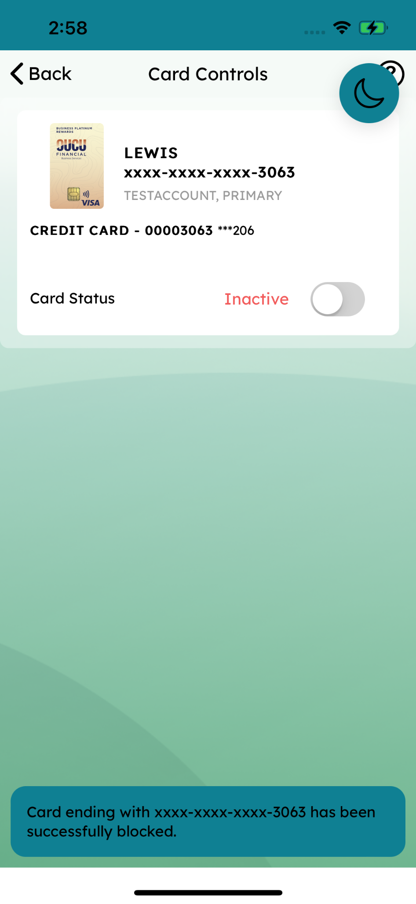

Depending on the rewards program the credit union has enrolled in, the card tile shows either Traditional Rewards points or Cash Back Rewards. The rewards balance is displayed directly on the tile for quick reference.

| 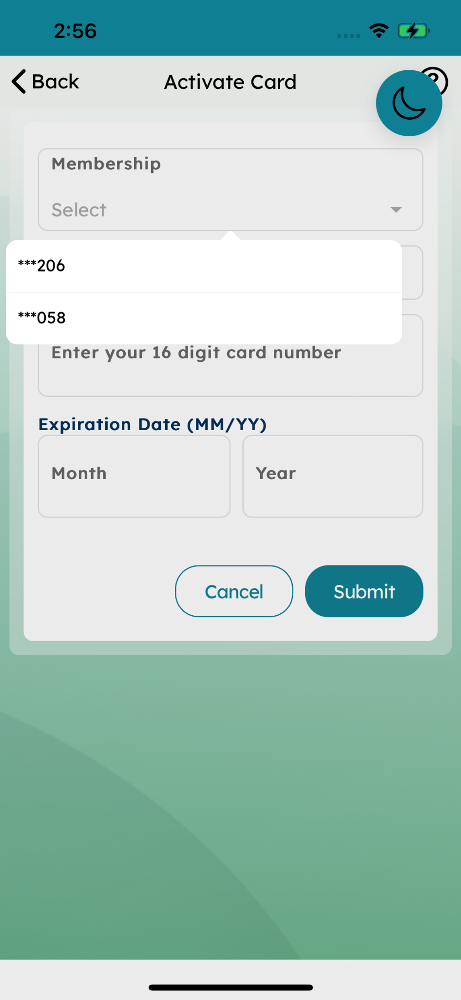 | 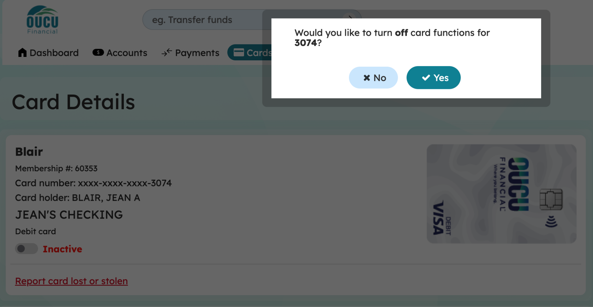 | 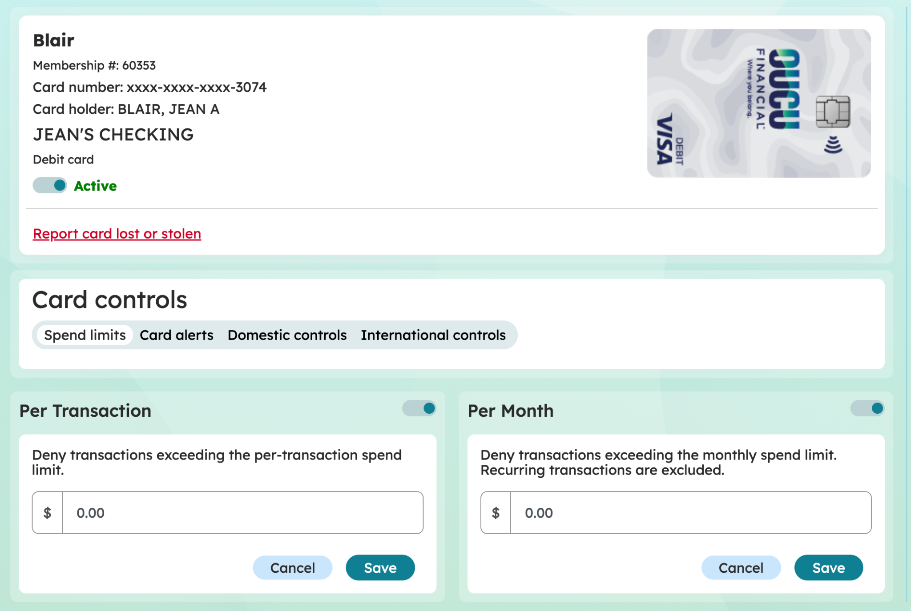 |
| :----------------------------------------------: | :----------------------------------------------: | :----------------------------------------------: |

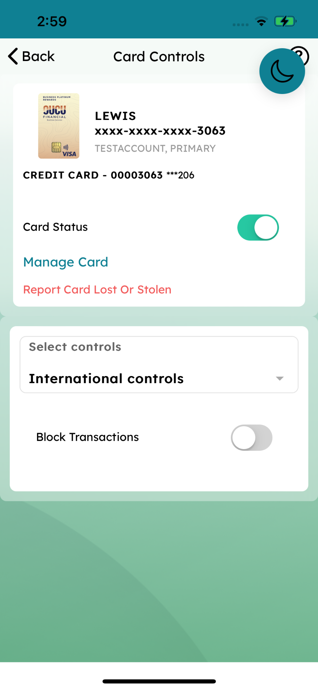 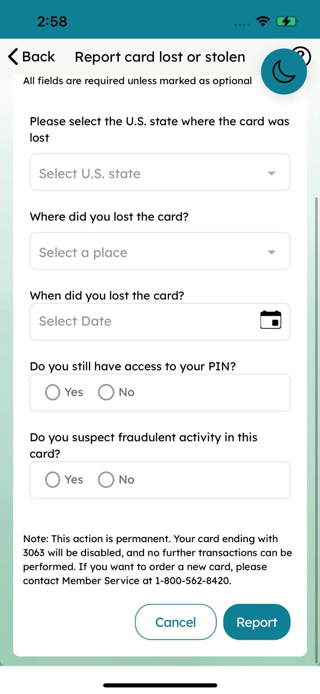

\| ■ Activate Card |

\| _📍 Navigation: Banking › Cards › Activate a New Card (or search "Activate Card")_ |

Members can activate a newly received credit card directly from nFinia without calling the credit union. Navigate to Cards and select Activate a New Card from the Related Links section, or use the search function.

**Step 1 Go to Activate a New Card**

From the Cards screen, find the Activate a New Card option in the Related Links section and tap it to begin.

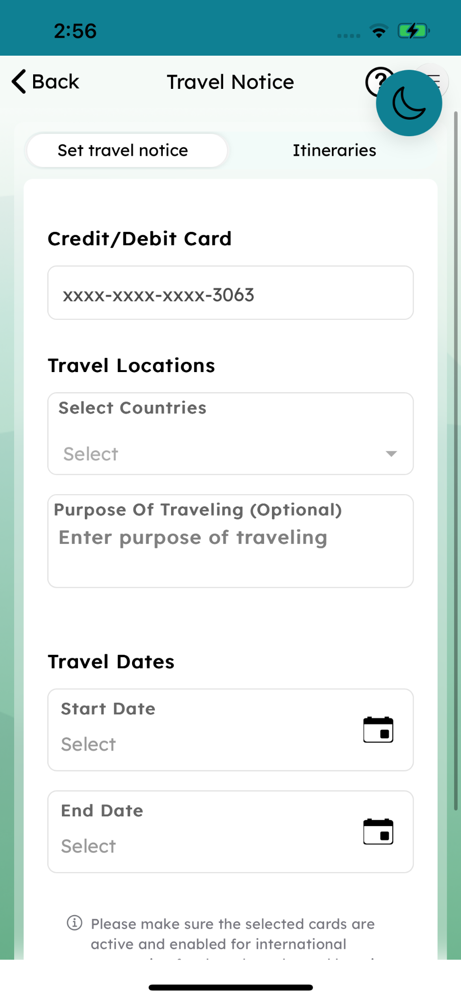

**Step 2 Enter Card Details & Confirm**

Enter your card number and confirm the expiry date as prompted. Once verified, the card is activated immediately and ready for use.

| 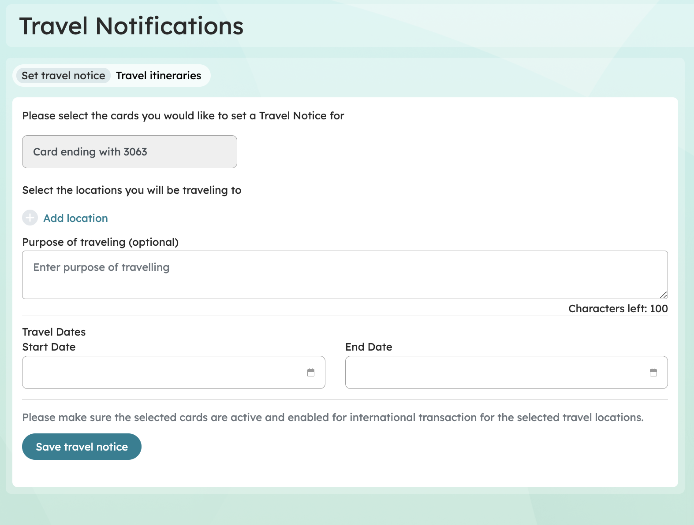 | 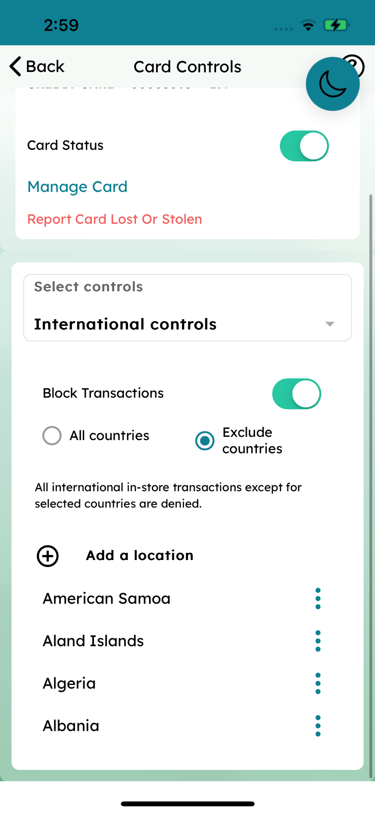 |
| :----------------------------------------------: | :----------------------------------------------: |

\| ■ Card On/Off (Lock / Unlock) |

\| _📍 Navigation: Banking › Cards › \[select card] › Card Details › Card On/Off_ |

The Card On/Off toggle lets members temporarily lock their credit card to prevent unauthorised use, and unlock it again when needed. Locking the card blocks both card-present (in-store) and card-not-present (online) transactions. Recurring transactions already set up on the card will continue to process even when the card is locked.

\| ℹ️ Tip: Use Card On/Off as an immediate first step if you suspect your card has been misplaced — you can unlock it again if you find it, without going through the full lost/stolen process. |

| 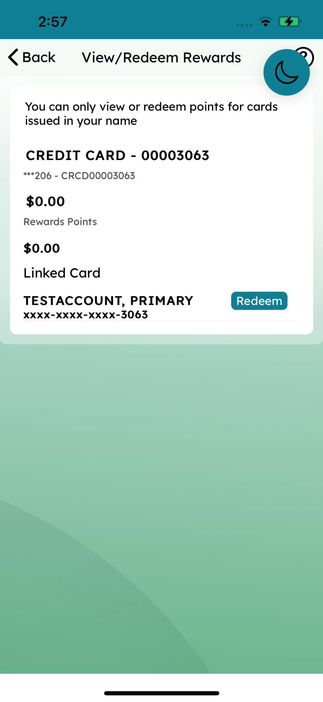 | 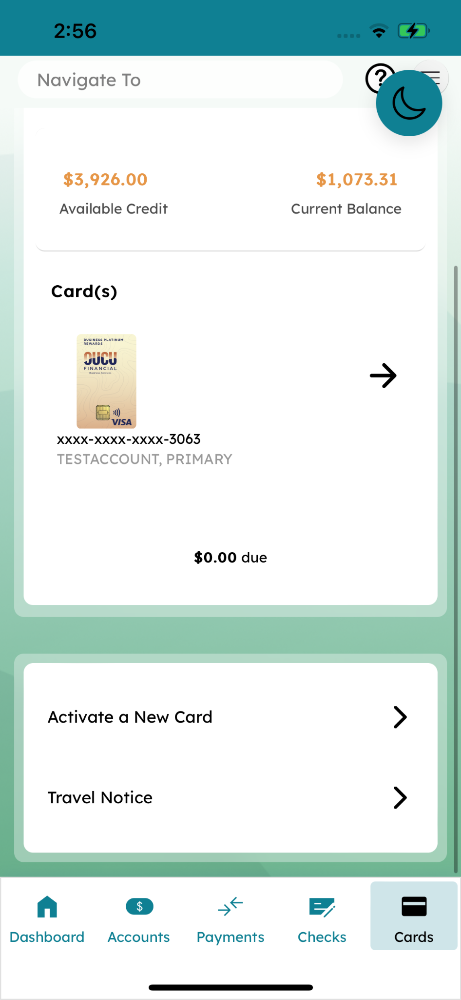 |
| :----------------------------------------------: | :----------------------------------------------: |

\| ■ Card Controls: Spend Limits |

\| _📍 Navigation: Banking › Cards › \[select card] › Card Details › Card Controls › Spend Limits_ |

Members can set a per-transaction spend limit and/or a monthly spend limit on their card. Any card-present or card-not-present transaction that exceeds the threshold will be automatically declined. This also applies to recurring transactions set up on the card.

\| ⚠️ Note: Spend limits apply to all transactions including recurring ones. Make sure your thresholds are set high enough to accommodate any regular subscriptions or automatic payments. |

| 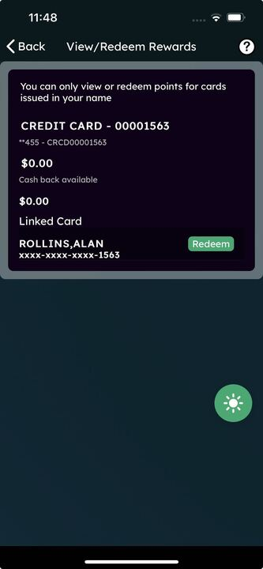 | 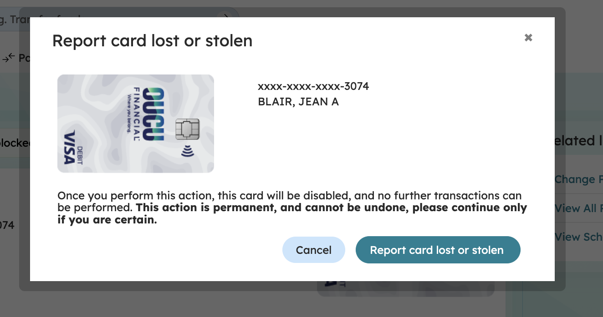 |
| :----------------------------------------------: | :----------------------------------------------: |

\| ■ Card Controls: Card Alerts |

\| _📍 Navigation: Banking › Cards › \[select card] › Card Details › Card Controls › Card Alerts_ |

Card Alerts notify members whenever their card is used, based on the preferences they configure. Three alert modes are available:

| All Transactions (default) | Receive an alert for every card transaction                     |
| -------------------------- | --------------------------------------------------------------- |
| **None**                   | No alerts are sent for card activity                            |
| **Selected Transactions**  | Alerts only for chosen transaction types or amounts (see below) |

When Selected Transactions is chosen, members can also configure:

• Per-transaction and/or monthly alert thresholds — an alert is sent when a card-present or card-not-present transaction exceeds the threshold.

• International transactions — alert when the card is used internationally.

• Transactions outside the USA.

• Transactions over a monthly amount.

• Transactions over a specific per-transaction amount.

\| ℹ️ Tip: Alert notifications are sent based on the channel preference (email, SMS, push) set in the main Alert Settings. Recurring transactions are excluded from amount-based alert thresholds. |

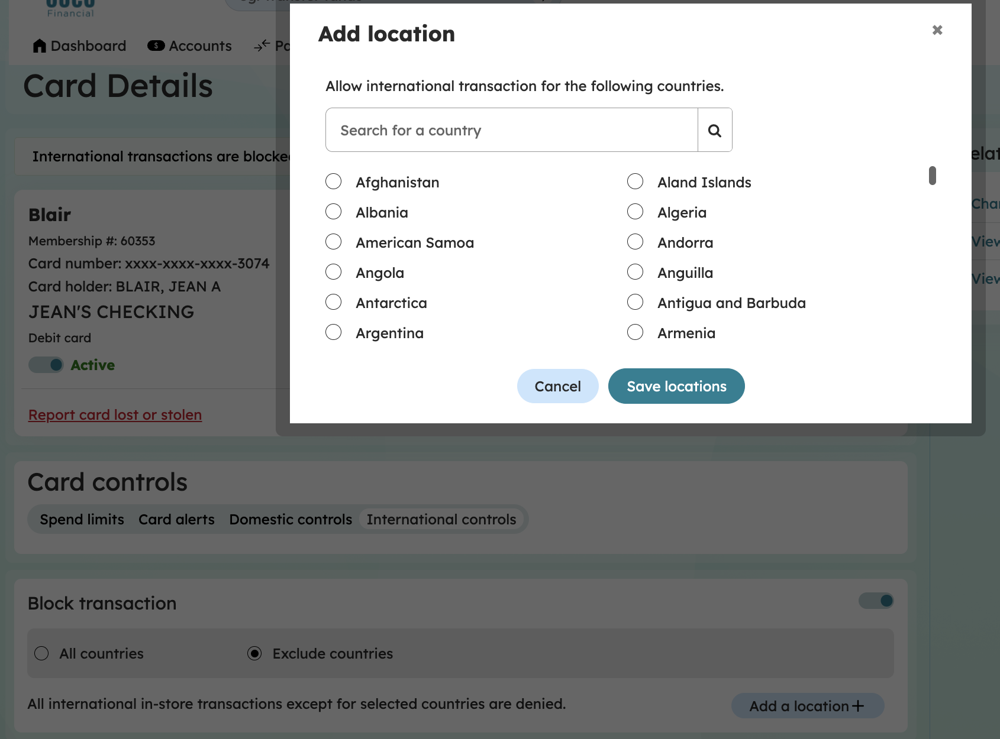

| 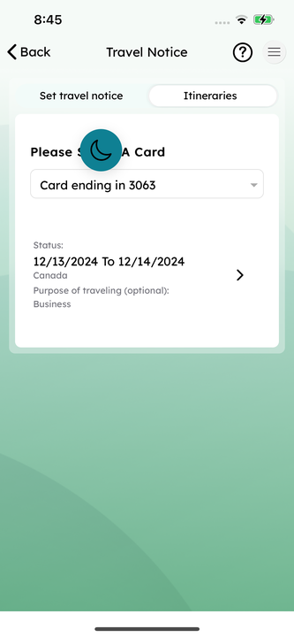 | 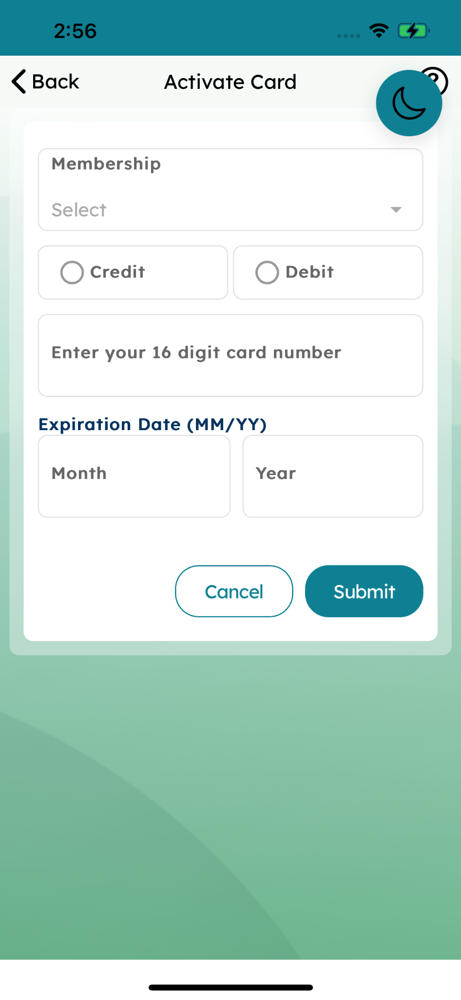 |
| :----------------------------------------------: | :----------------------------------------------: |

\| ■ Card Controls: Domestic Controls |

\| _📍 Navigation: Banking › Cards › \[select card] › Card Details › Card Controls › Domestic Controls_ |

Domestic Controls allow members to restrict card usage to a specific geographic area. Members can set a radius around a location within which card transactions are allowed; transactions attempted outside the radius will be declined. Alternatively, members can choose to allow transactions in all locations. The configurable radius range is set by the credit union.

\| ⚠️ Note: The Velera (PSCU) API does not support location names containing numbers. If you search for a location with numbers in the name, try searching by the city or neighbourhood name instead. |

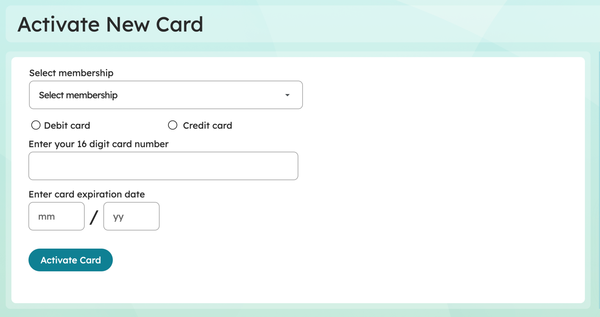

| 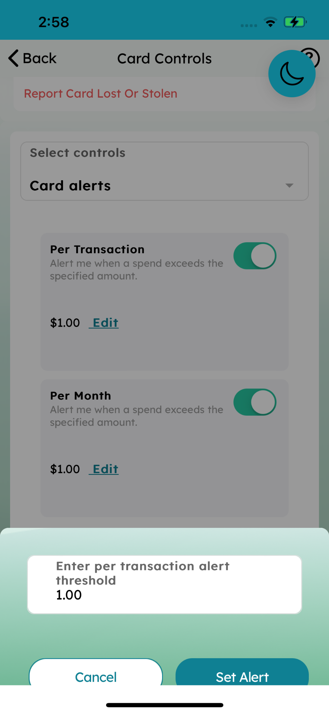 | 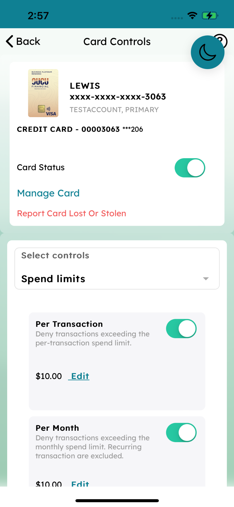 |
| :----------------------------------------------: | :----------------------------------------------: |

\| ■ Card Controls: International Controls |

\| _📍 Navigation: Banking › Cards › \[select card] › Card Details › Card Controls › International Controls_ |

International Controls let members block all in-store international transactions or specify a list of countries where their card should remain active. This is useful for preventing international fraud while still allowing transactions in countries the member frequently visits.

\| ⚠️ Note: Map-based country selection is not supported because the Velera (PSCU) API does not accept coordinates. Use the country list to specify allowed locations. |

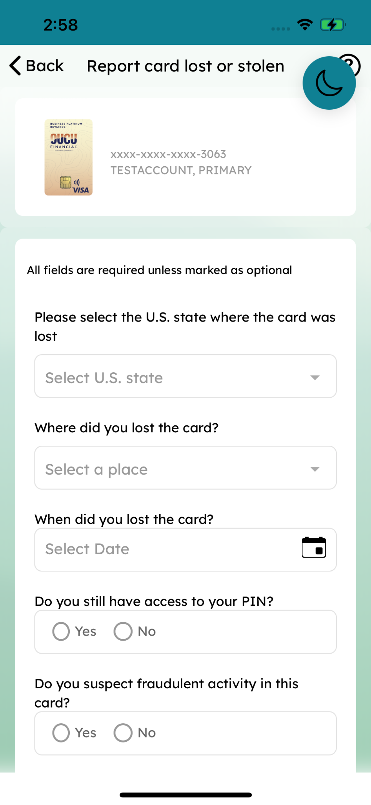 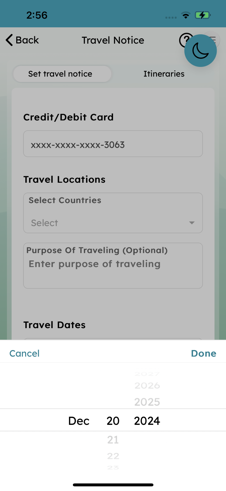

| 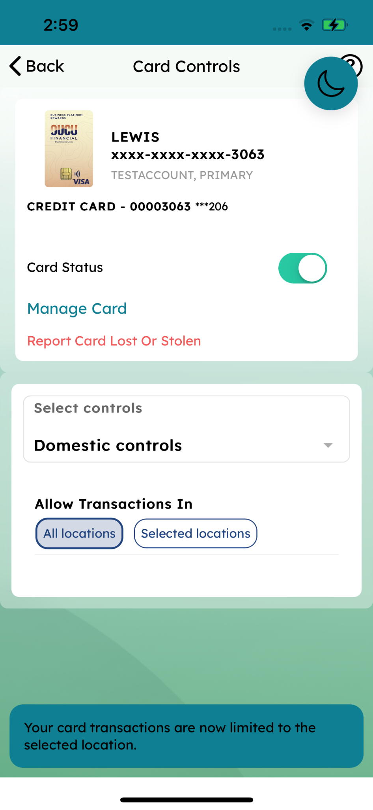 | 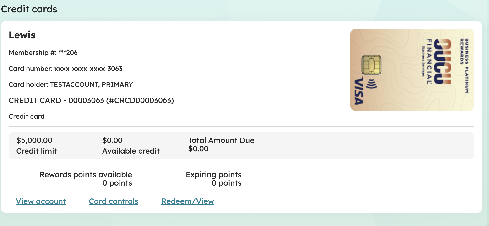 |
| :----------------------------------------------: | :----------------------------------------------: |

\| ■ Report Card Lost or Stolen |

\| _📍 Navigation: Banking › Cards › \[select card] › Card Details › Report Lost/Stolen_ |

If a member believes their card has been lost or stolen, they can report it directly from the card tile in nFinia. Reporting the card immediately flags it for the credit union and initiates the replacement process. Both debit and credit cards can be reported through this flow.

\| ℹ️ Tip: If you are not sure whether the card is lost or just misplaced, consider using the Card On/Off lock first. Use Report Lost/Stolen only when you are certain the card needs to be replaced. |

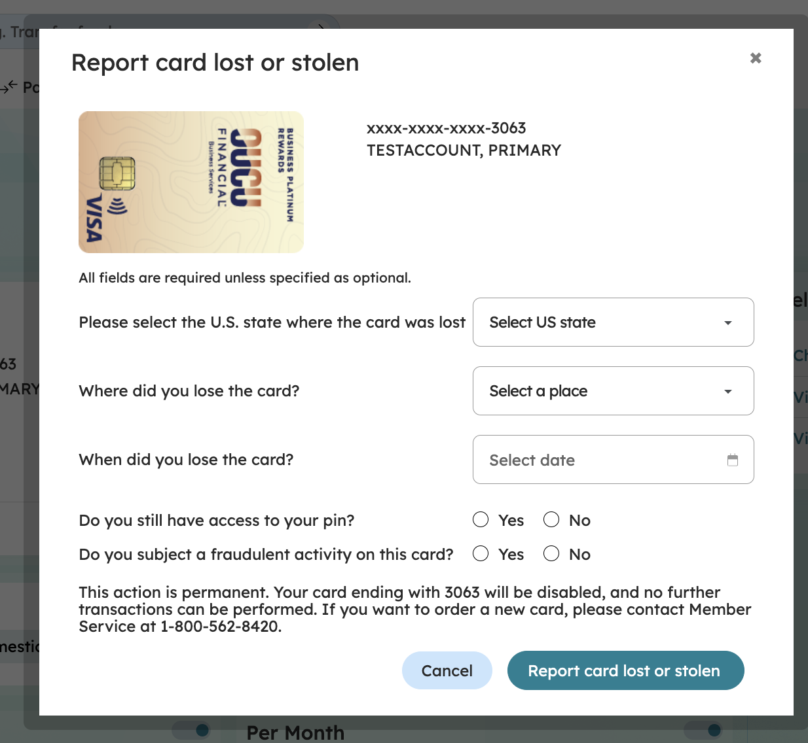 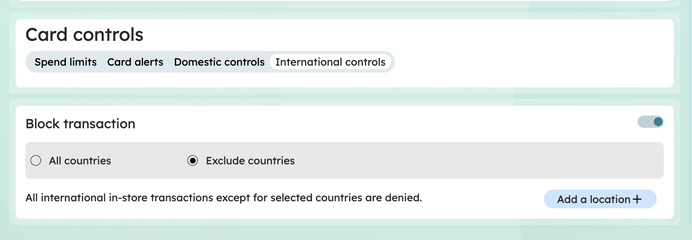

| 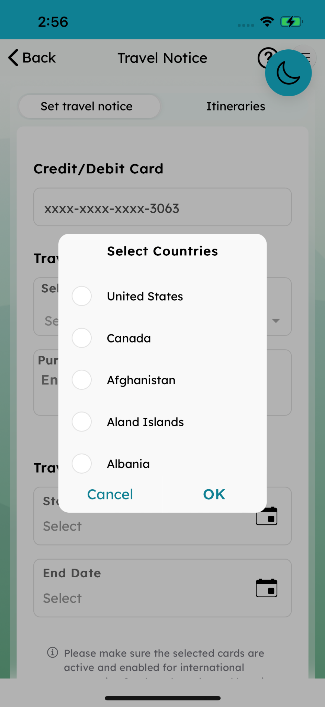 | 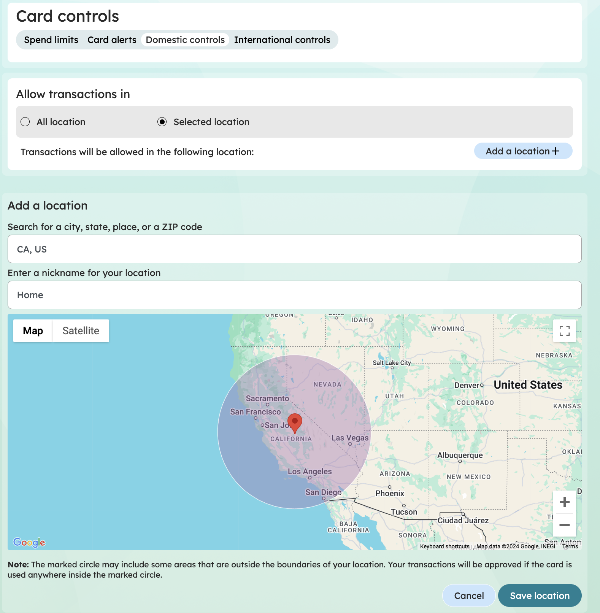 |
| :----------------------------------------------: | :----------------------------------------------: |

\| ■ Travel Notification |

\| _📍 Navigation: Banking › Cards › Travel Notice (via Related Links on the Cards screen)_ |

Travel Notifications allow members to let the credit union know they will be travelling internationally, preventing their card from being falsely flagged for fraud while abroad. Members can set one active travel notice per card at a time, view all upcoming and ongoing notices, edit an itinerary, or delete a notice they no longer need.

**Step 1 Open Travel Notice**

From the Cards screen, select Travel Notice from the Related Links section. The Travel Itineraries screen lists all active and upcoming notices you have set.

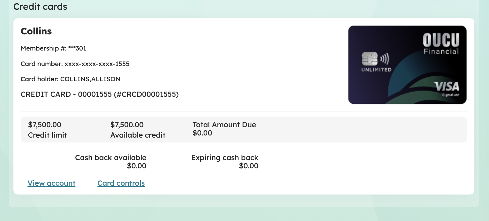

**Step 2 Add a Travel Itinerary**

Tap Add to create a new travel notice. Enter your destination(s), travel start and end dates, and any notes. Tap Save to submit the notice to Velera.

| 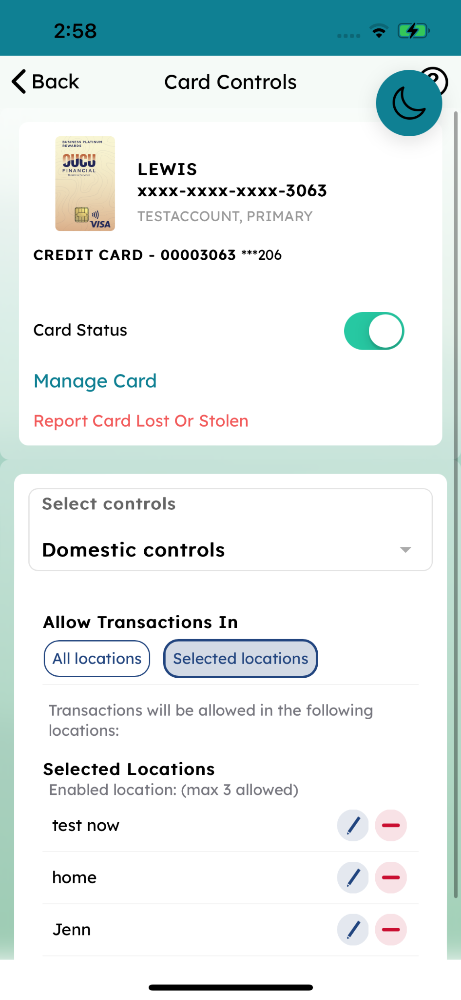 | 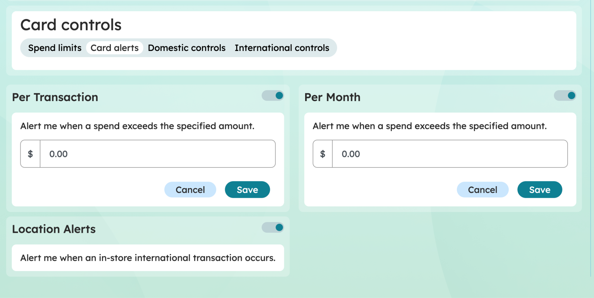 | 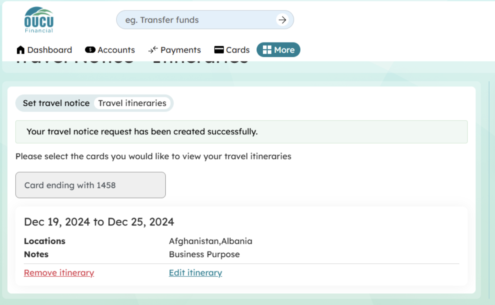 |
| :----------------------------------------------: | :----------------------------------------------: | :----------------------------------------------: |

**Step 3 View, Edit, or Delete a Notice**

From the Travel Itineraries list, tap a notice to view its details or make changes to the destination or dates. Use the Delete option to remove a notice that is no longer needed.

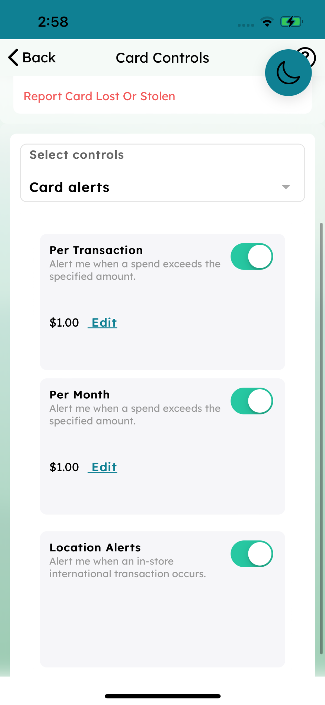 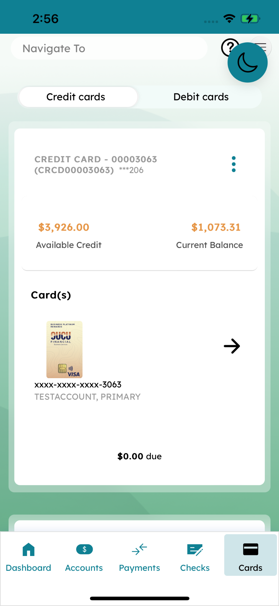

\| ⚠️ Note: Only one travel notice can be active per card at a time. If you need to travel to multiple destinations on the same trip, add all countries within a single itinerary entry. |
