# Velera — Credit Card eStatements & Rewards

_Module: Banking › Cards › Card Details › eStatements / Rewards_

## Summary

This document covers three features available for PSCU credit cardholders in nFinia Digital Banking: Credit Card eStatements, CURewards SSO, and CashBackMall SSO.

Credit Card eStatements lets members access and download their monthly credit card statements as PDFs directly from the Cards module or via eDocuments. Statements are stored at the card level in Velera and formatted per the credit union's branding. Members can also configure their eStatement delivery email address and receive an enrollment confirmation when they opt in.

CURewards SSO enables members enrolled in the Traditional Rewards program to view their current rewards balance and points expiring soonest — and to redeem them — all without leaving nFinia. CashBackMall SSO provides the same experience for members enrolled in the Cash Back Rewards program.

## At a Glance

| Attribute | Detail |
| --- | --- |
| Feature Names | Credit Card eStatements · CURewards SSO · CashBackMall SSO |
| Module Location | Banking › Cards (card tile) and Banking › eDocuments |
| Statement Format | PDF download — credit union branded, Velera format |
| Delivery Email | Managed separately from Core; members can sync, keep existing, or enter a new address |
| Rewards Programs | Traditional Rewards (CURewards) and Cash Back Rewards (CashBackMall) |
| Channels | Online Banking ✓ · Mobile Banking ✓ |
| Supported Cores | Correlation, Ultradata |
| Release Version | 10.41 |

## Key Use Cases

| Use Case | Member Goal | Steps | Outcome |
| --- | --- | --- | --- |
| Download a credit card statement | Access a monthly PDF statement for a credit card | Cards › select card › eStatements on card tile → tap a statement to download PDF | PDF opens / downloads; formatted per credit union branding |
| Access statements via eDocuments | Find all document types in one place | Search "eDocuments" or navigate to More › eDocuments; filter to credit card statements | All available credit card statements listed alongside other account documents |
| Update eStatement email address | Ensure statement notifications go to the right email | When prompted on first access, choose: sync from Core, keep Velera address, or enter a new one | eStatement notifications are sent to the chosen email address going forward |
| Enrollment confirmation | Confirm paperless enrollment succeeded | Opt in on first access; an enrollment email is sent to the selected address | Member receives a "You're Now Enrolled" email from the credit union |
| View & redeem CURewards points | Check rewards balance and redeem points (Traditional Rewards) | Cards › select credit card tile › Redeem/View; SSO launches the CURewards portal | Member sees current points balance and earliest expiry; can redeem via the rewards portal |
| View & redeem CashBack rewards | Check cash back balance and redeem (Cash Back Rewards program) | Cards › select credit card tile › Redeem/View; SSO launches the CashBackMall portal | Member sees available cash back and earliest expiry; can redeem via CashBackMall |

---

## Credit Card eStatements

_📍 Path A: Banking › Cards › \[select card] › eStatements on card tile_
_📍 Path B: Banking › More › eDocuments (desktop) or More › Finance Management › eDocuments (mobile)_
_📍 Path C: Use the global Search bar and type "eStatements" or "eDocuments"_

### Step 1 — Navigate to eStatements

There are three ways to reach Credit Card eStatements. Use whichever is most convenient — all three land on the same Velera-backed statements list.

**Path A — From the More menu (desktop and mobile)**

On desktop, click **More** in the top navigation and select **eDocuments** from the options grid. On mobile, open the **More** tab and tap **eDocuments** under Finance Management.

<figure>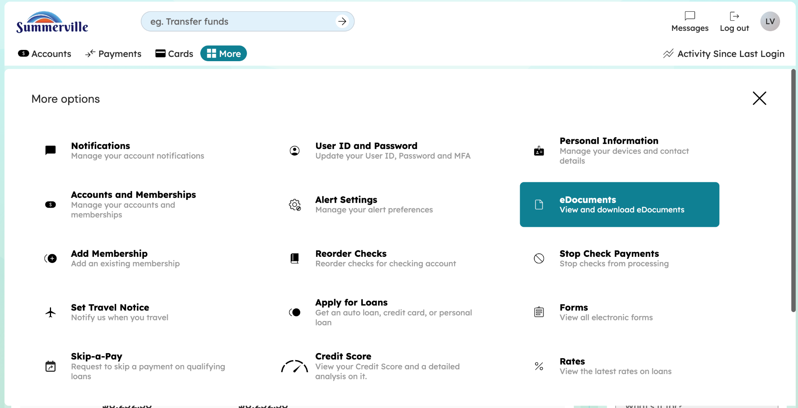<figcaption>Desktop — open the More menu and click eDocuments (highlighted on the right).</figcaption></figure>

<figure>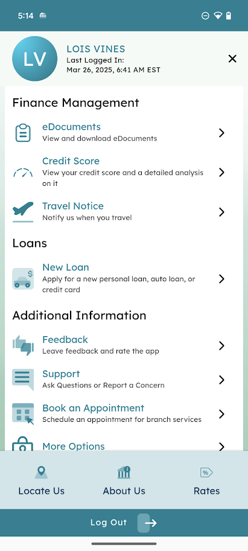<figcaption>Mobile — open the More tab and tap eDocuments under Finance Management.</figcaption></figure>

**Path B — From the global search bar**

Type "eStatements" or "eDocuments" into the Search bar at the top of the page. A suggestion drops down; select it to jump straight to the eDocuments screen.

<figure>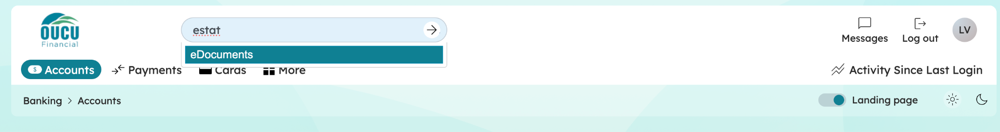<figcaption>Desktop — start typing "estat" in the search bar and the eDocuments suggestion appears.</figcaption></figure>

<figure>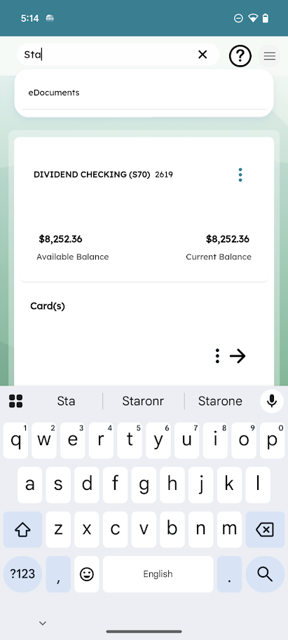<figcaption>Mobile — search for "Sta" from the top bar and select the eDocuments result.</figcaption></figure>

**Path C — From the credit card tile**

On mobile, tap the action menu on a credit card tile and select **eDocuments** to jump straight to that card's statements list.

<figure>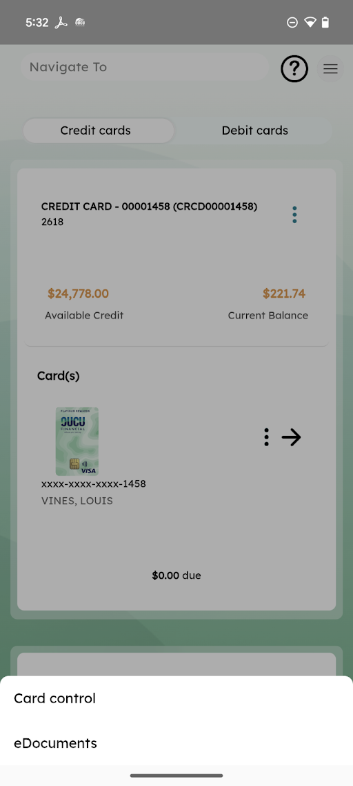<figcaption>Mobile — tap the action menu on a credit card tile and select eDocuments.</figcaption></figure>

### Step 2 — Browse and Download a Statement

The eStatements screen lists available monthly statements for the selected credit card. Tap any statement to download it as a PDF. The PDF is styled in the credit union's branding and formatted by Velera.

<figure>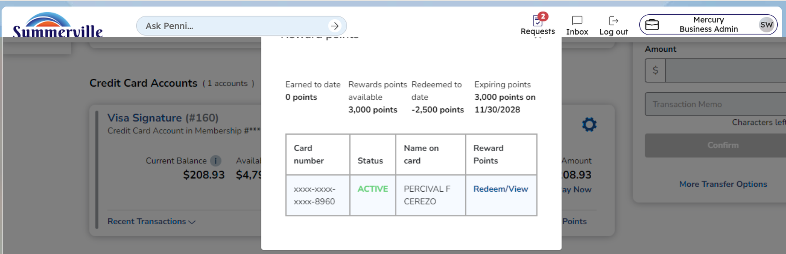<figcaption>Desktop — eStatements screen with Document Type, Membership, Card, and the list of available statements at the bottom.</figcaption></figure>

<figure>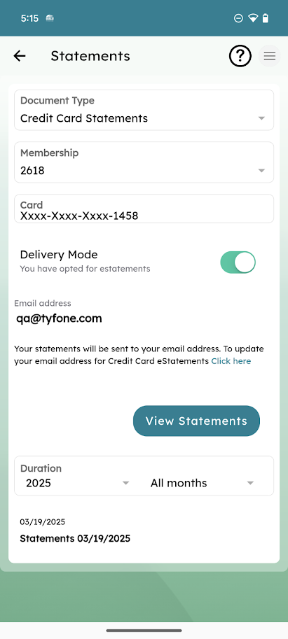<figcaption>Mobile — Statements screen with the same filters and a statement row ready to tap.</figcaption></figure>

<figure>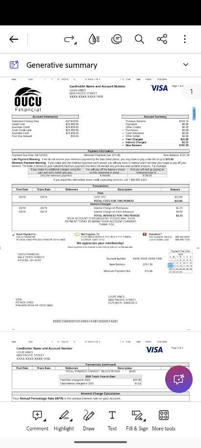<figcaption>Mobile — the PDF opens in the in-app viewer with zoom and share controls.</figcaption></figure>

<figure>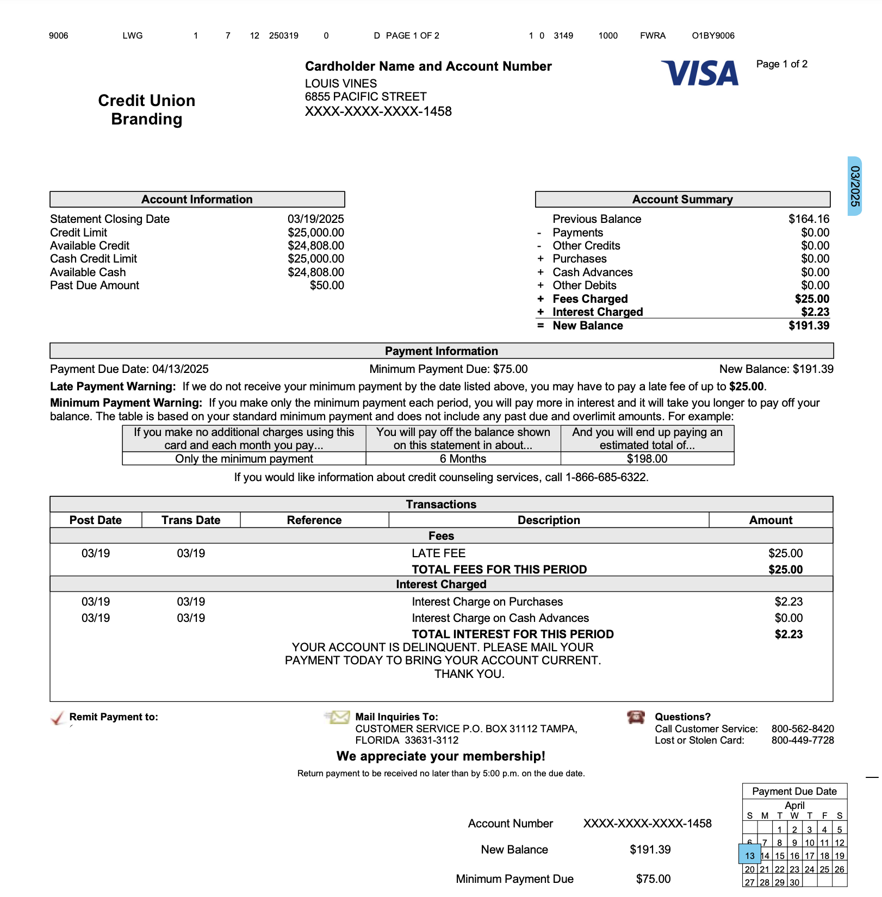<figcaption>Downloaded PDF — rendered in the credit union's branding by Velera, showing account summary, payment info, and transactions.</figcaption></figure>

### Step 3 — Set Your eStatement Delivery Email

When you access credit card eStatements for the first time, you will be prompted to confirm the email address where statement notifications should be sent. The email address stored in the core banking system may differ from the one Velera holds for your card. You will be given three options:

| Option | Description |
| --- | --- |
| **Option 1 — Sync from Core** | Update the email in Velera to match the address currently on file in the core system |
| **Option 2 — Keep Velera address** | Continue using the email address that Velera already has on file for this card |
| **Option 3 — Enter a new address** | Type a different email address to use specifically for credit card eStatement delivery |

> ⚠️ **Note:** Your credit card eStatement email can be different from the email used for other account types. Changing it here only affects credit card statement notifications via Velera.

<figure>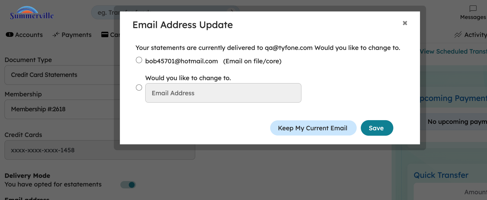<figcaption>Desktop — Email Address Update modal showing the core-on-file address, a new-address field, and Keep / Save buttons.</figcaption></figure>

<figure>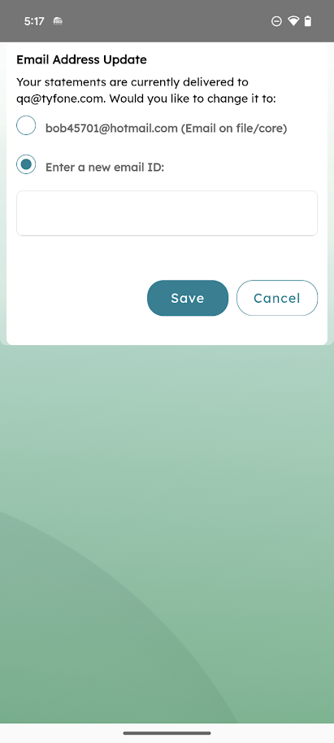<figcaption>Mobile — Email Address Update dialog with the same sync / keep / new-address options.</figcaption></figure>

### Step 4 — Confirm Enrollment (and Unenrollment)

After you opt in to paperless eStatements, Velera sends a confirmation email to your selected address. You can opt out at any time from the same screen, in which case Velera sends an unenrollment confirmation and mails paper statements from your next cycle onwards.

<figure>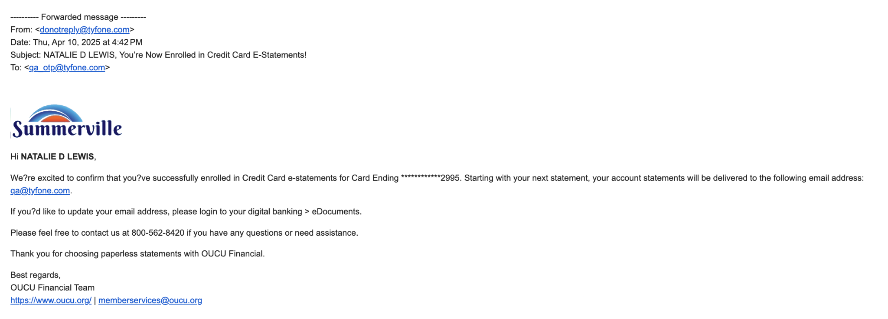<figcaption>Enrollment confirmation — "You're Now Enrolled in Credit Card E-Statements" email sent after opting in.</figcaption></figure>

<figure>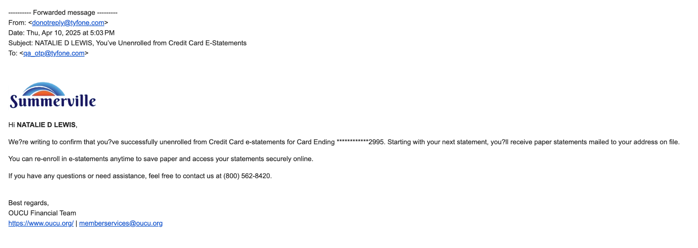<figcaption>Unenrollment confirmation — "You're Unenrolled from Credit Card E-Statements" email sent if the member opts back into paper.</figcaption></figure>

---

## CURewards SSO (Traditional Rewards)

_📍 Navigation: Banking › Cards › \[select credit card tile] › Redeem/View_

Members enrolled in the Traditional Rewards program can view their rewards balance and the points expiring soonest directly from the credit card tile in nFinia. Tapping **Redeem/View** launches the CURewards portal via single sign-on (SSO), where members can browse and redeem their accumulated points without needing a separate login.

> ℹ️ **Tip:** Rewards points are shown on the card tile for a quick balance check. For full redemption options, tap **Redeem/View** to open the CURewards portal.

### Step 1 — View Rewards Balance on the Card Tile

The credit card tile shows Rewards points available and the earliest expiring points right below the balance row. The **Redeem/View** link at the bottom of the tile launches the CURewards portal.

<figure>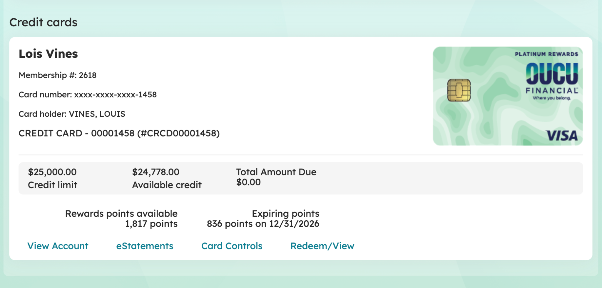<figcaption>Desktop — credit card tile showing 1,817 Rewards points and 836 Expiring points, with Redeem/View link at the bottom.</figcaption></figure>

<figure>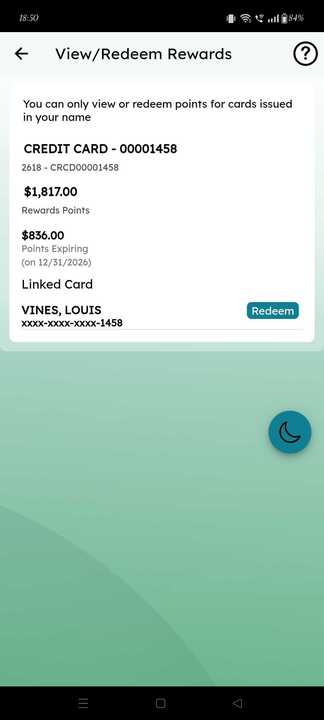<figcaption>Mobile — in-app View / Redeem Rewards screen showing points balance, expiring points, and a Redeem button.</figcaption></figure>

### Step 2 — Launch the CURewards Portal via SSO

Tapping **Redeem/View** signs the member into the CURewards portal automatically — no separate username or password. From there, members can browse redemption options and complete a redemption.

<figure>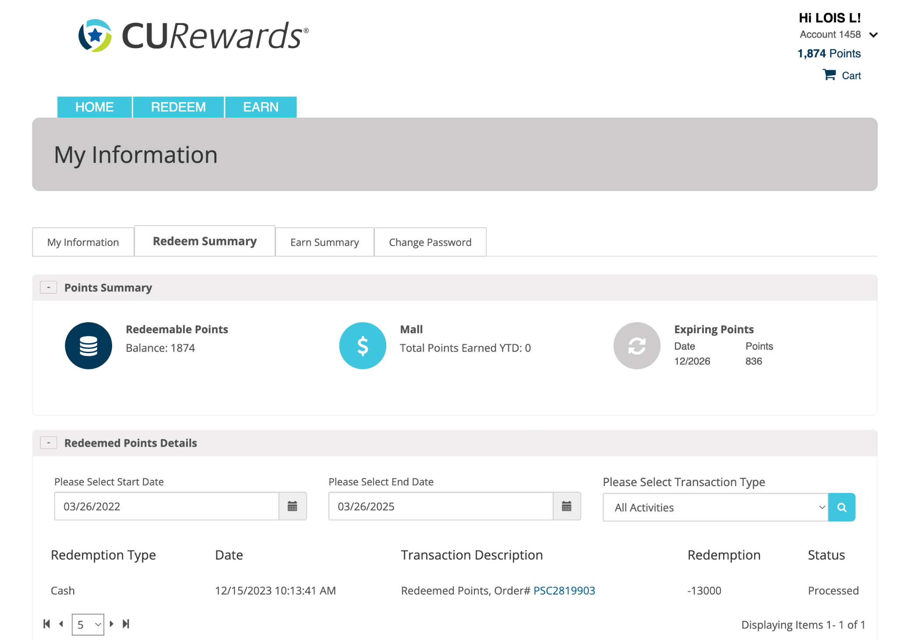<figcaption>Desktop — CURewards portal landing screen with Points Summary, Redeemable Points balance, and redemption history.</figcaption></figure>

<figure>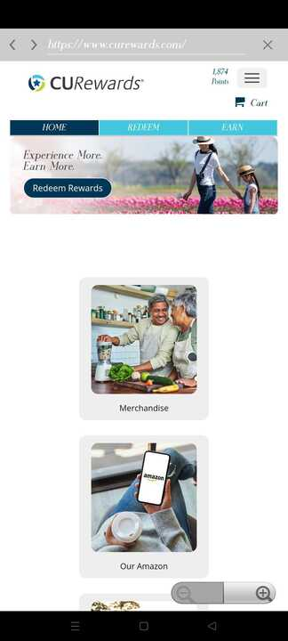<figcaption>Mobile — CURewards portal with Home / Redeem / Earn tabs and merchandise / Amazon redemption tiles.</figcaption></figure>

---

## CashBackMall SSO (Cash Back Rewards)

_📍 Navigation: Banking › Cards › \[select credit card tile] › Redeem/View_

Members enrolled in the Cash Back Rewards program can view their available cash back balance and the cash back expiring soonest from the credit card tile. Tapping **Redeem/View** launches the CashBackMall portal via SSO, where members can browse shopping offers and redeem their cash back rewards.

> ℹ️ **Tip:** The cash back balance and nearest expiry are shown on the card tile at a glance. For full redemption and shopping options, tap **Redeem/View** to open CashBackMall.

### Step 1 — View Cash Back on the Card Tile

The credit card tile for a cash back cardholder shows **Cash back available** and **Expiring cash back** in place of rewards points. The **Redeem/View** link opens CashBackMall via SSO.

<figure>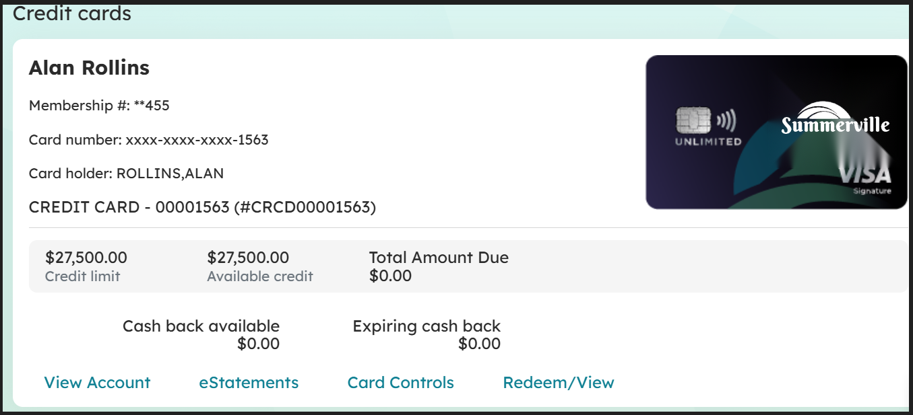<figcaption>Desktop — credit card tile for a Cash Back Rewards cardholder, showing Cash back available and Expiring cash back, with Redeem/View at the bottom.</figcaption></figure>

### Step 2 — Launch CashBackMall via SSO

Tapping **Redeem/View** signs the member into the CashBackMall portal automatically. The portal shows the cash back account summary and Redeem cash back / Earn more cash back actions.

<figure>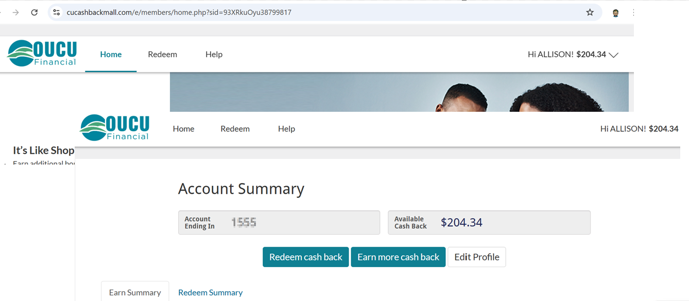<figcaption>Desktop — CashBackMall portal showing Account Summary, Available balance, and Redeem / Earn buttons.</figcaption></figure>
