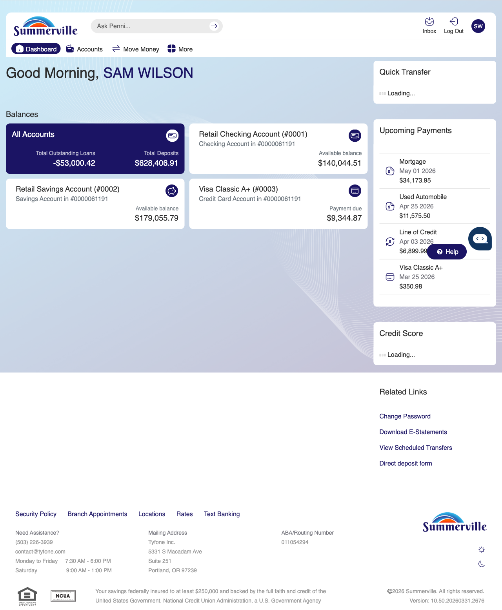
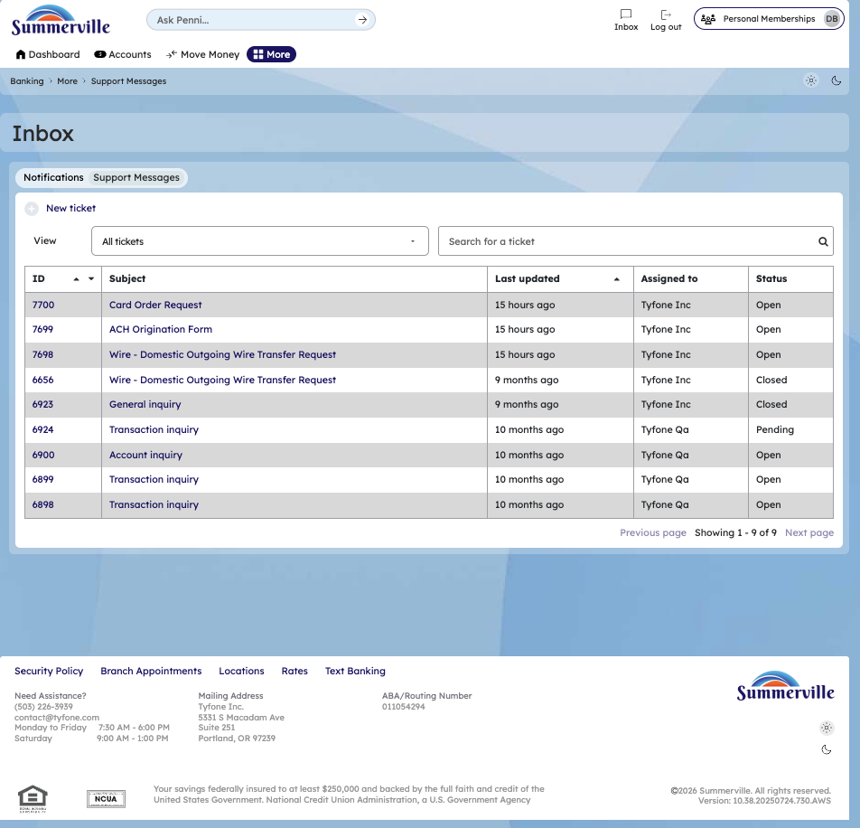
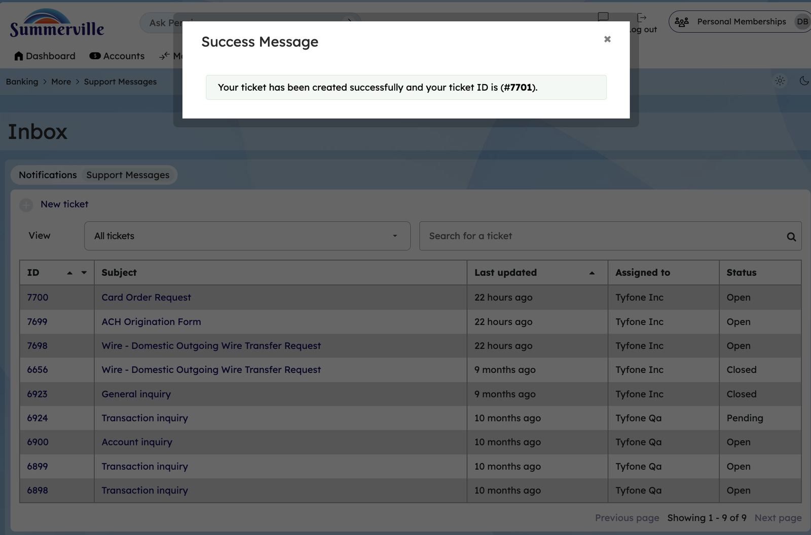

# Inbox & Message Center

> **Module:** Banking › Inbox |&#x20;

## Summary

The Inbox & Message Center is the in-app communication hub between members and the credit union. It consolidates two distinct types of messages: system notifications about account activities and transactions (Notifications tab), and secure two-way support messages exchanged with credit union staff (Support Messages tab).

Unlike email, which is transmitted in plain text and is inherently insecure for financial conversations, the Message Center operates entirely within the authenticated nFinia session. Members can send secure inquiries, receive replies from credit union staff, view full conversation history, and track the status of any open support request without leaving digital banking. This eliminates the need to call the credit union for routine questions and provides a written record of every support interaction.

A notification badge on the Inbox icon in the Dashboard navigation shows the unread message count at a glance, making it easy to see when there is new information requiring attention. All messages and notifications are encrypted in transit and at rest.

**At a Glance**

| Attribute | Detail |
| ------------------ | ------------------------------------------------------------------ |
| Module | Inbox |
| Notification Types | Account activity alerts, transfer confirmations, eDocument notices |
| Support Messages | Two-way authenticated messaging with credit union staff |
| Security | Encrypted, authenticated — safe for discussing account-specific financial information |
| New Message | Members can initiate support requests directly from the Inbox |

## Key Use Cases

Members checking recent account activity open Inbox > Notifications to see a consolidated history of all recent system alerts, provides a single-screen view of account events without navigating account by account.

Members following up on a past inquiry open Inbox > Support Messages to review the full conversation thread with credit union staff, eliminates the need to call the credit union to reference a previous support exchange.

Members with account questions click New Message to submit a secure support inquiry to the credit union, provides an asynchronous, secure support channel that avoids phone hold times and documents the conversation.

Members checking whether a submitted form was received look for a form submission confirmation in Inbox notifications, confirms that a submitted form has been received and processed, reducing uncertainty.

## Step-by-Step Guide

\| _Navigation: Dashboard > Inbox (bell/envelope icon in top navigation)._ |

**Step 1 - Start from Dashboard**

After logging in, you land on the Dashboard, which displays all account balances, upcoming payments, and the top navigation bar. The Inbox icon is visible in the navigation bar — a notification badge appears on the icon when there are unread messages or alerts.

<figure><figcaption></figcaption></figure>

**Step 2 - Navigate from Dashboard to Inbox**

Click the Inbox icon in the top navigation bar to open the Inbox page. The page displays a list of support tickets in a table format, with columns showing the ticket ID, subject line, last updated date, assigned staff member, and current status. Ticket types include Account Inquiry, Transaction Inquiry, and General Inquiry — giving members a clear overview of all open and resolved support conversations.

<figure><figcaption></figcaption></figure>

**Step 5 - Send a New Support Message**

To create a new support request, go to **Help > Message Us**. A **Create New Ticket** modal appears with fields for Inquiry Type (such as General Inquiry, Account Inquiry, or Transaction Inquiry), Subject, and a Message body where you can describe your question or issue in detail. A file attachment option is also available, with a maximum attachment size of 20 MB, allowing you to include relevant screenshots or documents with your inquiry.

<figure><figcaption></figcaption></figure>

<figure><figcaption></figcaption></figure>

**Step 6 - Reply to a Support Thread**

After submitting your ticket, a success confirmation modal appears showing the newly created ticket ID number. The list of your support tickets is visible in the background, updated to include your new request. From this point, the credit union's support team will review and respond to your message, and you will receive an inbox notification when a reply is available.

<figure><figcaption></figcaption></figure>

Members can also create tickets directly from other areas of the platform. From the Account Overview page, clicking on an account tile and selecting **Account Inquiry** creates an Account Inquiry ticket for that specific account instantly.

<figure><figcaption></figcaption></figure>

<figure><figcaption></figcaption></figure>

From the Account Detail page, navigating to Transaction History and clicking **Inquire** on a specific transaction creates a Transaction Inquiry ticket linked to that transaction — making it easy to dispute a charge or ask questions about a specific entry without having to manually describe it.

<figure><figcaption></figcaption></figure>

<figure><figcaption></figcaption></figure>
