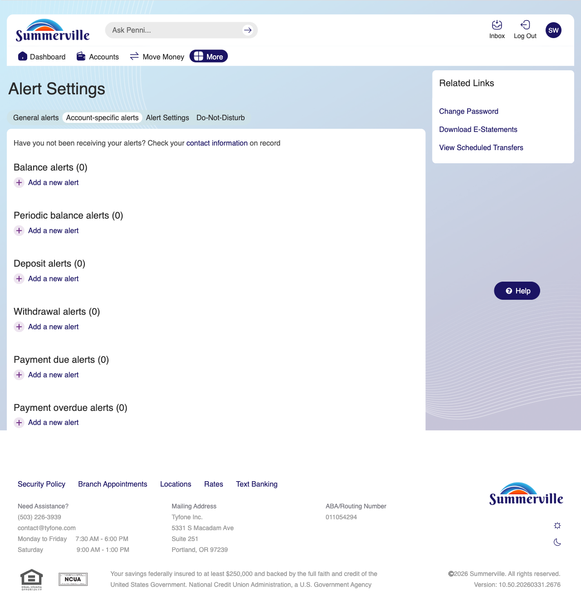
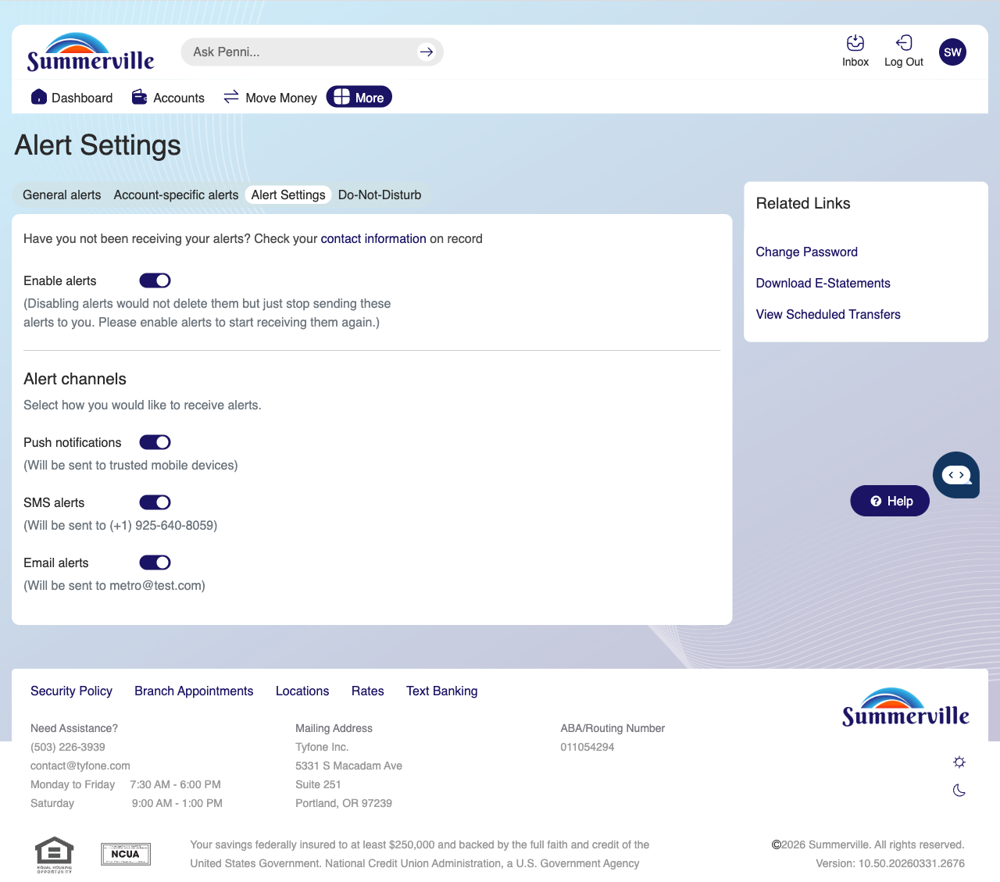
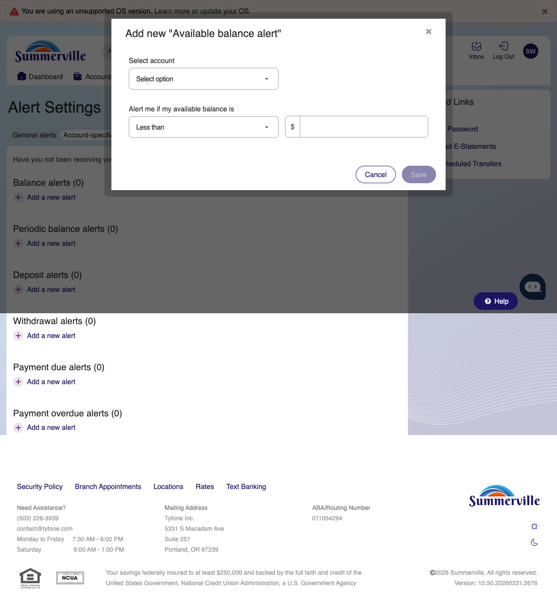
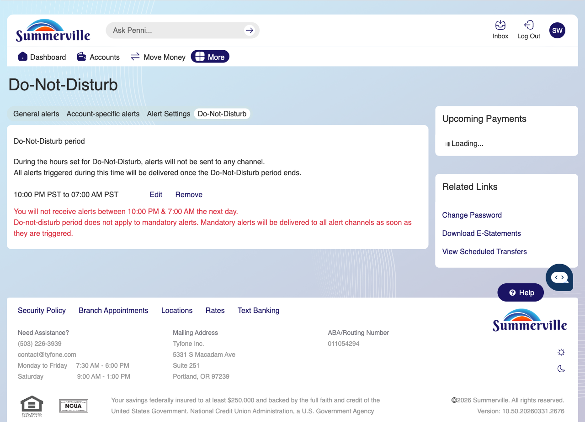

# Alerts & Notifications

> **Module:** Banking › Settings → Alerts |

## Summary

The Alerts & Notifications module allows members to configure real-time account alerts delivered via push notification, SMS, or email. Members receive immediate notifications for account events that matter to them — including low balance warnings, large transactions, successful transfers, payment postings, security events, and new eDocument availability — without needing to log in to check manually.

Members can set general alerts that apply system-wide (login notifications, security events) as well as account-specific alerts configured per account (balance threshold, individual transaction amount triggers). The Do Not Disturb schedule mutes non-critical notifications during specified hours while maintaining delivery of critical security alerts.

Alert history is maintained in the Inbox, giving members a record of all alerts they have received. The Scheduled/Recurring Transfer Alerts feature notifies members before and after scheduled transfers are executed, providing visibility into automated payment activity.

**At a Glance**

| Attribute | Detail |
| ----------------- | -------------------------------------------------------------------------- |
| Module | Settings > Alerts |
| Alert Types | Balance, Transaction, Security, Login, Payment Posted, eDocument Available |
| Delivery Channels | Push Notification, SMS, Email |
| Account-Specific | Balance threshold and large transaction alerts per account |
| Do Not Disturb | Time-window to mute non-critical alerts |

## Key Use Cases

| Use Case | Who Uses It | What They Do | Business Value |
| ----------------------- | ----------------------------- | ----------------------------------------------------- | --------------------------------------------------------------------- |
| Low Balance Alert | Members monitoring overdraft risk | Set balance alert threshold per account | Early warning before overdraft to fund account in time |
| Large Transaction Alert | Members detecting fraud | Configure alert for charges above a set dollar amount | Immediate notification of unexpected large transactions |
| Login Notification | Security-conscious members | Enable login alert for all new sign-in events | Real-time detection of unauthorized login attempts |
| Do Not Disturb Schedule | Members avoiding overnight alerts | Set DND hours to mute non-critical notifications | Reduces sleep disruption while maintaining critical security coverage |

## Step-by-Step Guide

\| _Navigation: Dashboard > Settings (gear icon) > 'Alerts' OR More > Settings > Alerts._ |

**Step 1 — Start from Dashboard**

The Dashboard displays all account balances, upcoming payments, quick-action tiles, and the top navigation bar with links to Accounts, Move Money, and More.

<figure><figcaption></figcaption></figure>

**Step 2 — Open the More Menu**

Click ‘More' in the top navigation bar. The More options panel expands to show additional features. Select "Alert Settings"

<figure><figcaption></figcaption></figure>

**Step 3 — Navigate to Alert Settings**

The Alert Settings page is displayed with tabs for General alerts, Account-specific alerts, Alert Settings, and Do-Not-Disturb. The current view shows alert category options available for configuration.

<figure><figcaption></figcaption></figure>

**Step 4 — Configure Alert Settings**

The Alert Settings tab shows alert delivery channel options including toggles for enabling or disabling push notifications and SMS alerts.

<figure><figcaption></figcaption></figure>

**Step 5 — Configure Account-Specific Alert Settings**

The Account-Specific Alerts tab contains all account-level alerts such as Balance Alerts, Deposit Alerts, and similar. Clicking "Add a new alert" opens a modal dialog where you can select the account and set the threshold amount for that alert.

<figure><figcaption></figcaption></figure>

**Step 6 — Set Do Not Disturb Hours**

The Do-Not-Disturb settings page is shown with options to configure quiet hours during which all alert notifications will be suppressed.

<figure><figcaption></figcaption></figure>
