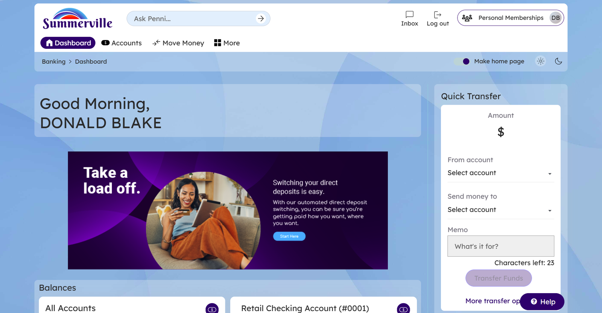
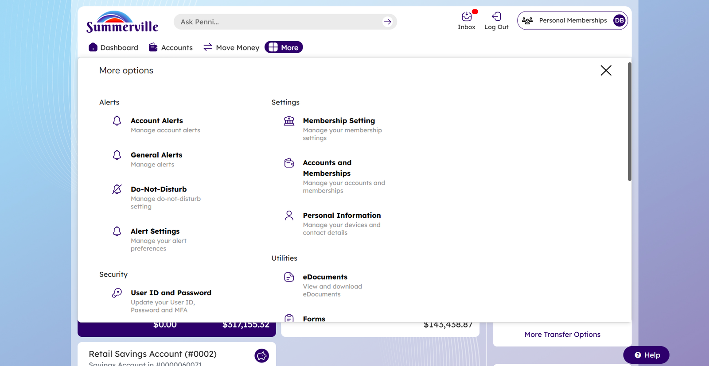
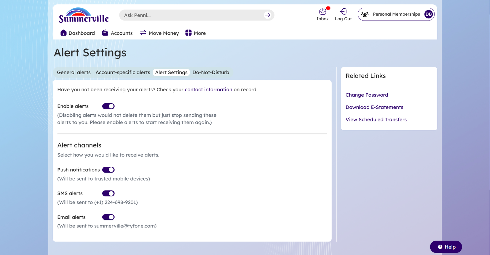
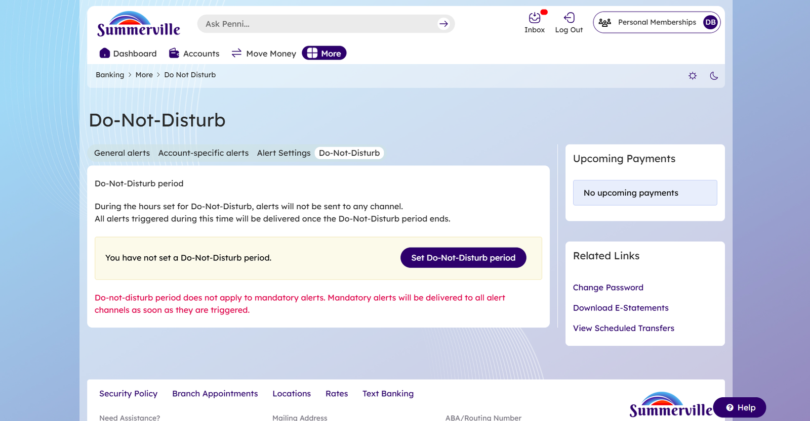
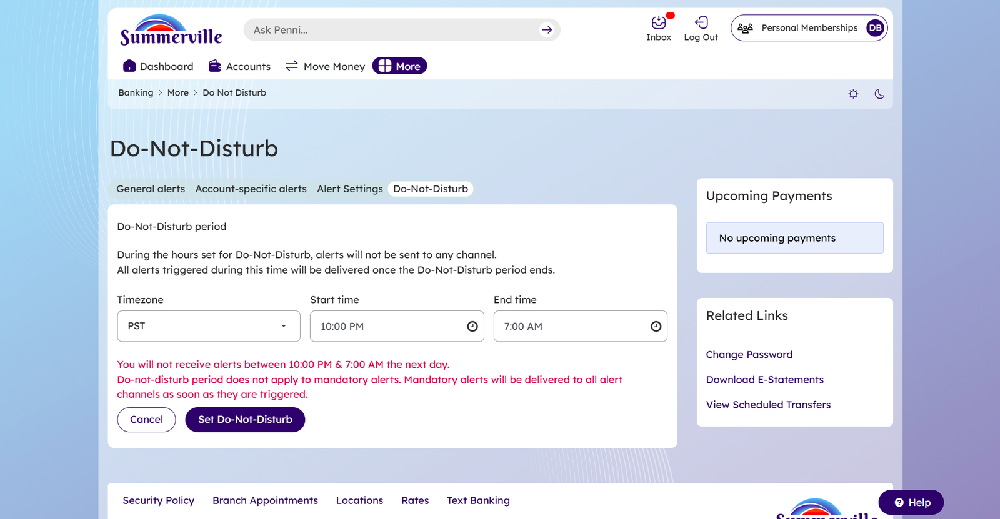
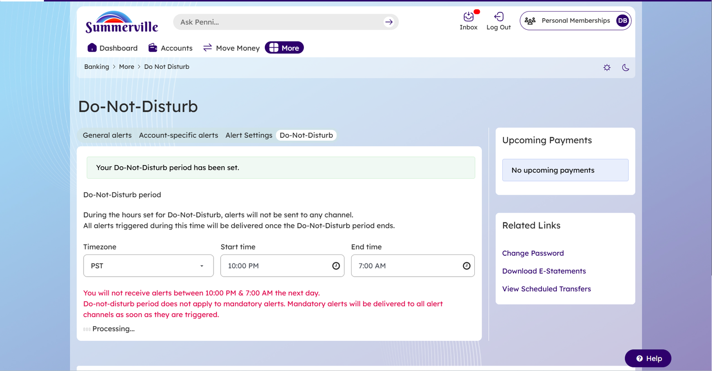
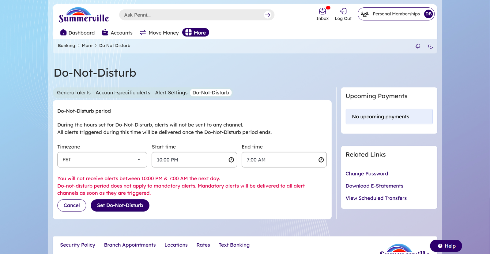
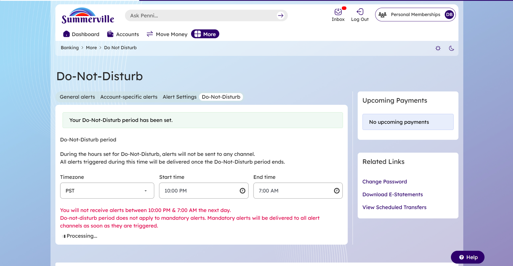
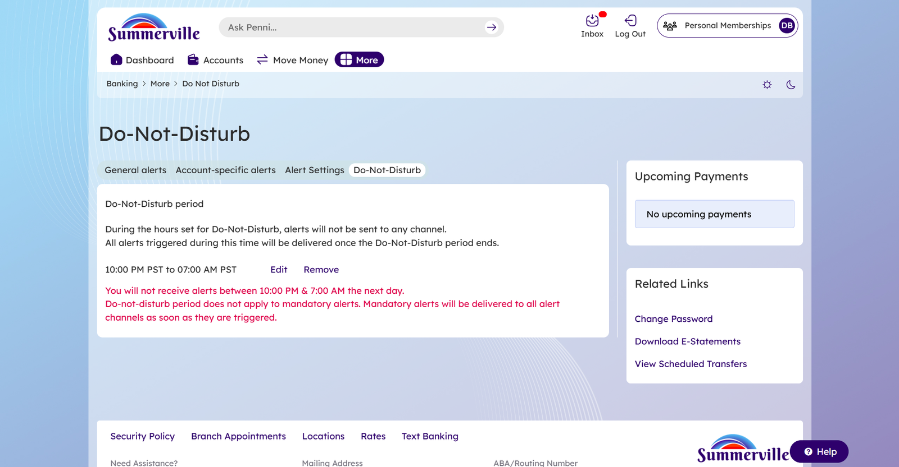
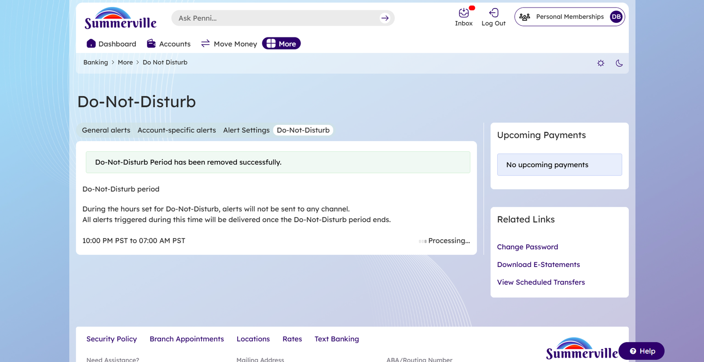

# Blackout Period

**Summerville Credit Union | nFinia Digital Banking Platform**

***

## Summary

The Alerts & Notifications feature in Summerville Credit Union's nFinia platform gives you real-time visibility into the activity on your accounts. you can subscribe to a range of alerts—from balance thresholds and deposit confirmations to security events like failed login attempts—and choose exactly how they receive them: push notification to a trusted device, SMS to a registered phone number, or email to a linked address. The system distinguishes between **Optional Alerts**, which you configure themselves, and **Mandatory Alerts**, which the platform automatically delivers regardless of individual preferences whenever security-critical events occur (e.g., password changes, account lockouts, new remembered device additions).

The feature is organized under **Alert Settings**, accessible via More > Alerts, and is composed of four tabs: **General Alerts**, **Account-Specific Alerts**, **Alert Settings**, and **Do-Not-Disturb**. Together these tabs give you fine-grained control over what they hear about, how they hear about it, and when they can be reached. For the credit union, this translates directly into reduced inbound support volume (members self-serve on transaction questions), stronger fraud detection outcomes (Members receive and act on security alerts), and higher digital channel engagement.

The Do-Not-Disturb (DND) sub-feature extends alert control further by letting you suppress non-mandatory alert delivery during defined quiet hours—a timezone-aware window set to your local time zone. Mandatory alerts bypass DND by design, ensuring security-critical communications are never silenced.

| Attribute | Detail |
| ------------------------ | --------------------------------------------------------------------------------------------------------------------------------------------- |
| **Feature Name** | Alerts & Notifications |
| **Module** | More > Alerts (General Alerts, Account-Specific Alerts, Alert Settings, Do-Not-Disturb) |
| **User Roles** | Retail Member (all authenticated you) |
| **Access Level** | Authenticated member; OTP verification required at login |
| **Key Actions** | Enable/disable alerts, configure alert channels, add account-specific alerts, set optional alert preferences, configure Do-Not-Disturb period |
| **Regulatory Relevance** | BSA/AML-adjacent fraud detection; mandatory security alerts support NCUA examination expectations for member authentication safeguards |

***

## Use Cases

| Use Case | Who Uses It | What They Do | Business Value |
| ----------------------------------------- | ------------- | ------------------------------------------------------------------------------------------------------------------------------------------------------------------------------------ | --------------------------------------------------------------------------------------------------------------- |
| **Enable alert delivery channels** | Retail Member | Navigates to Alert Settings tab, confirms or adjusts push, SMS, and email toggles to select preferred delivery channels | Ensures alerts reach you on your preferred channel; reduces missed notifications and support calls |
| **Add an account-specific balance alert** | Retail Member | Selects Account-Specific Alerts tab, clicks "Add a new alert" under Balance Alerts, selects account, sets condition (e.g., Less than $1,000), saves | Proactively warns you of low balances, reducing overdraft events and associated fees |
| **Configure optional general alerts** | Retail Member | On General Alerts tab, sets per-event preferences (Send all alerts / Send success alerts / Send failure alerts / Disable alerts) for events like Stop check request or Check reorder | Reduces noise for members who only care about outcomes, while keeping those who want full visibility fully informed |
| **Set a Do-Not-Disturb quiet period** | Retail Member | Navigates to Do-Not-Disturb tab, sets timezone, start time, and end time; confirms | Prevents late-night alert fatigue; improves member satisfaction and alert engagement rates during active hours |
| **Edit an existing DND period** | Retail Member | On Do-Not-Disturb tab, clicks Edit next to the active period, adjusts times, saves | Gives you ongoing control without requiring them to remove and recreate preferences |
| **Remove a DND period** | Retail Member | On Do-Not-Disturb tab, clicks Remove; system confirms removal and restores full-hour alert delivery | Allows you to re-enable all-hours alerting when their schedule changes (e.g., new work shift) |

Account-specific and general alerts together give Summerville CU you a layered notification model that mirrors what business-class banking platforms offer—a meaningful differentiator for credit unions competing with larger FIs for financially engaged you.

***

## End-to-End Workflow

### Prerequisites

* Members must hold an active Summerville CU account enrolled in online or mobile banking.
* Members must have at least one registered contact — a phone number or email address — on file with the credit union, as this is where alert notifications will be delivered.
* Members' devices should be enrolled as trusted, or they should be prepared to complete OTP verification at login before accessing alert settings.

***

### Step-by-Step Flow — Alert Preferences (Channel Setup)

**Step 1 — Login to Dashboard**

After completing authentication, you land on the main Dashboard showing your account balances, upcoming payment summaries, and the Quick Transfer panel. This is the starting point for navigating to Alert Settings through the More menu.

<figure><figcaption></figcaption></figure>

***

**Step 2 — Open More > Alert Settings**

Click **More** in the navigation bar. A panel expands showing available Alerts configuration options: Account Alerts, General Alerts, Do-Not-Disturb, and Alert Settings. Click **Alert Settings** to open the alert delivery channel configuration page.

<figure><figcaption></figcaption></figure>

***

**Step 3 — Alert Settings Tab: Configure Channels**

The **Alert Settings** tab loads with the delivery channel configuration options. From this tab, members can:

* Toggle **Enable alerts** on or off — disabling this switch suspends all alert delivery immediately without permanently removing any configured alert preferences, so they can be resumed later without reconfiguration
* Toggle each delivery channel independently: **Push notifications** (sent to the nFinia app on enrolled devices), **SMS alerts** (sent to the registered mobile number), and **Email alerts** (sent to the registered email address)

The screen displays the registered phone number and email address currently on file, so members can confirm the correct contact details are in place before saving channel preferences.

<figure><figcaption></figcaption></figure>

***

### Step-by-Step Flow — Set Do-Not-Disturb Period

**Step 1 — Do-Not-Disturb Landing (No Period Set)**

Clock on The Do-Not-Disturb tab. A message states "you have not set a Do-Not-Disturb period." A **Set Do-Not-Disturb period** button is prominently displayed. A disclaimer in red text clarifies that mandatory alerts bypass DND and will always be delivered.

<figure><figcaption></figcaption></figure>

***

**Step 2 — Set DND Form**

After clicking **Set Do-Not-Disturb period**, a form appears inline with three fields:

* **Timezone** (dropdown, e.g., PST)
* **Start time** (time picker, e.g., 10:00 PM)
* **End time** (time picker, e.g., 7:00 AM)

A preview message in red reads: "you will not receive alerts between \[Start time] & \[End time] the next day." you click **Set Do-Not-Disturb**.

<figure><figcaption></figcaption></figure>

***

**Step 3 — DND Confirmation**

A green banner reads "Your Do-Not-Disturb period has been set." The page reflects the active DND window and shows a "Processing…" indicator as the system saves the preference.

<figure><figcaption></figcaption></figure>

***

### Step-by-Step Flow — Edit Do-Not-Disturb Period

After a DND period is active, the Do-Not-Disturb tab displays the current period with **Edit** and **Remove** inline actions.

**Existing Period Display**

The current DND window is shown (e.g., "10:00 PM PST to 07:00 AM PST") with Edit and Remove links. The red disclaimer about mandatory alerts remains visible.

<figure><figcaption></figcaption></figure>

***

**Edit Form**

Clicking **Edit** expands the form with the current values pre-populated. you adjust Timezone, Start time, or End time and clicks **Set Do-Not-Disturb** to save.

<figure><figcaption></figcaption></figure>

***

**Edit Confirmation**

A green banner confirms "Your Do-Not-Disturb period has been set." The updated values are reflected immediately.

<figure><figcaption></figcaption></figure>

***

### Step-by-Step Flow — Remove Do-Not-Disturb Period

**Remove Action**

On the Do-Not-Disturb tab, you click **Remove** next to the active period.

<figure><figcaption></figcaption></figure>

***

**Removal Confirmation**

The system processes the request and displays a green banner: "Do-Not-Disturb-Period has been removed successfully." The page returns to the "no period set" state, restoring full-hour alert delivery.

<figure><figcaption></figcaption></figure>

***

* **Enable alerts toggle OFF**: All optional and mandatory alert delivery is suspended. Disabling does not delete configured alert rules—they resume when toggled back on.
* **DND period active + mandatory alert triggered**: System bypasses DND and delivers the mandatory alert immediately on all active channels.
* **No registered phone**: The SMS channel option will not be available; member must add a contact number via Personal Information before enabling SMS alerts.
* **OTP not received**: Click "Retry in \[N] seconds" or select "Select another method" to switch OTP delivery channel.

### Error Handling

* If you save an alert with no account selected, the modal displays an inline validation error requiring account selection before saving.
* If the DND start time and end time are identical, the system will not allow submission.
* If contact information is missing or outdated, a notice on the Alert Settings page states "Have you not been receiving your alerts? Check your contact information on record" with a direct link to Personal Information settings.

***

***

## Quick Reference

| Task | Navigation Path | Who Can Do It | Notes |
| -------------------------------------------- | -------------------------------------------------------------------------------------- | ------------------------ | --------------------------------------------------------- |
| Enable or disable all alerts | More > Alert Settings > Alert Settings tab > Enable alerts toggle | Any authenticated member | Disabling suspends, does not delete, alert rules |
| Change delivery channel (Push / SMS / Email) | More > Alert Settings > Alert Settings tab | Any authenticated member | Registered contact required for SMS and Email |
| Add a balance alert | More > Alert Settings > Account-Specific Alerts tab > Balance Alerts > Add a new alert | Any authenticated member | Select account and set threshold amount |
| Add a deposit or withdrawal alert | More > Alert Settings > Account-Specific Alerts tab > Deposit/Withdrawal alerts | Any authenticated member | Same modal flow as balance alert |
| Edit or remove an account alert | More > Alert Settings > Account-Specific Alerts tab > \[Alert row] > Edit / Remove | Any authenticated member | Edit opens same modal; Remove is immediate |
| Set optional general alert preference | More > Alert Settings > General Alerts tab > \[Event row] dropdown | Any authenticated member | Options: Send all / Send success / Send failure / Disable |
| Set Do-Not-Disturb period | More > Alert Settings > Do-Not-Disturb tab > Set Do-Not-Disturb period | Any authenticated member | Mandatory alerts always bypass DND |
| Edit Do-Not-Disturb period | More > Alert Settings > Do-Not-Disturb tab > Edit | Any authenticated member | Pre-fills current values |
| Remove Do-Not-Disturb period | More > Alert Settings > Do-Not-Disturb tab > Remove | Any authenticated member | Restores full-hour alert delivery immediately |
| Update contact info for alerts | More > Alert Settings > Alert Settings tab > contact information link | Any authenticated member | Redirects to Personal Information |
