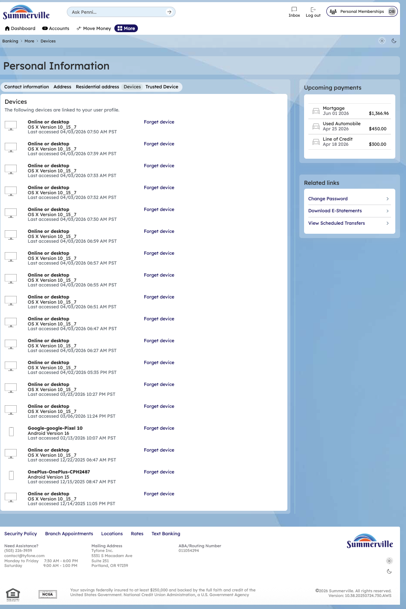
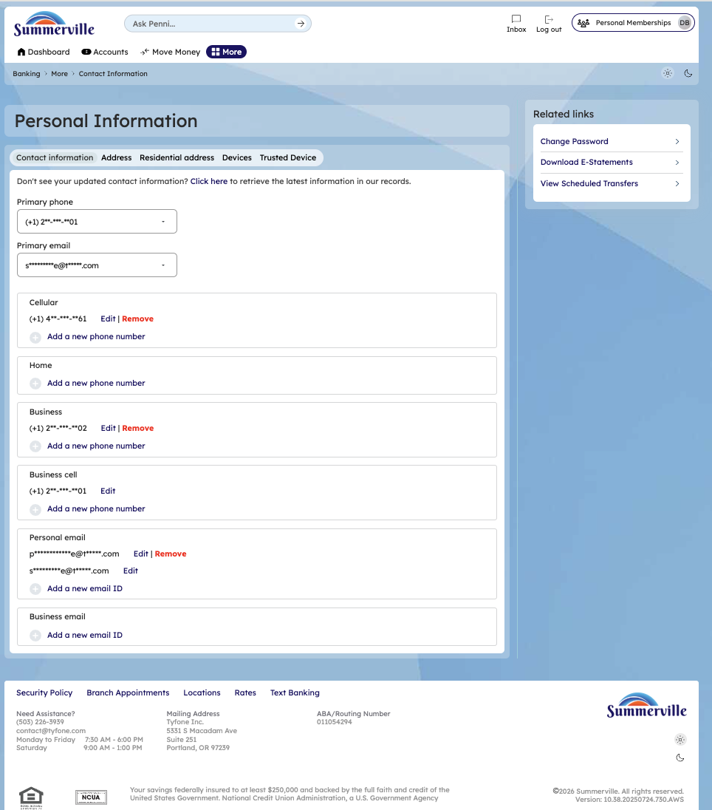
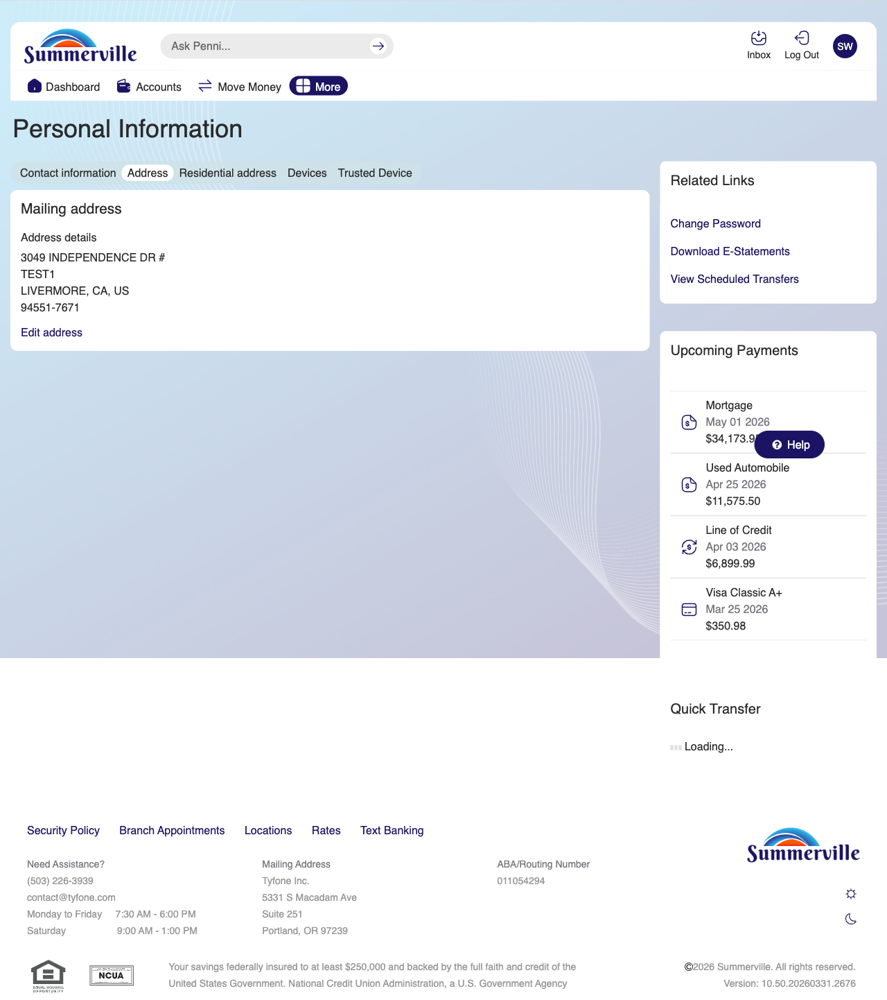
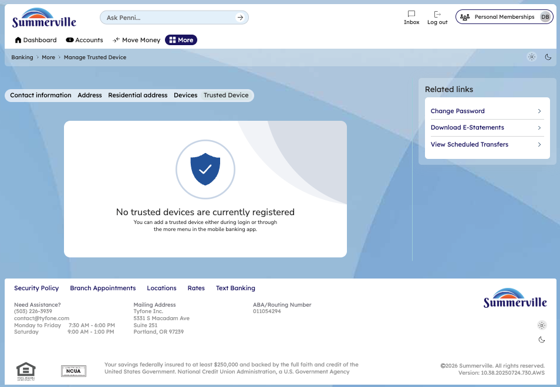

# Personal Information Management

> **Module:** Banking › More → Personal Information |

## Summary

The Personal Information section allows You to view and update their contact details, mailing and residential addresses, and manage trusted devices registered to your account. Keeping personal information current is essential for accurate OTP delivery, alert notifications, official correspondence, and identity verification.

The module is organised into tabs: Devices (trusted devices registered to the account), Contact Info (phone numbers and email addresses), Mailing Address, and Residential Address. Changes to sensitive contact fields (phone, email) require OTP verification using the existing contact before the new one can be saved.

You managing your personal information through the app avoid the need for branch visits or phone calls for routine updates. Address changes, phone number updates, and email address changes can all be completed self-service within minutes.

**At a Glance**

| Attribute       | Detail                                                               |
| --------------- | -------------------------------------------------------------------- |
| Module          | More > Personal Information                                          |
| Sections        | Devices, Contact Info, Mailing Address, Residential Address          |
| Verification    | OTP required for phone/email changes                                 |
| Trusted Devices | View, review, and remove registered trusted devices                  |
| Address Types   | Mailing (for statements/cards) and Residential (for ID verification) |
| Related Reports | (Device Management), (Settings), (Login)                             |

## Key Use Cases

| Use Case               | Who Uses It                   | What They Do                                             | Business Value                                               |
| ---------------------- | ----------------------------- | -------------------------------------------------------- | ------------------------------------------------------------ |
| Update Phone Number    | Member with new mobile number | Edit Contact Info > update phone number > verify via OTP | Ensures OTP and SMS alerts reach current phone number        |
| Update Email Address   | Member with new email         | Edit Contact Info > update email > verify new email      | Keeps email-based OTP and eDocument notifications functional |
| Update Mailing Address | Member who has moved          | Edit Mailing Address with new address details            | Ensures statements and cards are sent to the correct address |
| Verify Address on File | Member checking CU records    | View Mailing and Residential Address screens             | Quick audit without calling the CU branch                    |
|                        |                               |                                                          |                                                              |

## Step-by-Step Guide

\| _Navigation: Dashboard > More > 'Personal Information'._ |

**Step 1 — Start from Dashboard** The Dashboard displays all account balances, upcoming payments, quick-action tiles, and the top navigation bar with links to Accounts, Move Money, and More.

<figure><figcaption></figcaption></figure>

**Step 2 — Open the More Menu**

You can click ‘More' in the top navigation bar. The More options panel expands to show Personal Information. Or you can Navigate from Dashboard to Personal Information directly

<figure><figcaption></figcaption></figure>

**Step 3 — Personal Information page**

The Personal Information page is displayed showing the Devices tab. A list of registered devices is shown, each with a 'Forget Device' button for removing access.

<figure><figcaption></figcaption></figure>

**Step 4 — View Contact Information**

The Personal Information page shows the Contact Information section displayed in a form format with various fields for phone numbers and email addresses.

<figure><figcaption></figcaption></figure>

**Step 5 — View Mailing Address**

The Mailing Address section displays your current address  with an 'Edit addresses' button available.

<figure><figcaption></figcaption></figure>

**Step 6 — View Residential Address**

&#x20;The residential address section displays your residential address with an 'Edit addresses' button available.

<figure><figcaption></figcaption></figure>

**Step 7 — View Trusted Device Detail**

The Trusted Device section is displayed with a shield icon and a message indicating the current device  has been successfully trusted.

<figure><figcaption></figcaption></figure>
