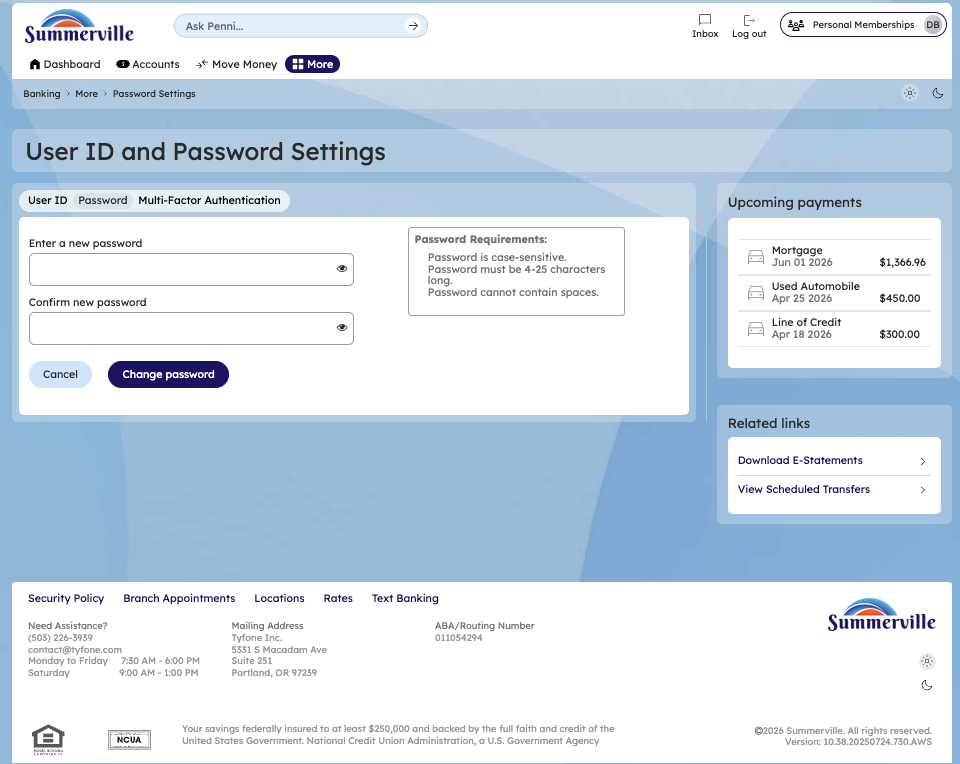
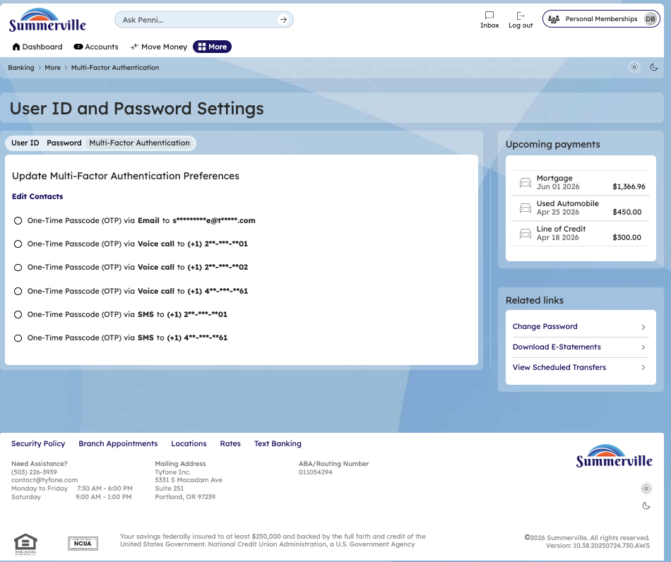
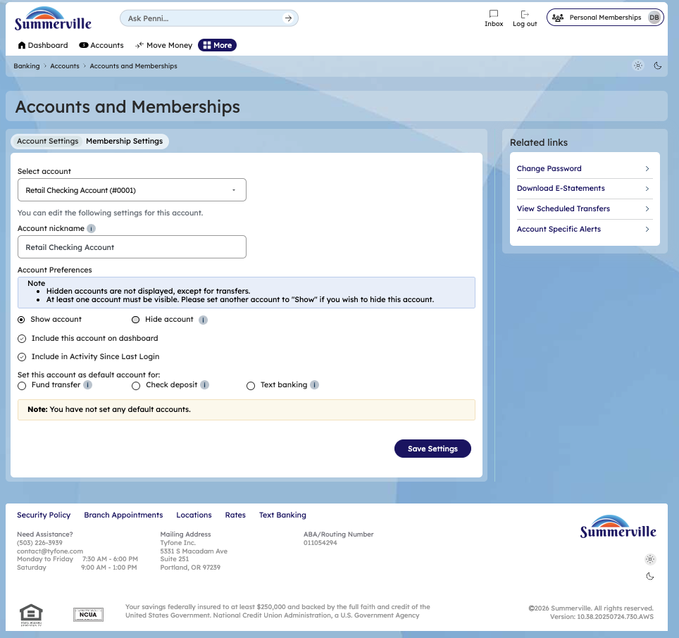

# Settings & Preferences

> **Module:** Banking › Settings |

## Summary

The Settings module is the central control panel for managing your nFinia digital banking experience. It brings together security configuration, account display preferences, notification settings, and membership management into a single accessible location. Settings is organised into clearly defined sections — including security (password, multi-factor authentication), account management (display names, visibility, ordering), and personal preferences — so members can maintain full control over how their account looks and behaves without needing to contact the credit union.

The Accounts & Memberships settings allow members to personalise how their accounts appear throughout the platform by setting nicknames, reordering the account list, hiding inactive accounts, and choosing display icons. These preferences persist across all sessions and devices, ensuring a consistent experience whether logging in via web or mobile. Members managing their own settings entirely through digital banking reduce their reliance on branch staff for routine administrative tasks.

**At a Glance**

| Attribute       | Detail                                               |
| --------------- | ---------------------------------------------------- |
| Module          | Settings                                             |
| Security        | Password, MFA, Authentication configuration          |
| Account Display | Nicknames, order, visibility, icons                  |
| Preferences     | Dark Theme, Masking, Text Banking, Courtesy Pay      |
| Navigation      | Accessible via top navigation gear icon or More menu |

## Key Use Cases

| Use Case              | Who Uses It                             | What They Do                                                     | Business Value                                            |
| --------------------- | --------------------------------------- | ---------------------------------------------------------------- | --------------------------------------------------------- |
| Set Account Nicknames | Members with multiple similar accounts  | Open Settings > Account Display, enter a nickname for each account | Makes account selection faster and clearer across all payment and transfer screens |
| Enable Dark Theme     | Members preferring dark mode display    | Toggle Dark Theme in Settings > Preferences                      | Reduces eye strain in low-light environments and improves app usability at night |
| Change Password       | Members rotating passwords for security | Open Settings > Security > Change Password                       | Self-service password update without contacting the credit union or visiting a branch |

## Step-by-Step Guide

\| _Navigation: Dashboard > Settings (gear icon) OR More > Settings._ |

**Step 1 - Start from Dashboard**

After logging in, you land on the Dashboard, which displays all account balances, upcoming payment summaries, quick-action tiles, and the top navigation bar. The navigation bar includes links to Accounts, Move Money, and More. This is the starting point for reaching Settings from either the gear icon in the navigation bar or through the More menu.

<figure><figcaption></figcaption></figure>

**Step 2 - Open the More Menu**

Click **More** in the top navigation bar. The More options panel expands to reveal additional features and configuration options, including User ID and Password settings, and Account & Membership Settings. You can also navigate directly to Settings from the Dashboard using the search option if you prefer a shortcut.

<figure><figcaption></figcaption></figure>

**Step 3 - User ID and Password Settings**

The User ID and Password Settings page opens with two tabs. The **User ID** tab lets you change the username you use to log into digital banking and displays a list of requirements your new User ID must meet (minimum character length, allowed characters, etc.). The **Password** tab lets you update your current password and displays the password requirements that must be satisfied before the new password can be saved. Both changes take effect immediately upon confirmation.

<figure><figcaption></figcaption></figure>

<figure><figcaption></figcaption></figure>

**Step 4 - View MFA Settings**

The **Multi-Factor Authentication** tab displays your current MFA configuration and gives you options to manage which contact methods — such as phone numbers or email addresses — are registered for receiving one-time passcodes. Keeping your MFA contact details current ensures you can always complete step-up authentication when logging in from a new device or performing a sensitive action.

<figure><figcaption></figcaption></figure>

**Step 5 - Accounts & Memberships Settings**

Navigate to the Accounts and Memberships settings page to manage how your accounts appear and behave throughout the platform. From here you can add or edit a nickname for any account to make it easier to identify, toggle individual accounts to show or hide them from the dashboard, and choose which accounts are included in the dashboard summary and activity-since-last-login view. Members can also designate a default account for fund transfers, check deposits, or text banking, saving time on routine transactions.

<figure><figcaption></figcaption></figure>

**Step 7 - Membership Settings**

The Memberships settings tab provides options to add an existing membership to your digital banking profile or remove a membership that is no longer needed. It also includes a masking preference that lets you choose whether membership numbers are displayed in full or masked throughout the platform — useful for members who access digital banking in shared or public environments.

<figure><figcaption></figcaption></figure>

<figure><figcaption></figcaption></figure>
