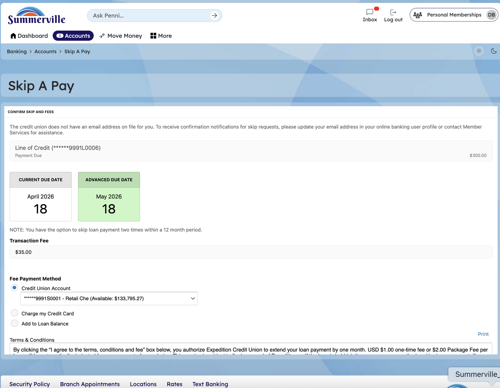
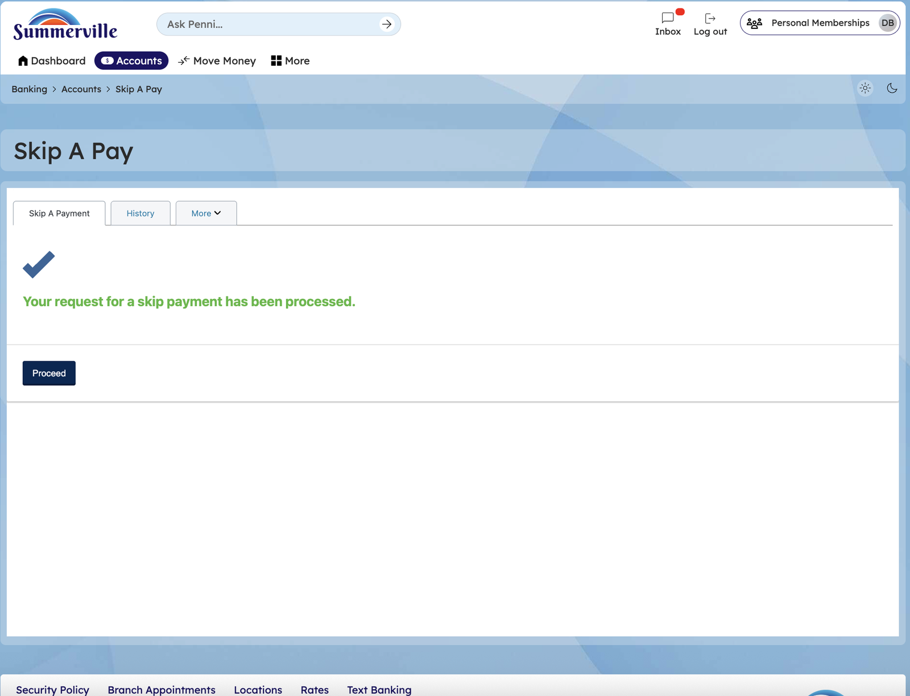

# Skip-A-Pay

> **Module:** Banking › More → Skip A Pay |

## Summary

Skip-A-Pay is a financial relief feature that allows eligible members to formally defer one loan payment per eligible period without incurring a late fee. The deferred payment is posted to the loan account, the loan term is extended by one month, and interest continues to accrue during the skipped month.

The digital Skip-A-Pay workflow replaces paper or phone requests with a fully self-service in-app process. You select the eligible loan, review the terms of the deferral, accept the agreement, and submit — all within a few steps. The Skip Payment Form in the Online Forms section provides an alternative access path for members who prefer the forms workflow.

**At a Glance**

| Attribute | Detail |
| --------------- | ----------------------------------------------------------------- |
| Module | More > Skip A Pay |
| Eligible Loans | Qualifying consumer and auto loans per CU eligibility rules |
| Effect on Loan | One payment deferred; interest continues to accrue; term extended |
| Fee | Nominal processing fee may apply per CU policy |
| Frequency | Once per eligible period per loan (typically once per 12 months) |
| Related Reports | (Loan Payments), (Online Forms) |

## Key Use Cases

| Use Case | Who Uses It | What They Do | Business Value |
| ----------------------- | --------------------------------------- | ------------------------------------------------------- | -------------------------------------------------------------- |
| Holiday Cash Relief | Members needing extra funds during holidays | Skip December payment to free up holiday budget | Maintains loan standing while managing seasonal cash flow |
| Emergency Expense Cover | Members facing unexpected financial need | Defer loan payment to cover immediate emergency expense | Avoids late fee while managing short-term cash flow disruption |
| Seasonal Income Gap | Members with seasonal employment | Skip payment during low-income month | Aligns payment obligation with income cycles |

## Step-by-Step Guide

\| _Navigation: Dashboard > More > 'Skip A Pay'._ |

**Step 1 — Start from Dashboard**

The Dashboard displays all account balances, upcoming payments, quick-action tiles, and the top navigation bar with links to Accounts, Move Money, and More.

<figure><figcaption></figcaption></figure>

**Step 2 — Open the More Menu**

Click ‘More' in the top navigation bar and find Skip A Pay option or **Navigate to Skip A Pay** from the search bar&#x20;

<figure><figcaption></figcaption></figure>

**Step 3 — Skip A Pay page**&#x20;

The Skip A Pay page lists all eligible loans, such as a Line of Credit or Auto Loan. Select the loan you want to skip a payment for.

<figure><figcaption></figcaption></figure>

**Step 4 — Select Loan & Review Fee Details**

The Skip A Pay confirmation page displays details about the selected loan, the applicable fee, the payment date, and payment method options. Review the terms and conditions, then check the agreement box before proceeding.

<figure><figcaption></figcaption></figure>

**Step 5 — Accept & Confirm Skip**

A confirmation screen states 'Your request for a skip payment has been processed' with a Continue button to return to the main interface.

<figure><figcaption></figcaption></figure>

**Step 6 — Skip a pay History & Notifications Tab**&#x20;

The Skip A Pay History tab shows a record of all previously skipped payments. The Notifications tab in More displays a history of all alert notifications sent to the member.
