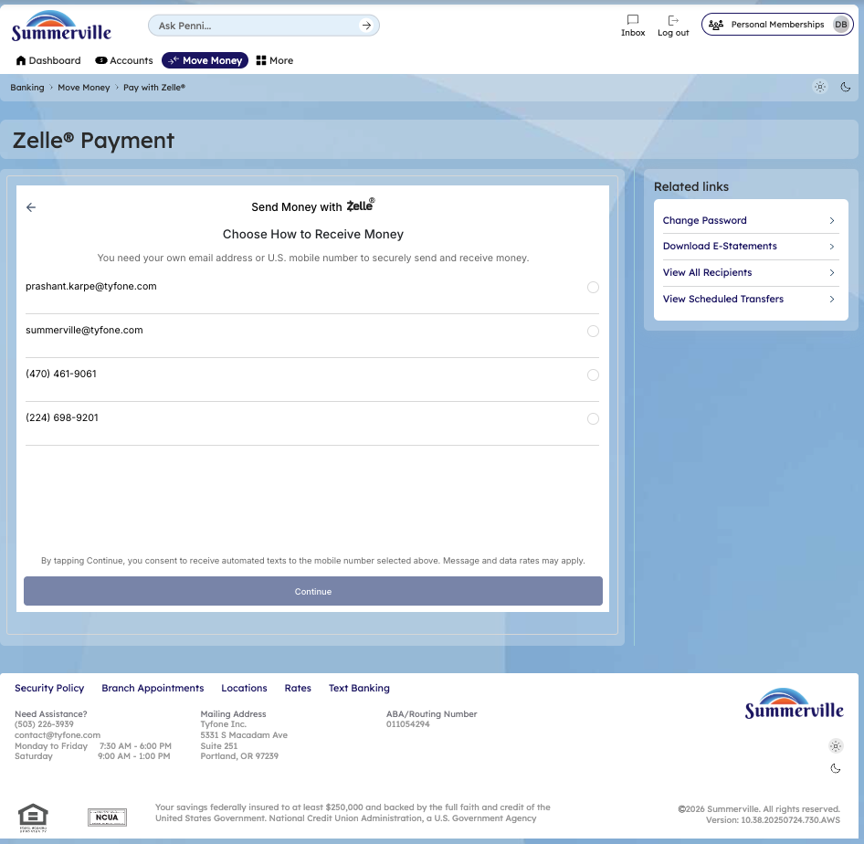
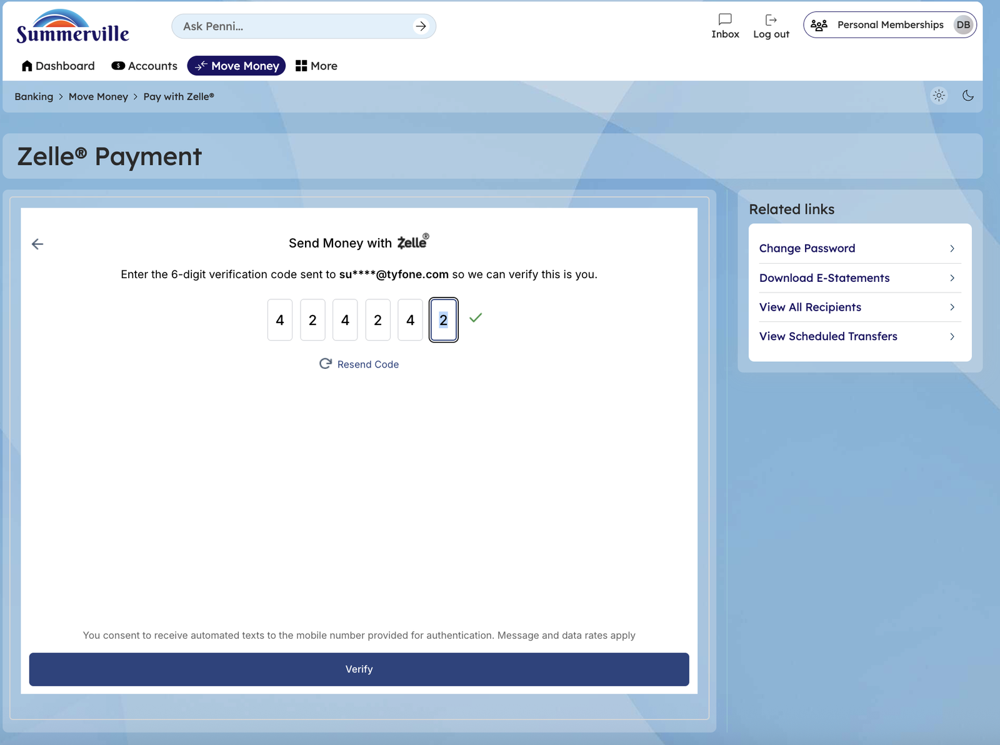

# Zelle & P2P Payments

> **Module:** Banking › Move Money → Zelle

## Summary

Zelle® is a real-time person-to-person (P2P) payment network integrated natively into the nFinia Move Money suite. It enables Summerville Credit Union Member to send and receive money directly with friends, family, and other trusted individuals — regardless of where those recipients bank — in a matter of minutes, using only the recipient's U.S. mobile phone number or email address.

The Zelle® integration within nFinia means members do not need a separate Zelle app or account. Transactions flow directly between bank accounts without storing money in a digital wallet. You can send money, request money from others, split bills across multiple people, and manage Zelle® activity and settings from within digital banking.

Because Zelle® payments to enrolled recipients are processed instantly and are effectively irreversible, You are strongly advised to verify the recipient's contact information before sending. Zelle® is intended for payments between people who know and trust each other.

**At a Glance**

| Attribute            | Detail                                                       |
| -------------------- | ------------------------------------------------------------ |
| Module               | Move Money > Zelle®                                          |
| Network              | Zelle® P2P Payment Network                                   |
| Recipient Identifier | US mobile phone number or email address                      |
| Transfer Speed       | Minutes to enrolled recipients; 14-day window for unenrolled |
| Reversibility        | Cannot be cancelled once recipient is enrolled in Zelle      |

## Key Use Cases

| Use Case          | Who Uses It                                     | What They Do                                                        | Business Value                                                  |
| ----------------- | ----------------------------------------------- | ------------------------------------------------------------------- | --------------------------------------------------------------- |
| Split Bill        | Members splitting a restaurant or shared bill   | Send the exact share to each recipient's enrolled Zelle contact     | Eliminates cash exchange for shared expenses                    |
| Pay an Individual | Members paying a trusted person                 | Enter recipient phone/email, amount, note, and send                 | Works for babysitters, tutors, contractors, friends, and family |
| Request Money     | Members asking someone to pay them back         | Use Zelle Request to send a payment request to a contact            | Recipient receives notification and can pay instantly via Zelle |
| Receive Payment   | Members expecting funds from another Zelle user | Share your enrolled phone number or email for others to send to you | Funds arrive directly into linked CU checking account           |

## Step-by-Step Guide

**Step 1 — Navigate to Move Money Hub**

Click ‘Move Money' in the top navigation bar and go to Zelle Payment

<figure><figcaption></figcaption></figure>

**Step 2 — Send a Zelle Payment**

The Zelle Payment form page is displayed from a legacy banking interface with form fields visible for entering recipient and payment details.

<figure><figcaption></figcaption></figure>

**Step 3 — Verify Zelle Payment**

The Zelle verification screen prompts you to enter a 6-digit verification code sent via SMS to verify and complete the Zelle transaction.

<figure><figcaption></figcaption></figure>
