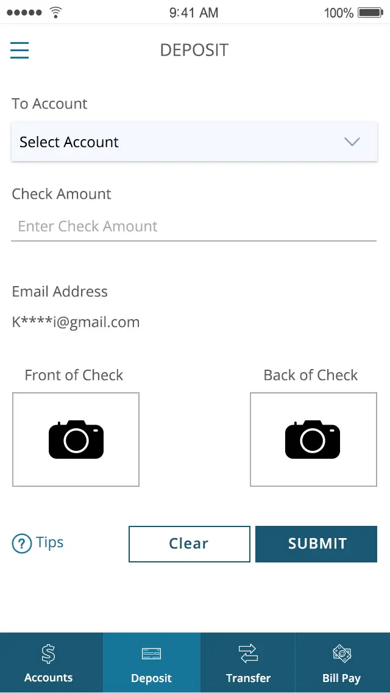
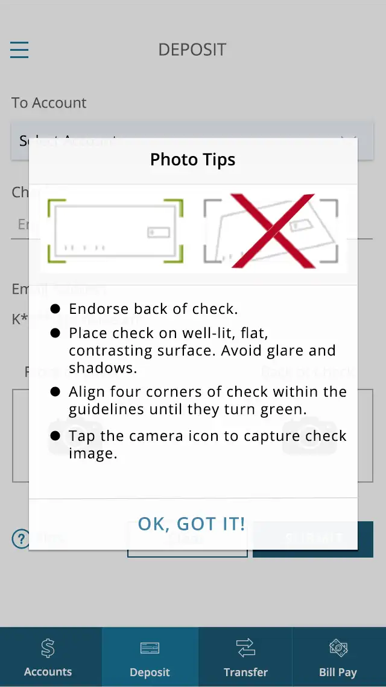
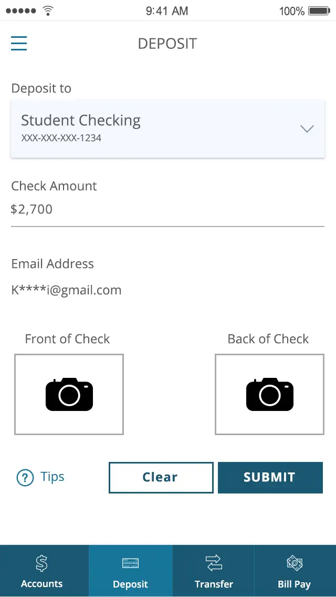
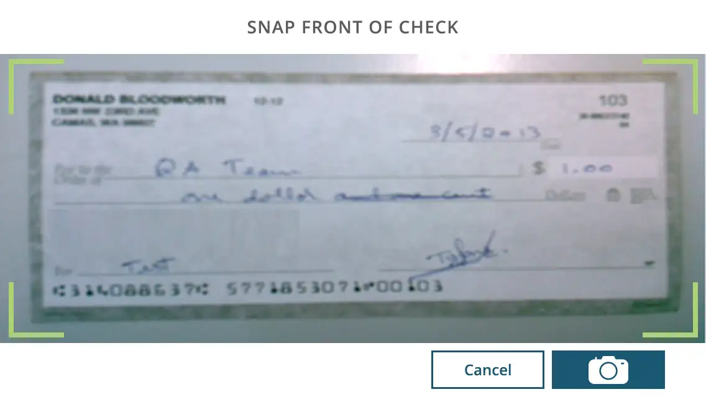
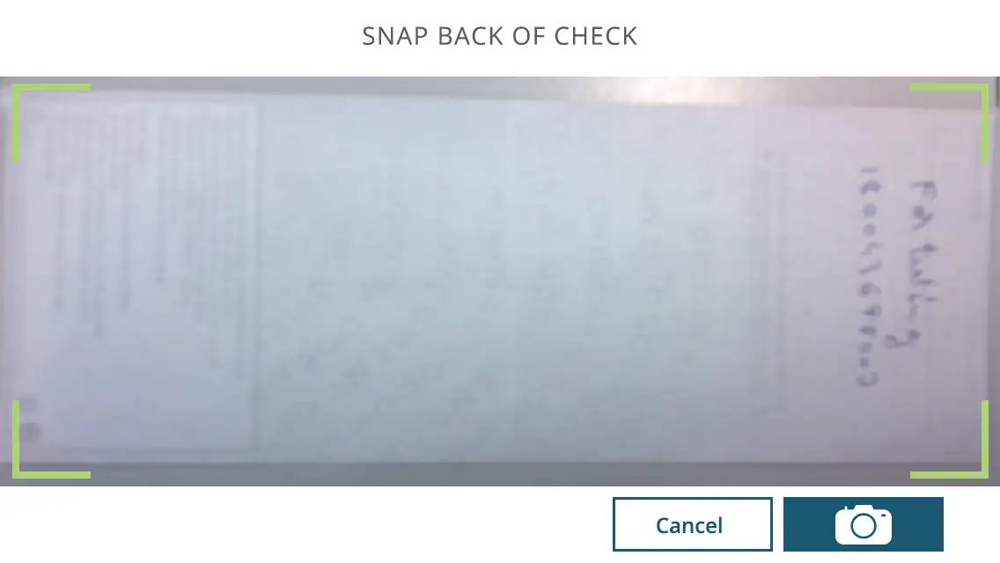
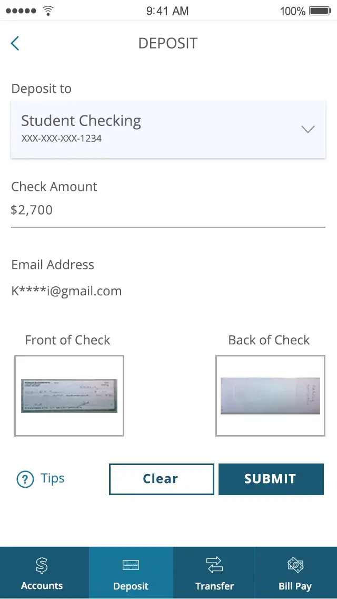
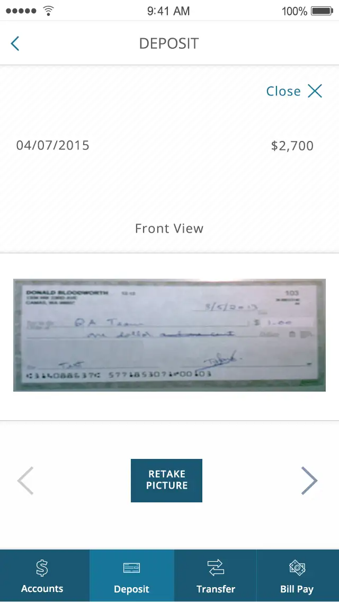
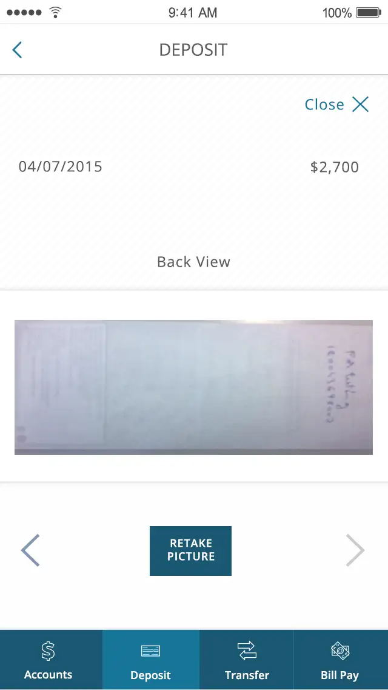

# Remote Check Deposit - Mobile

Platform: nFinia Mobile Banking&#x20;

**SUMMARY**

Mobile Check Deposit — also known as Remote Deposit Capture (RDC) — on nFinia enables Summerville CU  to deposit checks directly from your mobile device, eliminating the need for a branch visit. You use your device camera to photograph the front and back of a check through a guided capture interface with green corner-alignment overlays that ensure image quality.

The deposit flow walks You through each step: selecting the target account, entering the check amount, capturing check images using guided tips, reviewing thumbnails, and submitting. The system validates the amount against configured deposit limits and checks image quality before processing.

For Summerville CU , Mobile Check Deposit reduces teller traffic, extends deposit availability beyond branch hours, and provides  member — especially those with limited time to visit in person — with a fully digital deposit channel. All deposits create an auditable record in Check Deposit History, supporting Reg CC compliance and BSA/AML monitoring.

**At-a-Glance**

|                      |                                                                        |
| -------------------- | ---------------------------------------------------------------------- |
| **Attribute**        | **Detail**                                                             |
| Feature Name         | Mobile Check Deposit (Remote Deposit Capture / RDC)                    |
| Module               | Accounts > Deposit                                                     |
| User Roles           | Enrolled Member, Business Account Holder                               |
| Access Level         | Requires RDC enrollment and account eligibility                        |
| Key Actions          | Select account, enter amount, capture front/back check images, submit  |
| Regulatory Relevance | Reg CC (funds availability), BSA/AML (deposit monitoring), audit trail |

**2. USE CASES**

|                                |                            |                                                                                                         |                                                                      |
| ------------------------------ | -------------------------- | ------------------------------------------------------------------------------------------------------- | -------------------------------------------------------------------- |
| **Use Case**                   | **Who Uses It**            | **What They Do**                                                                                        | **Business Value**                                                   |
| Standard Check Deposit         | Business member            | Selects deposit account, enters check amount, photographs front and back using guided capture, submits  | Eliminates branch visit; deposit available within Reg CC timeframes  |
| First-Time Photo Capture       | New RDC user               | Reviews Photo Tips modal (endorse back, flat surface, align to green corners), then proceeds to capture | Reduces failed deposits and resubmission rates                       |
| Retake Check Image             | Member with blurry capture | Reviews thumbnail, taps Retake Picture on front or back image, recaptures                               | Improves image quality before submission; prevents processing delays |
| Large-Amount Deposit           | Business CFO               | Deposits check within configured limit (e.g. $2,700); system validates amount against account limit     | Enables treasury management without branch dependency                |
| Deposit Confirmation & History | Operations staff / Member  | Views deposit status, receipt number, and channel (Mobile/Online/Branch) in history tab                 | Provides audit trail; supports BSA/AML monitoring                    |

**3. END-TO-END WORKFLOW**

**3.1 Prerequisites**

• RDC enrollment active for your account

• Account eligible for mobile check deposit (configured by Summerville CU )

• nFinia mobile app installed with camera permission granted

**4. FEATURE OVERVIEW — UI WALKTHROUGH**

**Step 1: Tap on Deposit from the menu at the bottom.**&#x20;

<figure><figcaption></figcaption></figure>

|                            |                       |                                                            |
| -------------------------- | --------------------- | ---------------------------------------------------------- |
| **Field / Element**        | **Type**              | **Description**                                            |
| To Account                 | Dropdown              | Selects the target deposit account (e.g. Student Checking) |
| Check Amount               | Numeric input         | Dollar amount of check being deposited; required           |
| Email                      | Text input (optional) | Email address for deposit confirmation notification        |
| Front Check \[camera icon] | Button                | Opens camera or Photo Tips modal for front image capture   |
| Back Check \[camera icon]  | Button                | Opens camera for endorsed back image capture               |
| Bottom Nav                 | Navigation bar        | Accounts                                                   |

**Step 2: A Photo Tips guidance modal appears before camera opens**

<figure><figcaption></figcaption></figure>

|                     |              |                                                                      |
| ------------------- | ------------ | -------------------------------------------------------------------- |
| **Field / Element** | **Type**     | **Description**                                                      |
| Tip Text            | Instructions | Endorse back of check; place on flat surface; align to green corners |
| Proceed Button      | Button       | Dismisses modal and opens camera view for check capture              |

**Step 3:  Select the account (Student Checking) and amount to be deposited**

<figure><figcaption></figcaption></figure>

|                         |                   |                                                           |
| ----------------------- | ----------------- | --------------------------------------------------------- |
| **Field / Element**     | **Type**          | **Description**                                           |
| To Account              | Dropdown (filled) | Student Checking XXX-XXX-XXX-1234 selected                |
| Check Amount            | Numeric (filled)  | $2,700.00 entered                                         |
| Deposit Limit Indicator | Display           | Configured limit shown (e.g. $2,700 max for this account) |

**Step 4: Capture a picture of the Front of Check using the Camera (Landscape)**

<figure><figcaption></figcaption></figure>

|                     |             |                                                                  |
| ------------------- | ----------- | ---------------------------------------------------------------- |
| **Field / Element** | **Type**    | **Description**                                                  |
| Camera Viewfinder   | Live camera | Full-screen camera view oriented to capture check                |
| Green Corner Guides | Overlay     | Visual alignment corners; turn green when check properly aligned |
| Capture Button      | Button      | Takes photo when check is aligned and in focus                   |

**Step 5: Capture a picture of the Back of the Check using the Camera (Landscape)**

<figure><figcaption></figcaption></figure>

|                         |             |                                             |
| ----------------------- | ----------- | ------------------------------------------- |
| **Field / Element**     | **Type**    | **Description**                             |
| Camera Viewfinder       | Live camera | Full-screen view for endorsed back of check |
| Corner Alignment Guides | Overlay     | Same guidance system as front capture       |
| Capture Button          | Button      | Takes photo of back of endorsed check       |

**Step 6:** Review screen with front and back thumbnails before submission

<figure><figcaption></figcaption></figure>

|                     |                  |                                                       |
| ------------------- | ---------------- | ----------------------------------------------------- |
| **Field / Element** | **Type**         | **Description**                                       |
| Front Thumbnail     | Image preview    | Captured front check image — tap to enlarge or retake |
| Back Thumbnail      | Image preview    | Captured back (endorsed) check image                  |
| SUBMIT Button       | Primary action   | Submits deposit for processing                        |
| RETAKE PICTURE      | Secondary action | Discards and recaptures front or back image           |

**Step 7 (Optional):** There is an option to Retake the picture of the front and back of the check if needed.&#x20;

<figure><figcaption></figcaption></figure>

|                     |           |                                                        |
| ------------------- | --------- | ------------------------------------------------------ |
| **Field / Element** | **Type**  | **Description**                                        |
| Front Image Preview | Full view | Enlarged view of front check image for quality review  |
| RETAKE PICTURE      | Button    | Discards current front image and reopens camera        |
| Check Details       | Display   | Date, check amount, account info displayed below image |

**Step 8 (Optional): Back Check Retake View**

<figure><figcaption></figcaption></figure>

|                     |           |                                                       |
| ------------------- | --------- | ----------------------------------------------------- |
| **Field / Element** | **Type**  | **Description**                                       |
| Back Image Preview  | Full view | Enlarged view of back (endorsed) check image          |
| RETAKE PICTURE      | Button    | Discards back image and reopens camera for re-capture |
| Endorsement Area    | Visual    | Back image should show member endorsement signature   |

**Step 9 — Completion**

Upon successful submission, a confirmation screen is displayed. The transaction is recorded in Check Deposit History with status "Submitted," timestamp, amount, and channel (Mobile). An audit log entry is created with deposit event details for BSA/AML and Reg CC compliance.

**5. Decision Points & Error Handling**

|                                          |                                                                      |
| ---------------------------------------- | -------------------------------------------------------------------- |
| **Condition**                            | **System Behavior**                                                  |
| Amount exceeds configured deposit limit  | "Exceeds deposit limit" error shown; deposit blocked until corrected |
| Image quality insufficient (blurry/dark) | "Image quality insufficient" prompt; member directed to retake       |
| Account not eligible for RDC             | Account not shown in deposit dropdown                                |
| Network failure during submission        | Draft preserved; retry option shown on next app open                 |

**7. QUICK REFERENCE**

|                           |                                               |                              |                                                 |
| ------------------------- | --------------------------------------------- | ---------------------------- | ----------------------------------------------- |
| **Task**                  | **Navigation Path**                           | **Who Can Do It**            | **Notes**                                       |
| Deposit a check           | App > Deposit tab > Fill form > Submit        | Enrolled member (RDC active) | Camera permission required                      |
| View deposit history      | App > Deposit > History tab                   | Member                       | Shows all channels: Mobile, Online, Branch, ATM |
| Retake check image        | Deposit flow > Review screen > Retake Picture | Member                       | Available before submission only                |
| Check deposit limit       | Deposit form — displayed automatically        | Member                       | Configured per account type by Summerville CU   |
| View deposit confirmation | Success screen after submit                   | Member                       | Shows receipt number, amount, status            |
