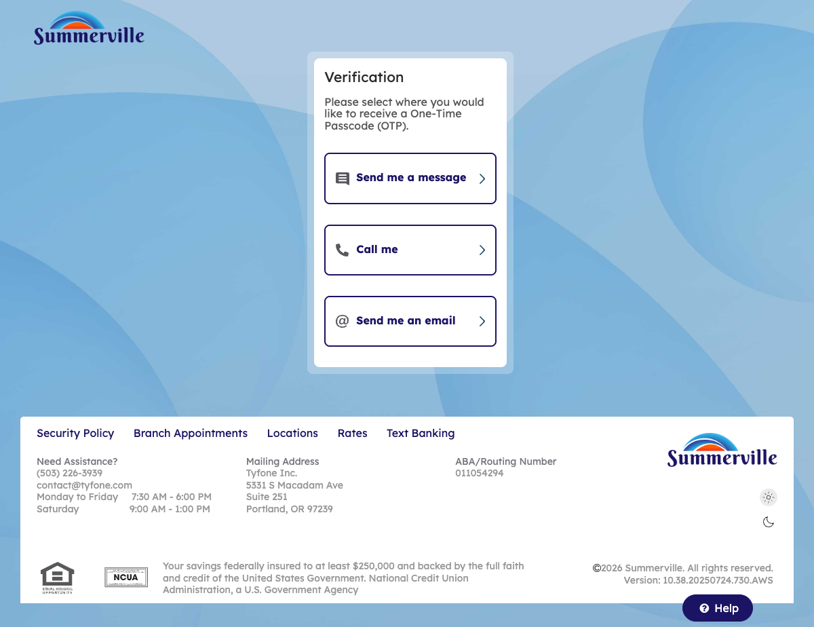
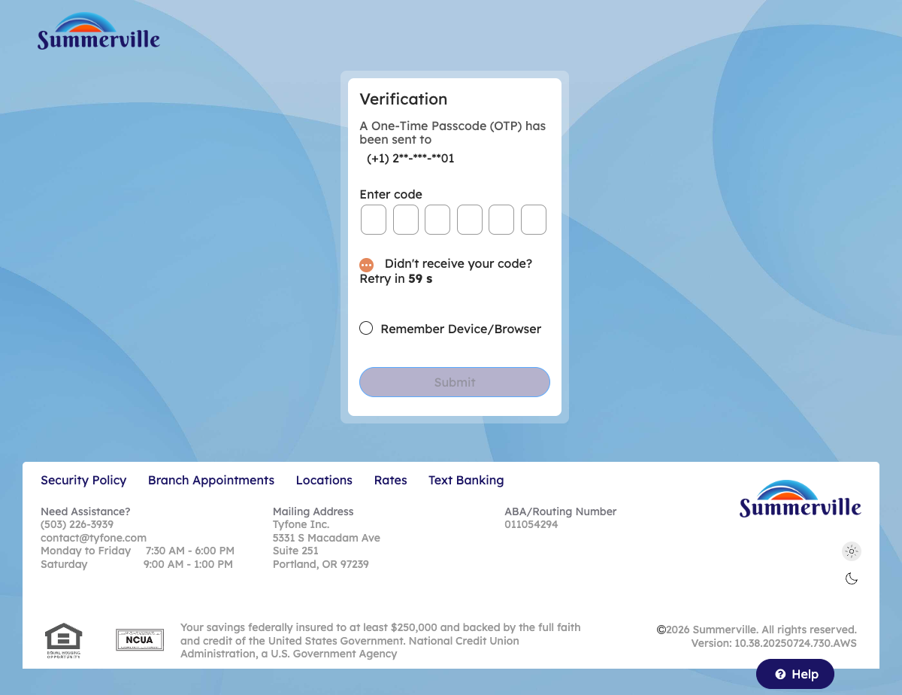

# External ACH Transfer

## Summary

External ACH Transfer enables members to send and receive funds between their Summerville CU accounts and accounts held at other financial institutions — using the ACH network with standard 1–3 business day settlement. For business members funding a business account from a personal account at another bank, paying a vendor whose banking relationship is at a different institution, or collecting a receivable via ACH pull, this feature provides a fully self-service external transfer channel that avoids wire fees for non-time-critical payments.

## Key Use Cases

Business members initiate ACH pushes to fund a business operating account from an external personal or business account when internal account balances fall below operating thresholds. Members use ACH pull to collect a payment from a customer or partner who has authorised the debit — entering the external account details and the collection amount directly in the transfer form. Members also use External ACH to transfer personal funds from a credit union account to a brokerage or investment account held elsewhere, consolidating cash movement within a single authenticated session rather than initiating the transfer from the receiving institution.

## Step-by-Step Guide

**Step 1 — Navigate to Move Money Hub**

Click ‘Move Money' in the top navigation bar. The Move Money Hub displays External Transfer or Same Day Trander to other institutions as one of the options.&#x20;

<figure><figcaption></figcaption></figure>

**Step 3 — Click on External Transfer**

This screen shoes a simplified form with fields for entering the source account and external recipient,enter an amount of $100 and select the date and click on continue.

<figure><figcaption></figcaption></figure>

**Step 4 — Review Pre-Confirmation**

The confirmation screen displays a transfer from Retail Savings Account to an external Retail Savings Account, showing the description and scheduled transfer date.

<figure><figcaption></figcaption></figure>

**Step 5 — Select OTP Verification Method**

A verification modal appears offering three authentication methods — 'Send me a message', 'Call me', or 'Send me an email' — to verify the external transfer before processing.

<figure><figcaption></figcaption></figure>

**Step 6 — Enter OTP & Submit**

The verification page is displayed with a field to enter the verification code received via the selected authentication method to complete the external transfer.

<figure><figcaption></figcaption></figure>

_**Step 7: External Funds are Transfered Successfully**_ &#x20;

<figure><figcaption></figcaption></figure>
