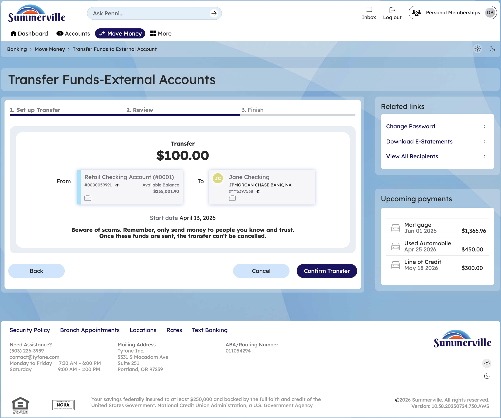

# Wire Transfers

> **Module:** Banking › Move Money → Domestic Wired Transfer
>
> **Alternate Path:** More → Online Forms → Wire Transfer Form

## Summary

Summerville Credit Union offers both Domestic and International Outgoing Wire Transfers through the nFinia digital banking platform. Wire transfers are the preferred instrument for time-critical, high-value payments that require same-day or guaranteed settlement — real estate closings, escrow deposits, large business disbursements, and international supplier payments.

Domestic wires clear through the Federal Reserve Fedwire system and typically settle the same business day when submitted before the daily cut-off time. International wires route through the SWIFT network and typically settle within 1–3 international banking days, with additional time for correspondent bank processing.

Wire transfers are captured as digital forms within the Online Forms portal. The system pre-populates available account information and guides You through all required fields. For international wires, a SWIFT/BIC code for the receiving bank is mandatory, as is a complete international beneficiary address.

**At a Glance**

| Attribute                | Detail                                                                           |
| ------------------------ | -------------------------------------------------------------------------------- |
| Module (Primary)         | Move Money > Domestic Wired Transfer                                             |
| Module (Alternate)       | More > Online Forms > Wire Transfer Form                                         |
| Domestic Network         | Federal Reserve Fedwire                                                          |
| International Network    | SWIFT                                                                            |
| Domestic Settlement      | Same business day (if before cut-off)                                            |
| International Settlement | 1–3 international banking days                                                   |
| Related Reports          |  (Move Money Hub),  (Recipient Management),  (Online Forms) |

## Key Use Cases

| Use Case                       | Who Uses It                                    | What They Do                                                               | Business Value                                                     |
| ------------------------------ | ---------------------------------------------- | -------------------------------------------------------------------------- | ------------------------------------------------------------------ |
| Real Estate Closing            | You wiring earnest money or closing funds      | Complete domestic wire form with title company's bank details              | Same-day settlement meets real estate transaction deadlines        |
| International Supplier Payment | Business You paying overseas vendors           | Complete international wire form with SWIFT, IBAN, and beneficiary address | SWIFT network reaches most global financial institutions           |
| Recurring Wire Payee           | You who wire to the same beneficiary regularly | Save recipient in Recipient Management; use template for repeat wires      | Reduces data entry errors for known beneficiaries                  |
| High-Value Urgent Payment      | You needing same-day guaranteed settlement     | Use wire instead of ACH for amount-critical same-day needs                 | ACH cannot guarantee same-day; wire settles by end of business day |
|                                |                                                |                                                                            |                                                                    |

## Step-by-Step Guide

\| _Navigation: Dashboard > Move Money > Domestic Wired Transfer tile — or — Dashboard > More > Online Forms > Wire Transfer Form._ |&#x20;

**Step 1 — Start from Dashboard** The Dashboard displays all account balances, upcoming payments, quick-action tiles, and the top navigation bar with links to Accounts, Move Money, and More.&#x20;

<figure><figcaption></figcaption></figure>

**Step 2 — Navigate to Move Money**

Click **Move Money** in the top navigation bar. The Move Money Hub displays all available transfer and payment tiles. Locate and click the **Domestic Wired Transfer** tile to begin a new wire request.

> **Alternate path:** You can also access wire transfers via **More → Online Forms → Wire Transfer Form**. The Forms route opens the same wire transfer request form through the Online Forms portal.

<figure><figcaption></figcaption></figure>

**Step 3 — Open the Wire Transfer Form**

The Domestic Outgoing Wire Transfer Request form is displayed within the Online Forms section, showing the form title and multiple input fields for initiating a wire transfer request.

<figure><figcaption></figcaption></figure>

**Step 4 — Review & Submit**

Review all wire details — originating account, beneficiary name, bank routing/SWIFT code, and amount. Click **Submit** to send the wire request. A confirmation screen displays the submitted wire reference number and status. You can track the wire status from your Inbox notifications.
