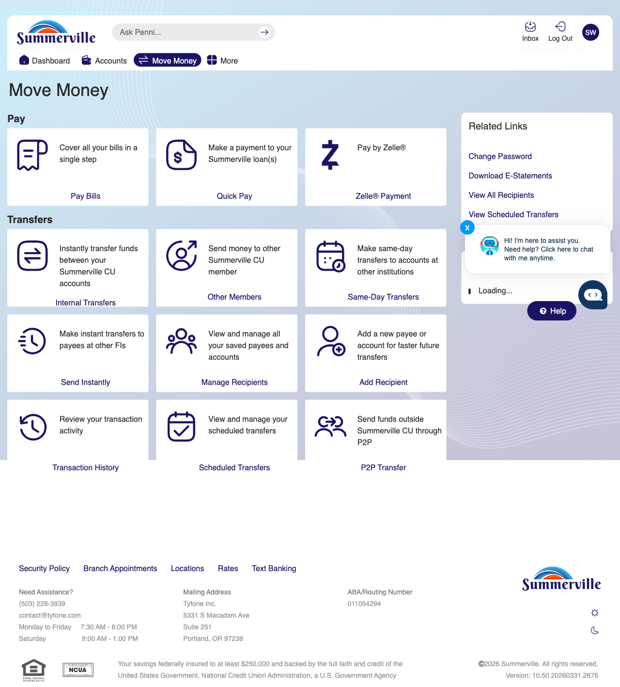
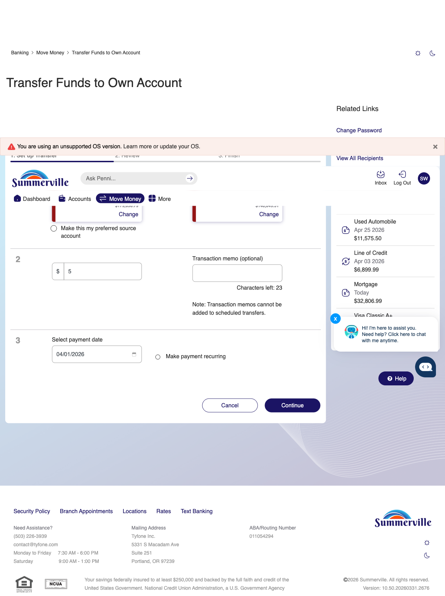
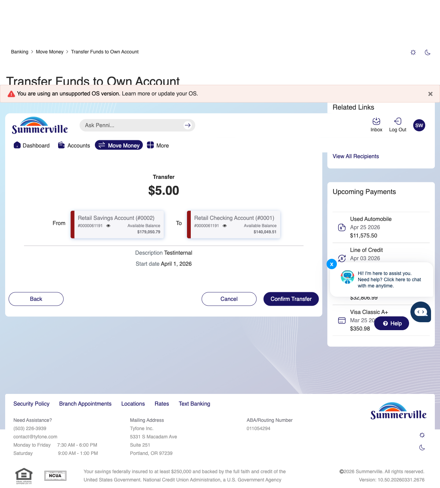
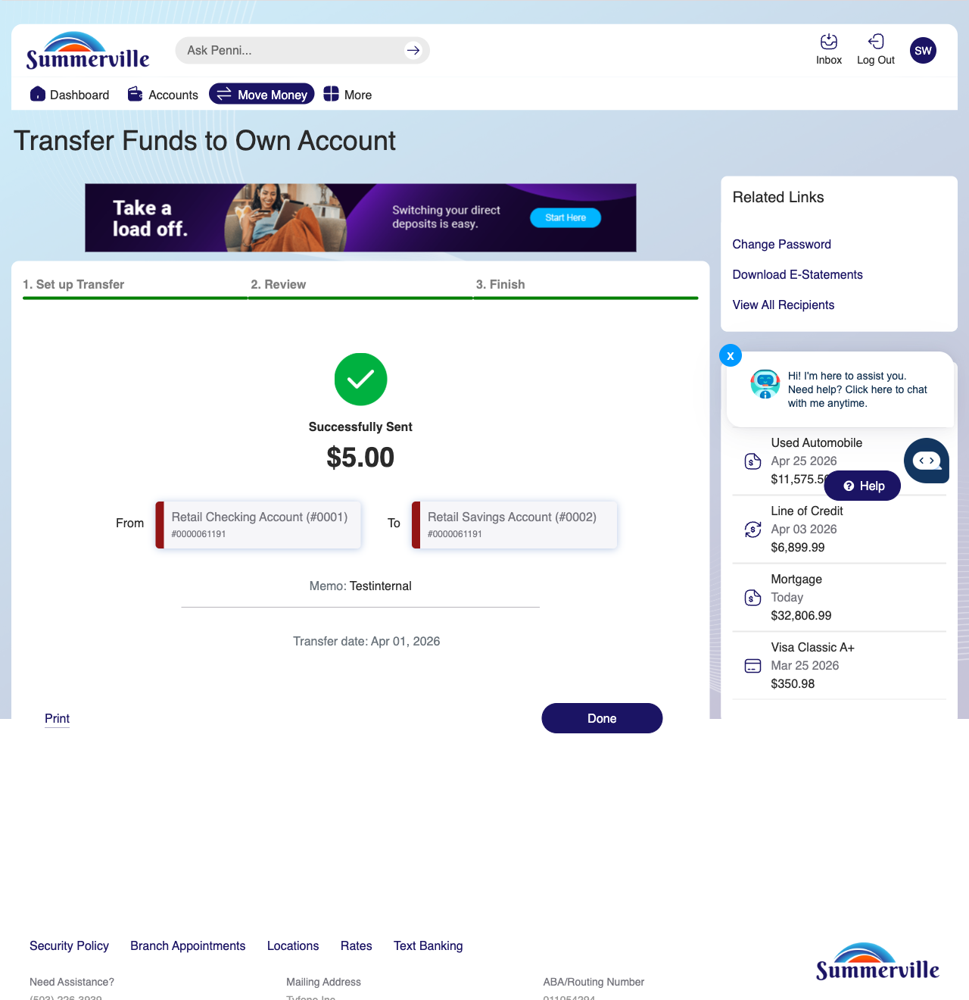
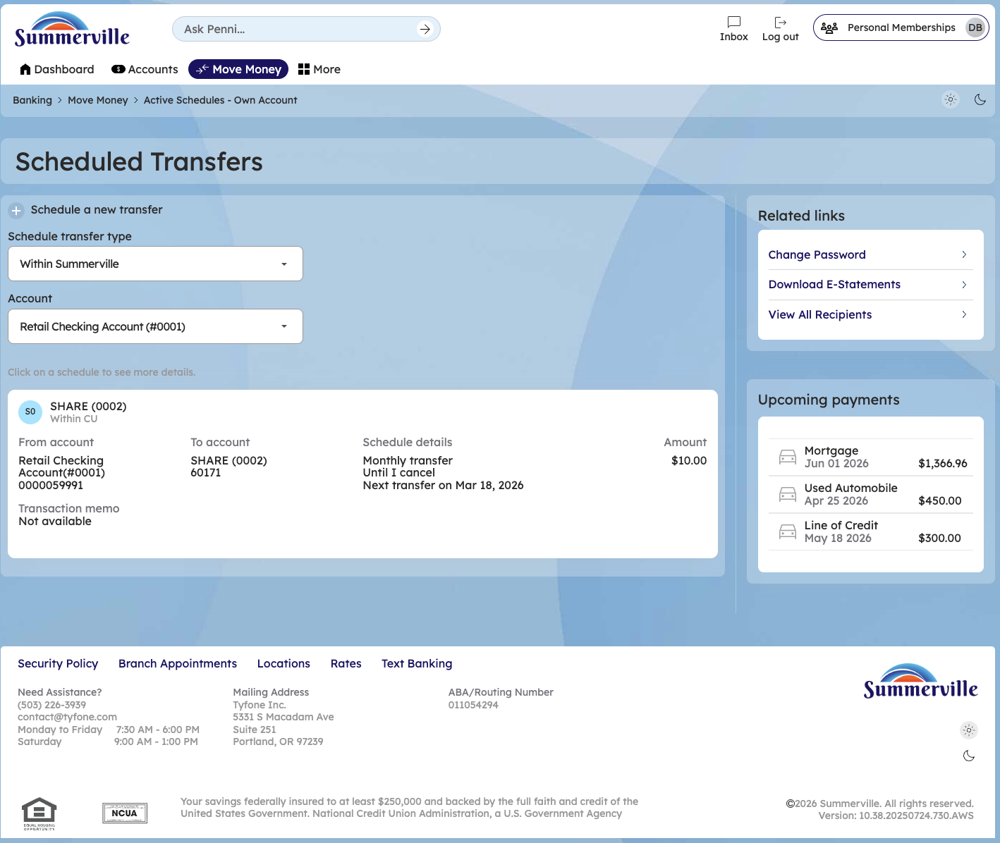

# Transfer to Own Account & Scheduled

> **Module:** Banking › Move Money → Transfer / Scheduled

## Summary

The Transfer to Own Account feature enables You to move funds instantly between your own accounts held at the credit union — for example, from checking to savings, or from savings to a loan. Transfers between own accounts are processed in real time with immediate balance updates. The four-step wizard guides You through selecting source and destination accounts, entering amount and memo, reviewing the summary, and receiving a success confirmation.

Scheduled Transfers extend the own-account transfer capability to automated recurring movements. You can schedule weekly, bi-weekly, semi-monthly, or monthly transfers that execute automatically on the configured date. Common use cases include automatic savings contributions on payday and recurring loan payments to avoid missed deadlines.

The Scheduled Transfers view also serves as a log for completed FedNow and ACH transfers, giving You a consolidated payment history view alongside your active transfer schedules.

**At a Glance**

| Attribute       | Detail                                                  |
| --------------- | ------------------------------------------------------- |
| Module          | Move Money > Transfer Own Account / Scheduled Transfers |
| Transfer Speed  | Instant (real-time for own-account transfers)           |
| Schedule Types  | One-time, Weekly, Bi-weekly, Semi-monthly, Monthly      |
| Steps           | 4 (From → To → Amount/Memo → Confirm → Success)         |
| History View    | Completed FedNow and scheduled transfer records         |
| Related Reports | CSUM-06 (Move Money Hub), CSUM-08 (Other You Transfer)  |

## Key Use Cases

| Use Case                    | Who Uses It                      | What They Do                                                       | Business Value                                          |
| --------------------------- | -------------------------------- | ------------------------------------------------------------------ | ------------------------------------------------------- |
| Savings Top-Up              | You building savings goal        | Select checking as From, savings as To, enter amount               | Instant savings deposit without branch or ATM           |
| Automate Monthly Savings    | You setting up recurring savings | Schedule weekly transfer from checking to savings after payday     | Set-and-forget savings automation                       |
| Loan Payment from Savings   | You with funds in savings        | Select savings as From, loan as To for immediate payment           | Flexible payment source beyond primary checking account |
| View Scheduled Transfer Log | You reviewing automated payments | Open Scheduled Transfers to see all active and completed schedules | Full automation history in one screen                   |
|                             |                                  |                                                                    |                                                         |

## Step-by-Step Guide

\| _Navigation: Dashboard > Move Money > 'Transfer to Own Account' OR 'Scheduled Transfers'._ | **Step 1 — Start from Dashboard** | you begins at the Dashboard after logging in. The Dashboard displays all account balances, upcoming payments, quick-action tiles, and the top navigation bar with links to Accounts, Move Money, and More. |

<figure><figcaption></figcaption></figure>

_Step 1: Start from Dashboard_

**Step 2 — Navigate to Move Money Hub**

You click ‘Move Money' in the top navigation bar. The Move Money Hub displays all payment and transfer options as tiles including Pay Bills, Quick Pay, Zelle Payment, Internal Transfers, Other You, Same-Day Transfers, Send Instantly, Manage Recipients, Add Recipient, Transaction History, Scheduled Transfers, and P2P Transfer.

<figure><figcaption></figcaption></figure>

_Step 2: Move Money Hub_

**Step 3 — Navigate from Dashboard to Own Account Transfer**

Step 1 of the Own Account Transfer flow shows the account selection screen with a dropdown to choose the source account for the internal transfer.

<figure><figcaption></figcaption></figure>

_Step 3: Navigate from Dashboard to Own Account Transfer_

**Step 4 — Enter Amount & Memo**

Step 4 displays the transfer details form with fields for entering the transfer amount, an optional transaction memo, payment date selection, and a recurring payment checkbox.

<figure><figcaption></figcaption></figure>

_Step 4: Enter Amount & Memo_

**Step 5 — Review Transfer Summary**

The confirmation screen shows a $5.00 transfer between Retail Savings and Retail Checking accounts, displaying the description and scheduled date for member review.

<figure><figcaption></figcaption></figure>

_Step 5: Review Transfer Summary_

**Step 6 — Transfer Complete — Success Screen**

A success confirmation page is displayed with a green checkmark, confirming the completed $5.00 transfer between accounts with a transfer date of Apr 01, 2026.

<figure><figcaption></figcaption></figure>

_Step 6: Transfer Complete — Success Screen_

**Step 7 — View & Manage Scheduled Transfers**

The Scheduled Transfers page is displayed with Summerville branding. A 'Schedule a new transfer' link is at the top. The schedule transfer type is set to 'Within Summerville' and the account is 'Retail Checking Account (#0001)'. An active schedule card shows a transfer from Retail Checking to SHARE (0002) for $10.00 monthly, set to continue until cancelled with the next transfer date of Mar 18, 2026. Related Links and Upcoming Payments are shown in the right sidebar.

<figure><figcaption></figcaption></figure>

_Step 7: View & Manage Scheduled Transfers_
