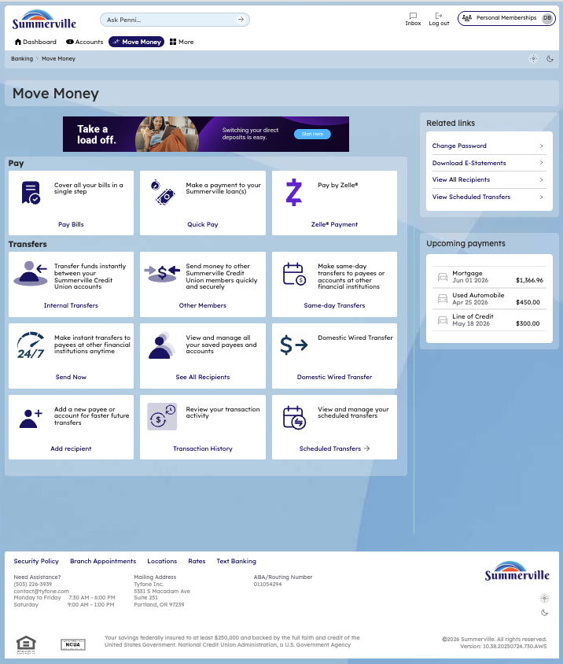
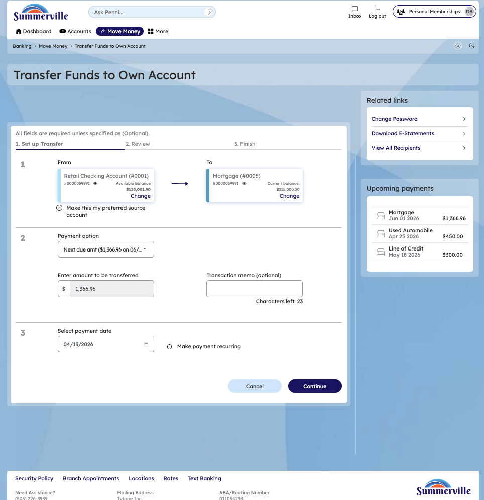

# Scheduled Transfers

_Module: Banking › Move Money › Scheduled Transfers_

## Summary

Scheduled Transfers let you automate recurring or future-dated movements of money between your own accounts (and eligible linked accounts) at Summerville. Schedule weekly, bi-weekly, semi-monthly, or monthly transfers that execute automatically on the configured date — ideal for automatic savings contributions, recurring loan payments, or planned one-time future transfers. The Scheduled Transfers screen also serves as a consolidated view of all active schedules and completed scheduled transfer history, so you always know what will move and what has already moved.

## At a Glance

| Attribute | Detail |
| --- | --- |
| Module | Move Money › Scheduled Transfers |
| Who Can Use | All nFinia Digital Banking members |
| Schedule Types | One-time future-dated, Weekly, Bi-weekly, Semi-monthly, Monthly |
| End Conditions | Continue until cancelled, End by date, After N occurrences |
| Execution Speed | Runs automatically on the scheduled date (instant for own-account) |
| History View | Active schedules and completed scheduled transfer records |
| Availability | 24 / 7 — via web or mobile |

## Key Use Cases

| Use Case | Who Uses It | What They Do | Business Value |
| --- | --- | --- | --- |
| **Automate monthly savings** | Member with a savings goal | Schedule a weekly transfer from checking to savings after payday | Set-and-forget savings automation |
| **Recurring loan payment** | Borrower with monthly obligation | Schedule a monthly transfer from checking to loan | Avoids missed payments and late fees |
| **Future-dated one-time transfer** | Member planning a large purchase | Schedule a one-time transfer for a specific future date | Move funds exactly when needed, not earlier |
| **Bill-aligned cash flow** | Member with due-date patterns | Schedule semi-monthly transfers aligned to bill cycles | Keeps cash positioned to cover obligations |
| **Review & manage schedules** | Any member | Open Scheduled Transfers to view, edit, or cancel any schedule | Full visibility into all upcoming automated transfers |

## Step-by-Step Guide

_Navigation: Banking › Move Money › Scheduled Transfers — or Dashboard › Related Links › View Scheduled Transfers_

### Step 1 — Open the Move Money Hub

From the top navigation, click **Move Money** to open the Move Money Hub. The hub displays all payment and transfer options as tiles: Pay Bills, Quick Pay, Zelle Payment, Internal Transfers, Other Members, Same-Day Transfers, Send Instantly, Manage Recipients, Transaction History, and **Scheduled Transfers**. You can also reach Scheduled Transfers directly from the Dashboard's **Related Links** panel via the **View Scheduled Transfers** shortcut.

<figure><figcaption>
Step 1: Open the Move Money Hub and select <strong>Scheduled Transfers</strong>, or use the Dashboard <strong>Related Links</strong> shortcut.
</figcaption></figure>

<figure><figcaption>
Alternative entry point: Dashboard › Related Links › <strong>View Scheduled Transfers</strong>.
</figcaption></figure>

### Step 2 — Set Up the Scheduled Transfer

Open **Transfer Funds to Own Account** (or the appropriate transfer type) and complete the wizard: select the **From** account, select the **To** account, enter the transfer amount, add an optional transaction memo, and choose the payment date. To make the transfer recurring, check the **Make payment recurring** box. This exposes the recurrence controls — **Every** (Weekly / Bi-weekly / Semi-monthly / Monthly), and an end condition (**Continue until cancelled**, **End by** a specific date, or **After** a set number of occurrences). Click **Continue** to proceed.

<figure><figcaption>
Step 2: Enter amount, date, and check <strong>Make payment recurring</strong>. Select the frequency and end condition.
</figcaption></figure>

### Step 3 — Review and Confirm

Review the summary — source account, destination account, amount, recurrence schedule, and next run date — then click **Confirm** to activate the schedule. The first run happens on the scheduled date (or immediately if the date is today), and subsequent runs execute automatically at the configured cadence.

### Step 4 — View & Manage Scheduled Transfers

Return to the **Scheduled Transfers** page at any time to see every active schedule in one place. For each schedule, the card displays the source and destination accounts, the amount, the frequency (for example, Monthly), the end condition (for example, _continue until cancelled_), and the **next transfer date**. You can also filter by transfer type and account to narrow the view, and the screen doubles as a history log for completed scheduled and FedNow transfers.

<figure><figcaption>
Step 4: Review, edit, or cancel any active schedule from the <strong>Scheduled Transfers</strong> page.
</figcaption></figure>

## End-to-End Workflow

1. **Entry point** — Member opens Move Money (or uses Dashboard › Related Links › View Scheduled Transfers).
2. **Set up** — Member configures the transfer: From / To accounts, amount, memo, start date.
3. **Enable recurrence** — Member checks **Make payment recurring**, selects frequency and end condition.
4. **Confirm** — Member reviews the summary and confirms; the schedule becomes active immediately.
5. **Automatic execution** — On each scheduled date, the platform executes the transfer automatically and updates balances in real time for own-account moves.
6. **Manage** — Member returns to Scheduled Transfers to view, edit, pause, or cancel any schedule — and to review completed scheduled transfer history.

> **Note:** Scheduled Transfers is separate from **Own Account Transfers**. Use Own Account Transfers for instant, one-off moves between your accounts. Use Scheduled Transfers when you need the transfer to run on a future date or repeat on a schedule.
