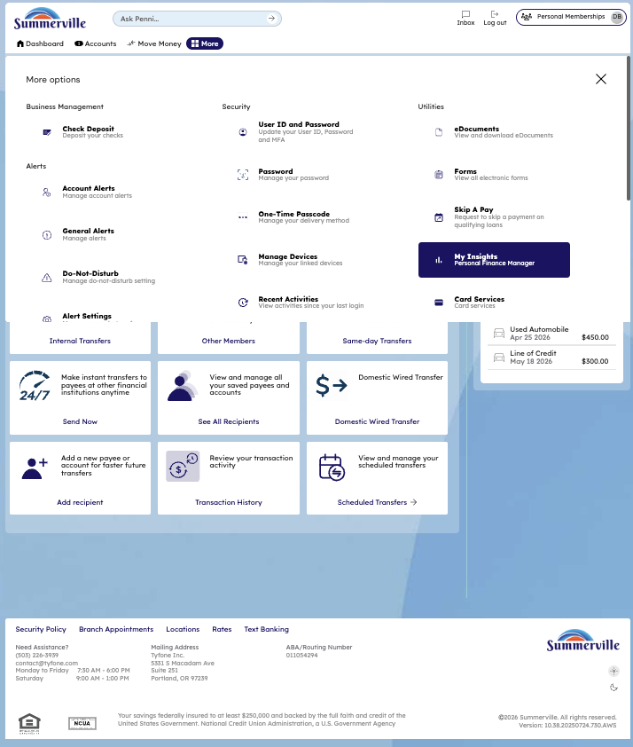
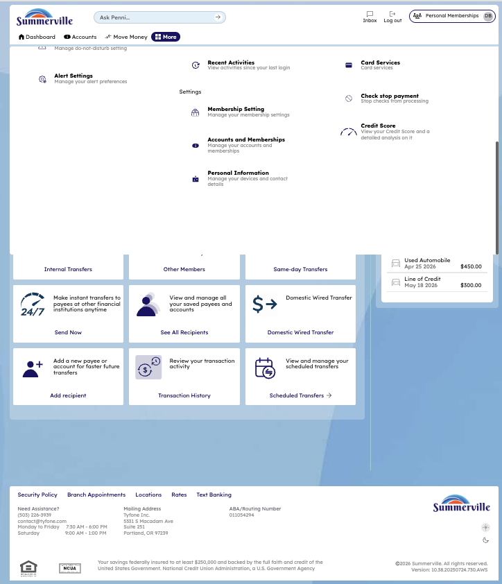
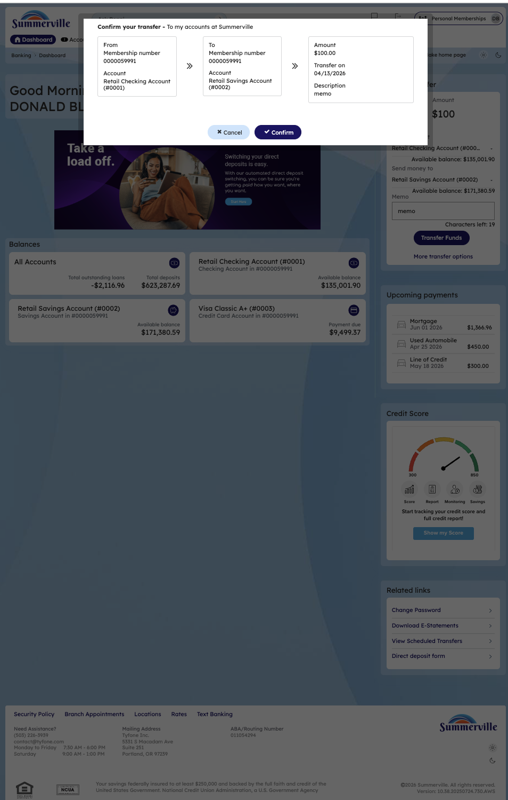

# Scheduled Transfers

_Module: Banking › Move Money › Scheduled Transfers_

## Summary

Scheduled Transfers let you automate recurring or future-dated movements of money between your own accounts (and eligible linked accounts) at Summerville. Schedule weekly, bi-weekly, semi-monthly, or monthly transfers that execute automatically on the configured date — ideal for automatic savings contributions, recurring loan payments, or planned one-time future transfers. The Scheduled Transfers screen also serves as a consolidated view of all active schedules and completed scheduled transfer history, so you always know what will move and what has already moved.

## At a Glance

| Attribute | Detail |
| --- | --- |
| Module | Move Money › Scheduled Transfers |
| Who Can Use | All nFinia Digital Banking members |
| Schedule Types | One-time future-dated, Weekly, Bi-weekly, Semi-monthly, Monthly |
| End Conditions | Continue until cancelled, End by date, After N occurrences |
| Execution Speed | Runs automatically on the scheduled date (instant for own-account) |
| History View | Active schedules and completed scheduled transfer records |
| Availability | 24 / 7 — via web or mobile |

## Key Use Cases

| Use Case | Who Uses It | What They Do | Business Value |
| --- | --- | --- | --- |
| **Automate monthly savings** | Member with a savings goal | Schedule a weekly transfer from checking to savings after payday | Set-and-forget savings automation |
| **Recurring loan payment** | Borrower with monthly obligation | Schedule a monthly transfer from checking to loan | Avoids missed payments and late fees |
| **Future-dated one-time transfer** | Member planning a large purchase | Schedule a one-time transfer for a specific future date | Move funds exactly when needed, not earlier |
| **Bill-aligned cash flow** | Member with due-date patterns | Schedule semi-monthly transfers aligned to bill cycles | Keeps cash positioned to cover obligations |
| **Review & manage schedules** | Any member | Open Scheduled Transfers to view, edit, or cancel any schedule | Full visibility into all upcoming automated transfers |

## Step-by-Step Guide

_Navigation: Banking › Move Money › Scheduled Transfers_

### Step 1 — Open the Move Money Hub

From the top navigation, click **Move Money** to open the Move Money Hub. The hub displays all payment and transfer options as tiles: Pay Bills, Quick Pay, Zelle Payment, Internal Transfers, Other Members, Same-Day Transfers, Send Instantly, Manage Recipients, Transaction History, and **Scheduled Transfers**.

<figure><figcaption>
Step 1: Open the Move Money Hub from the top navigation.
</figcaption></figure>

### Step 2 — Create a Scheduled Transfer

Select **Scheduled Transfers** from the Move Money Hub. The **Transfer Funds to Own Account** wizard opens. Complete the form: select the **From** account, select the **To** account, enter the transfer amount, add an optional transaction memo, and choose the payment date. Check the **Make payment recurring** box to expose recurrence controls — choose a frequency (Weekly, Bi-weekly, Semi-monthly, Monthly) and an end condition (Continue until cancelled, End by date, or After N occurrences). Click **Continue** to proceed.

<figure><figcaption>
Step 2: Enter amount, date, and check <strong>Make payment recurring</strong> to configure the schedule.
</figcaption></figure>

### Step 3 — Return to the Move Money Hub

After setting up the schedule, you are returned to the Move Money Hub. From here you can initiate the matching instant transfer now — or navigate to **Internal Transfers** to execute a linked movement alongside your scheduled automation.

<figure><figcaption>
Step 3: Back at the Move Money Hub — choose your next action.
</figcaption></figure>

### Step 4 — Open Internal Transfers

Select **Internal Transfers** to initiate a same-membership transfer that pairs with the schedule you just created. The Internal Transfers screen surfaces quick entry points for account-to-account transfers, scheduled transfer management, and related utilities.

<figure><figcaption>
Step 4: Open <strong>Internal Transfers</strong> to complete the matching movement.
</figcaption></figure>

### Step 5 — Confirm the Transfer

A **Confirm your transfer** modal appears showing the full transfer summary — **From** account, **To** account, **Amount**, **Transfer on** date, and **Description**. Review each field carefully. Click **Confirm** to submit, or **Cancel** to go back and edit.

<figure><figcaption>
Step 5: Review the transfer details and click <strong>Confirm</strong>.
</figcaption></figure>

### Step 6 — Final Review Screen

A final review screen appears reiterating the transfer summary before the platform commits the movement. This second confirmation protects against accidental double-submission and gives you one last chance to verify the amount and destination.

<figure><figcaption>
Step 6: Final confirmation — verify once more and submit.
</figcaption></figure>

### Step 7 — Success Confirmation

A success confirmation screen displays with a **green checkmark**, confirming that the transfer has been submitted. Your scheduled transfer is now active and will execute on the configured date(s); the instant internal transfer, if initiated, has posted in real time. Balances update immediately for own-account movements.

<figure><figcaption>
Step 7: Green checkmark — transfer submitted and schedule active.
</figcaption></figure>

## End-to-End Workflow

1. **Open Move Money Hub** — Member clicks **Move Money** in the top nav.
2. **Create scheduled transfer** — Member selects Scheduled Transfers, fills in From/To/Amount/Date, checks **Make payment recurring**, and picks frequency and end condition.
3. **Return to Move Money Hub** — Member navigates back after configuring the schedule.
4. **Open Internal Transfers** — Member selects Internal Transfers to initiate the matching instant movement.
5. **Confirm transfer** — The confirmation modal displays full details; member clicks Confirm.
6. **Final review** — A second confirmation screen verifies the transfer before commit.
7. **Success** — Green-check success screen confirms the transfer is submitted and the schedule is active.

> **Note:** Use **[Transfer to Own Account](<CSUM-06-Transfer-Own-Account-Scheduled.md>)** for one-off instant transfers. Use **Scheduled Transfers** (this page) whenever the movement needs to happen on a future date or repeat on a schedule.
