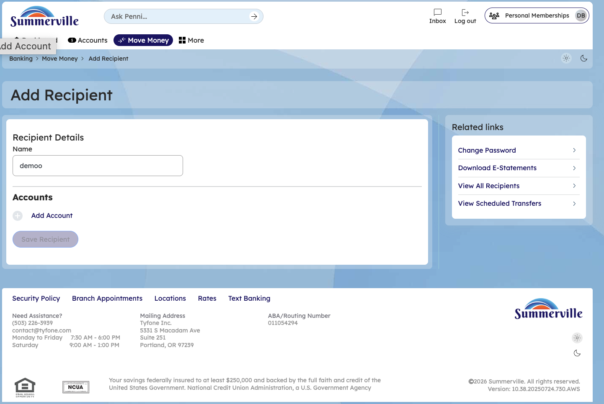
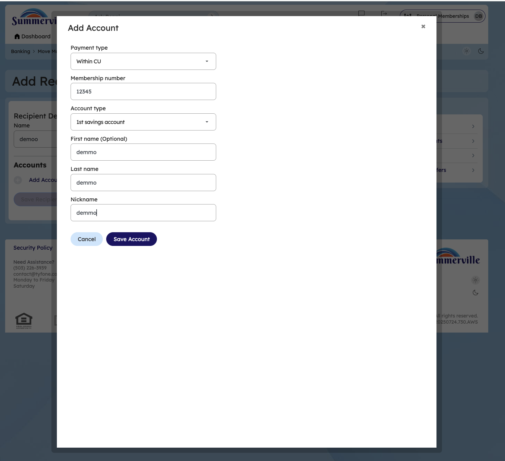

# Recipient Management

> **Module:** Banking › Move Money → Recipient Management

## Summary

Recipient Management is the centralised address book for all transfer and payment recipients. Members can store details for other CU members, external ACH bank accounts, domestic wire beneficiaries, international wire beneficiaries, and FedNow recipients. Saved recipients appear as quick-select options throughout all payment workflows, eliminating the need to re-enter banking details for each transaction.

The module supports multiple recipient types with different required fields: domestic wire recipients require an ABA routing number and account number, international wires require a SWIFT/BIC code and international address, external ACH accounts require routing and account number plus account type. You can view, add, edit, rename, delete, copy, and verify recipients from one management screen.

**At a Glance**

| Attribute | Detail |
| --------------- | ------------------------------------------------------------------ |
| Module | Move Money > Recipient Management |
| Recipient Types | CU Member, External ACH, Domestic Wire, International Wire, FedNow |
| Fields Stored | Name, institution, routing, account number, account type, nickname |
| Security | Adding new recipients may trigger OTP verification |
| Related Reports | (External ACH), (Wire Transfers) |

## Key Use Cases

| Use Case | Who Uses It | What They Do | Business Value |
| ---------------------- | ---------------------------- | ----------------------------------------------------- | --------------------------------------------------------- |
| Add External Account | Members setting up ACH pull/push | Add external bank routing and account numbers | Required before initiating any external ACH transfers |
| Add Wire Beneficiary | Members who send domestic wires | Enter ABA, account number, beneficiary name for wire | Saves wire recipient details for recurring wire transfers |
| Audit Saved Recipients | Members reviewing payee list | View all saved recipients with masked account details | Identify and remove outdated or incorrect payees |

## Step-by-Step Guide

**Step 1 — Navigate to Move Money Hub**

Click ‘Move Money' in the top navigation bar. Go to Manage Recipients

<figure><figcaption></figcaption></figure>

**Step 2 — View Recipient List**

The Recipient Management page displays all saved recipients as cards in a grid layout, each displaying the number of linked accounts.&#x20;

<figure><figcaption></figcaption></figure>

**Step 3 — View Recipient Details & Linked Accounts**

Members can view the Recipient Details page by clicking on the Recipient. The Accounts section lists two linked external accounts with columns for Nickname, Payment method, and Financial Institution. Each account shows action buttons including 'Initiate Transfer' and a delete option. An 'Add Account' button and 'Remove recipient' link are available below.

<figure><figcaption></figcaption></figure>

**Step 4 — Add a New Recipient**

You can add a New Recipient by searching for it in the search bar or navigating from Move Money. The Add Recipient form is displayed with a 'Recipient Details' section containing a Name field. The Accounts area shows an 'Add Account' link to attach payment accounts to the new recipient.&#x20;

<figure><figcaption></figcaption></figure>

**Step 5 — Add Account to Recipient**

The Add Account modal is open with fields for Payment type (set to 'within CU'), Membership number, Account type (set to '1st savings account'), optional First name and Last name fields, and a Nickname field. The member can enter those details and 'Save Account' to the recipient successfully. .

<figure><figcaption></figcaption></figure>
