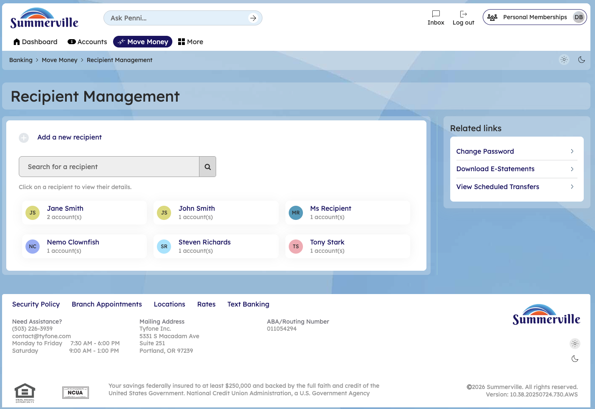
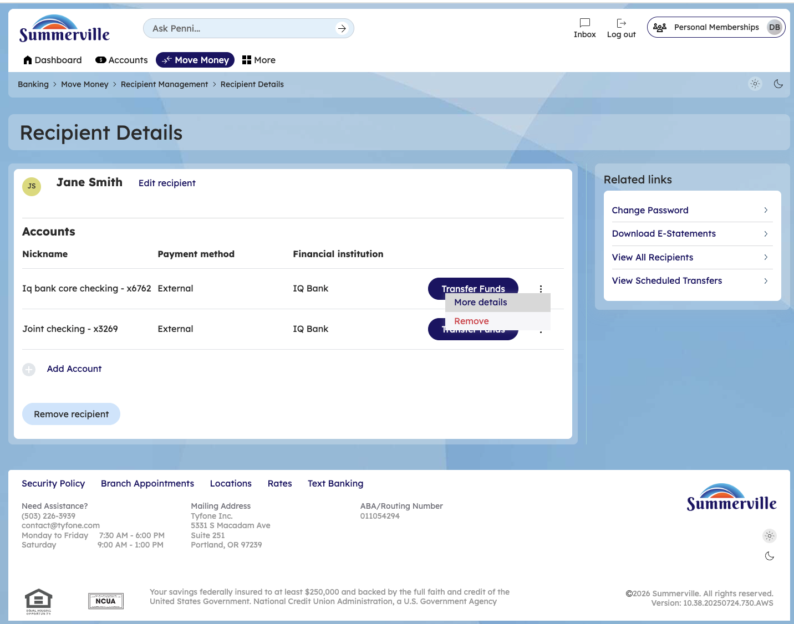

# Recipient Management

## Summary

Recipient Management allows members to create, maintain, and organise a directory of external payment recipients — storing their bank account details, routing numbers, and nicknames — so that recurring transfers and payments can be initiated without re-entering banking details each time. For business members who pay the same vendors, contractors, or suppliers on a regular basis, a well-managed recipient list is a core operational efficiency tool that reduces data entry errors and accelerates the payment initiation workflow.

## Key Use Cases

Business members add a new vendor to the recipient directory when setting up a first-time ACH payment, storing the vendor's account and routing details once so that future payments can be initiated by selecting the recipient name rather than re-entering banking details. Members update a recipient's account information when a vendor changes banks — editing the stored record to reflect the new routing and account number before the next payment cycle. Operations staff auditing the payment recipient list review stored accounts to identify outdated or duplicate entries, removing recipients no longer used to maintain a clean and accurate payment directory.

## Step-by-Step Guide

**Step 1 — Open Recipient Management**

From the Move Money menu, select **Recipients** or navigate to **Recipient Management** to open the recipient directory. All saved recipients are listed with their nickname, institution name, and last payment date — providing a complete view of all stored external payees.

<figure><figcaption></figcaption></figure>

**Step 2 — Add a New Recipient**

Click **Add Recipient** to open the recipient entry form. Enter the recipient's nickname, full legal name, bank routing number, account number, and account type (checking or savings). Click **Save** — for ACH recipients, a micro-deposit verification may be required before the recipient can be used for transfers.

<figure><figcaption></figcaption></figure>

**Step 3 — Edit or Remove a Recipient**

Select an existing recipient from the directory to open their record. Click **Edit** to update account details — such as a new routing number when a vendor changes banks — or click **Delete** to permanently remove the recipient from the directory. Changes take effect immediately and apply to all future transfers initiated to that recipient.

<figure><figcaption></figcaption></figure>
